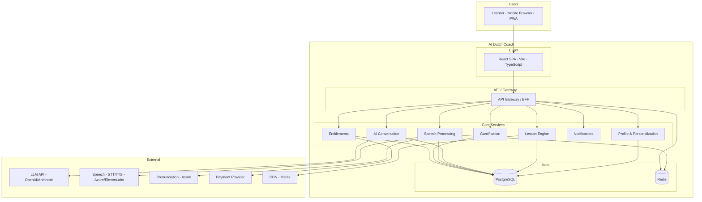

# Phase 3: Product Architecture Overview (v1)

## Document Info

| Attribute | Value |
|-----------|--------|
| Phase | 3 – Product Architecture Overview |
| Version | 1 |
| Status | Draft |

---

## 1. Problem and Objectives

### 1.1 Problem

Engineering needs a single, high-level view of the AI Dutch Coach system so that:

- Frontend (mobile-web-first), backend, data, and integrations are consistently scoped.
- Future expansion (native apps, other languages) is possible without re-architecting the product model.
- All capability domains from Business and Industry docs map to architectural components.

### 1.2 Objectives

- Describe the high-level architecture: client, API, services, data, external systems.
- Establish mobile-web-first delivery with React + Vite + TypeScript and a path to React Native/native.
- Map product capabilities to system components.
- Define deployment and deployment-unit boundaries (e.g. SPA, API gateway, services).
- Call out scalability, security, and compliance touchpoints.

---

## 2. Scope

### 2.1 In Scope

- System context diagram (users, client app, backend, external services).
- Logical architecture: frontend app, API layer, core services (profile, lessons, AI conversation, speech, gamification, notifications, entitlements).
- Data stores (PostgreSQL, Redis); CDN/media.
- External systems (AI/LLM, speech STT/TTS, pronunciation, payments).
- Mobile-web-first and future native strategy.
- High-level security and compliance (EU residency, auth).

### 2.2 Out of Scope

- Detailed API contracts (Backend doc).
- Detailed data schemas (Data doc).
- Detailed UI components (UI doc).
- Detailed integration payloads (Integrations doc).
- Runbooks and SLAs (Operations doc).

---

## 3. System Context

- **User**: Learner on mobile browser (or PWA); future native app uses same API.
- **Client**: React SPA (Vite, TypeScript); mobile-web-first, responsive.
- **API**: Single backend-for-frontend or API gateway; auth, routing, rate limiting.
- **Core services**: Profile & Personalization, Lesson Engine, AI Conversation, Speech Processing, Gamification, Notifications, Entitlements.
- **Data**: PostgreSQL (persistent), Redis (cache, queues, session).
- **External**: LLM, STT/TTS, pronunciation, payment, CDN.

---

## 4. Logical Architecture

### 4.1 Client (Frontend)

| Aspect | Decision |
|--------|----------|
| **Stack** | React 18+, Vite, TypeScript, Tailwind CSS |
| **Delivery** | Mobile-web-first; responsive; PWA-capable |
| **State** | Client state (e.g. React state/context or state library); server state via API |
| **Future** | Architecture allows React Native or native apps reusing same API and product model |
| **Auth** | Session/token via API; secure storage (httpOnly cookie or secure storage) |

The client does not implement business logic beyond UI and client-side validation; all entitlements, lesson selection, and AI flows are enforced by the backend.

### 4.2 API Layer

- **Role**: Auth, request validation, routing to services, rate limiting, optional BFF aggregation.
- **Style**: REST and/or GraphQL; WebSocket or long-poll for real-time (e.g. voice streaming) if needed.
- **Location**: EU region; BNFR-001 (data residency) applies.

### 4.3 Core Services (Logical)

| Service | Responsibility | Data | External |
|---------|----------------|------|----------|
| **Profile & Personalization** | User profile, onboarding, preferences, level, goals; personalization engine | PostgreSQL | — |
| **Lesson Engine** | Content selection, **CEFR curriculum path** (manifests, units, ordered lessons), learning path, lessons, flashcards, quizzes, scenarios (orchestration); content from PostgreSQL and/or CMS (see Data doc); revision session assembly from completed lesson pools | PostgreSQL, Redis | CDN (media) |
| **AI Conversation** | Scenario simulation, chat/voice conversation orchestration; prompts, context injection | PostgreSQL, Redis | LLM |
| **Speech Processing** | STT, TTS, pronunciation analysis; session handling | PostgreSQL, Redis | STT/TTS, Pronunciation |
| **Gamification** | XP, streaks, achievements, leaderboards, daily challenges | PostgreSQL, Redis | — |
| **Notifications** | In-app and push (if PWA); scheduling; preferences | PostgreSQL, Redis | Push provider (optional) |
| **Entitlements** | Subscription, trial, free-tier limits; feature gating | PostgreSQL | Payment provider |

Content (lessons, scenarios, exam prep) may be served by Lesson Engine from PostgreSQL and/or CMS; media from CDN. Daily reflection and location-aware features consume Profile and Lesson Engine (and optionally location from client).

### 4.4 Data Stores

- **PostgreSQL**: Users, profiles, progress, lessons, sessions, gamification, entitlements, audit trail. Primary persistent store; EU region.
- **Redis**: Caching (e.g. session, entitlements), queues (e.g. async jobs), short-lived session state (e.g. voice session). EU region where possible.

### 4.5 External Systems

- **LLM**: Conversation, corrections, lesson generation (e.g. daily reflection). OpenAI and/or Anthropic; API key and prompts managed by backend.
- **Speech**: Azure Speech (STT, TTS, pronunciation) and/or ElevenLabs (TTS). Latency-sensitive; consider regional endpoints.
- **Payment**: Stripe or equivalent; subscription and trial lifecycle; webhooks for sync.
- **CDN**: Static assets and media (audio, images); EU edge preferred.

---

## 5. Capability-to-Component Map

| Product capability (from Business) | Primary component(s) |
|-----------------------------------|----------------------|
| Personalized learning path | Profile & Personalization, Lesson Engine |
| CEFR curriculum path, daily plan, weak areas, revision | Lesson Engine, Profile & Personalization (see `docs/feature-extensions/cefr-curriculum-path-overview.md`) |
| Core language modules (vocab, grammar, etc.) | Lesson Engine, Content/CDN |
| Real-life scenario simulations | Lesson Engine, AI Conversation |
| AI voice conversation tutor | AI Conversation, Speech Processing |
| Listening training | Lesson Engine, Speech Processing, CDN |
| Pronunciation analysis | Speech Processing |
| Daily life reflection | Profile, Lesson Engine, AI Conversation |
| Location-aware prompts | Client (location), API, Lesson Engine |
| Exam preparation | Lesson Engine, Content |
| Gamification | Gamification service |
| AI tutor feedback | AI Conversation, Lesson Engine |
| Premium / trial / limits | Entitlements, Payment |
| Notifications | Notifications service |

---

## 6. Mobile-Web-First and Future Native

### 6.1 Current

- **Single codebase**: React SPA; responsive; touch-first; viewport and performance optimized for phone.
- **PWA**: Optional install, offline shell or degraded mode (e.g. show message when offline); service worker for caching static assets.
- **API-first**: All product logic and data access via API; no product logic in client beyond UX.

### 6.2 Future Native / React Native

- **Same API**: Native or React Native app reuses the same backend API and auth model.
- **Shared product model**: Same entitlements, lessons, scenarios, gamification rules; only presentation layer differs.
- **Recommendation**: Keep API contracts and domain models stable so that a React Native or native client can be added without changing backend behavior.

---

## 7. Security and Compliance (High-Level)

| Concern | Approach |
|---------|----------|
| **Auth** | Secure session or JWT; token refresh; logout and invalidation. |
| **Data residency** | PostgreSQL, Redis, and app compute in EU region (BNFR-001). |
| **Personal data** | Minimization; consent for optional data (BFR-009); retention per Data doc. |
| **Payments** | No card data in our systems; payment provider handles PCI; webhooks over HTTPS. |
| **AI/content** | Moderation and safety per Industry doc (IS-017, IS-018); transparency (IS-016). |

---

## 8. Architecture Requirements (Traceable)

| ID | Requirement |
|----|-------------|
| ARCH-001 | The system shall be deployable such that application and data run in the EU region (BNFR-001). |
| ARCH-002 | The client (web or future native) shall consume a single API layer for all product and data operations. |
| ARCH-003 | All persistent personal data shall be stored in EU-resident data stores (PostgreSQL, Redis as used for persistence). |
| ARCH-004 | The system shall support observability: structured logging, metrics, and distributed tracing for API and services (details in Operations). |

---

## 9. Deployment View

- **Deployment units**: (1) Static SPA (CDN), (2) API/service layer (compute), (3) PostgreSQL, (4) Redis, (5) Optional worker/queue consumers.
- **Region**: Single EU region for launch (e.g. eu-west-1 or equivalent); same region for API, DB, Redis to minimize latency.
- **External**: LLM, speech, payment, CDN may be multi-region; traffic from API in EU to provider endpoints as per provider and compliance.

---

## 10. Scalability and Performance (High-Level)

- **Client**: Code splitting, lazy loading, asset optimization; CDN for static/media.
- **API**: Stateless; horizontal scaling; rate limiting per user and per endpoint.
- **Services**: Stateless where possible; queue-based async for heavy work (e.g. pronunciation, lesson generation).
- **Data**: Connection pooling; read replicas if needed; Redis for hot path (sessions, entitlements cache).
- **AI/Speech**: Provider SLAs and regional endpoints; circuit breaker and fallbacks when external services fail.

---

## 11. Assumptions and Dependencies

### 11.1 Assumptions

- Single API layer (monolith or small set of services) is sufficient for initial scale; microservices can be split later if needed.
- Third-party AI and speech are used as APIs; no self-hosted LLM/speech in initial scope.
- PWA is optional; core experience works without install.

### 11.2 Dependencies

- Business Requirements (BFRs, capabilities).
- Industry Standards (CEFR, accessibility, safety).
- Backend doc (API contracts, service details).
- Data doc (schemas, retention).
- Integrations doc (LLM, speech, payment).
- UI doc (client structure, routing).
- Operations doc (deployment, monitoring).

---

## 12. Risks

| ID | Risk | Mitigation |
|----|------|------------|
| ARCH-1 | API becomes bottleneck | Stateless scaling; caching; async for heavy operations. |
| ARCH-2 | AI/speech latency on mobile | Regional endpoints; streaming where possible; clear loading states. |
| ARCH-3 | Tight coupling to one LLM/speech provider | Abstract provider behind internal API; multi-provider strategy in Integrations. |

---

## 13. Open Questions

| ID | Question | Owner |
|----|----------|--------|
| OQ-1 | Monolith vs. separate service per domain at launch? | Engineering |
| OQ-2 | WebSocket vs. REST long-poll for voice streaming? | Backend / Frontend |
| OQ-3 | CMS for lesson content or DB-only? | Product / Content |

---

## 14. Summary

The AI Dutch Coach architecture is **mobile-web-first** (React + Vite + TypeScript SPA), with an **API layer** and **core services** (Profile, Lesson Engine, AI Conversation, Speech, Gamification, Notifications, Entitlements), **PostgreSQL and Redis** in the EU, and **external** LLM, speech, payment, and CDN. The design supports **future native or React Native** clients on the same API and product model. Detailed API, data, integrations, UI, and operations are in their respective phase documents.
