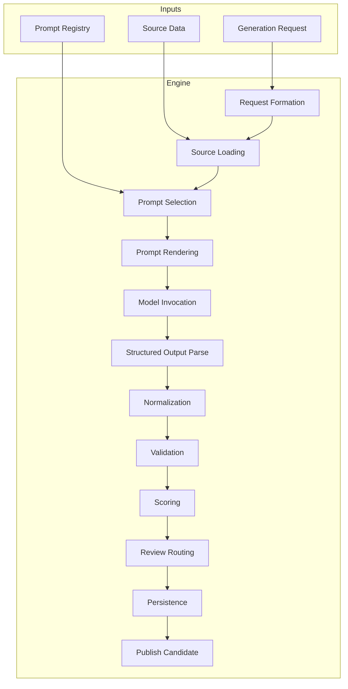

# Content Generation Engine — Overview

## 1. Purpose

This document defines the **content generation engine**: the system that creates, expands, validates, versions, and prepares learning content at scale. The engine operationalizes the existing content/data architecture (taxonomy, scenarios, lesson templates, prompt library, pipelines) by providing structured generation workflows, artifact schemas, validation gates, review routing, and publishing flows. It ensures that AI-generated and batch-generated content never reaches production without structured input, prompt templates, parsing, validation, and optional human review.

## 2. Scope

- **In scope**: Engine architecture; artifact model; prompt execution framework; generation pipelines (request formation → source loading → prompt selection → rendering → model invocation → parse → normalize → validate → score → review routing → persist → publish candidate); validation layer; quality gates; review queue design; publishing flow; batch generation strategy; risk controls; code scaffolding (schemas, interfaces, CLI, tests).
- **Out of scope**: LLM provider APIs (integrations layer); frontend UI; live runtime lesson generation (handled by runtime layer; engine produces seed and batch content).

## 3. Out of Scope (Explicit)

- Actual LLM API calls (engine invokes an abstract provider interface).
- User-facing runtime personalization (engine produces content that runtime layer consumes).
- Full CMS implementation (engine produces artifacts; storage contracts only).

## 4. Assumptions

- Existing content/data architecture is authoritative for schemas and pipelines (see docs/final/content-system-summary.md).
- Content is stored in PostgreSQL (and optionally object storage for media); engine writes via repository interfaces.
- Prompt templates live in a registry (DB or config) with code, body, input_schema, output_schema, constraints, safety.
- Multi-language is supported via locale on every artifact; Dutch is first, engine does not hardcode Dutch-only logic in core.
- Human review is required for high-risk artifact types unless auto-approval rules are explicitly met.

## 5. High-Level Architecture

## 6. Core Principles

| Principle | Description |
|-----------|-------------|
| **Structured input** | Every generation request has a typed request shape (artifact type, locale, level, scenario, constraints). |
| **Template-driven** | Generation uses versioned prompt templates from the registry; no ad-hoc prompt strings. |
| **Structured output** | All LLM output is parsed against a schema (Zod/JSON Schema); parse failures do not persist. |
| **Validation before persist** | Schema, pedagogy, safety, and duplication checks run before any artifact is saved. |
| **Provenance** | Every artifact stores prompt_template_id, prompt_version, model_id, input_hash, validator_results. |
| **Review or auto-approve** | Content is either routed to review queue or auto-approved by explicit rules (e.g. low-risk vocabulary). |
| **Versioning** | Artifacts have version; publish creates content_version snapshot; rollback supported. |

## 7. Engine Capabilities (Summary)

| Capability | Description | Artifact types |
|------------|-------------|----------------|
| Vocabulary pack generation | Sets by level, topic, scenario, segment | VocabularyItem[] |
| Phrase pack generation | Phrases with intent, formality, variants | PhraseItem[] |
| Dialogue generation | Scenario-based dialogues (café, doctor, etc.) | Dialogue |
| Guided lesson generation | Blueprints with objective, blocks, examples, exercises | LessonBlueprint, LessonInstance |
| Exercise generation | From templates (MCQ, fill-blank, ordering, etc.) | ExerciseInstance[] |
| Level adaptation | A1–B2 variants of same scenario/lesson | Same types, level field |
| Exam prep generation | Reading, listening, speaking, writing, civic | ExamTask[] |
| Reflection lesson generation | From user notes/metadata/timeline | ReflectionLessonDraft |
| Recommendation pack generation | Lesson candidates from profile, weak skills, goals | LessonCandidate[] |
| Regeneration / expansion | Improved variants from telemetry, low performers | Same as above |

## 8. Inputs and Outputs

| Stage | Inputs | Outputs |
|-------|--------|---------|
| Request formation | Trigger (CLI, API, scheduler), params | GenerationRequest |
| Source loading | Request (locale, scenario, level) | SourceData (vocab, scenarios, templates) |
| Prompt selection | Request (use_case, artifact_type) | PromptTemplateRef |
| Prompt rendering | Template + variables | RenderedPrompt |
| Model invocation | RenderedPrompt, model config | RawModelResponse |
| Parse | RawModelResponse, output_schema | ParsedOutput or ParseError |
| Normalize | ParsedOutput | NormalizedArtifact(s) |
| Validation | NormalizedArtifact(s) | ValidationReport |
| Scoring | Artifact + ValidationReport | QualityScore |
| Review routing | Artifact, score, policy | ReviewQueueItem or AutoApprove |
| Persistence | Artifact, provenance | StoredArtifact (ids) |
| Publish candidate | StoredArtifact, approval | PublishRecord, content_version |

## 9. Dependencies

- **Content/data architecture**: docs/final/content-system-summary.md, database-schema, content-entities, prompt-library-architecture.
- **Pipelines**: ai-content-generation-pipeline, content-validation-pipeline, content-review-process, content-release-process.
- **Governance**: content-governance, ai-content-generation-policies.

## 10. Failure Modes

| Failure | Behavior |
|---------|----------|
| Invalid request | Return 400; no generation. |
| Missing template | Return 404; log. |
| Model timeout / error | Retry per policy; then fail; no persist. |
| Parse error | Retry with “valid JSON only” once; then fail; no persist. |
| Validation failure | Do not persist; return ValidationReport; optional retry with different params. |
| Moderation flag | Do not persist; log; alert if repeated. |
| Review queue full / unavailable | Persist as draft; mark “pending_review”; retry routing later. |

## 11. Security and Safety

- No PII in prompt variables or logs; anonymize/hash where needed.
- All generated text passes through moderation before persist.
- Prompt templates and model config are versioned and audited.
- Kill switch: disable generation by template or globally via config.

## 12. Cost Considerations

- Token usage logged per run (input + output); cost estimated by model.
- Batch jobs support chunking, concurrency limits, and rate limiting.
- Caching: same (request_hash, template_version) can reuse result if policy allows (e.g. deterministic seeds).

## 13. Open Questions

- Exact retry count and backoff per provider.
- Cache TTL for “same request” reuse in batch.

## 14. Recommended Decisions

- Implement engine as a dedicated module (e.g. `src/content-engine/`) with clear boundaries from runtime and CMS.
- Use Zod for all artifact and request/response schemas in code.
- Provide a CLI for batch jobs (generate:scenario, generate:batch, validate:artifacts, publish:approved).
