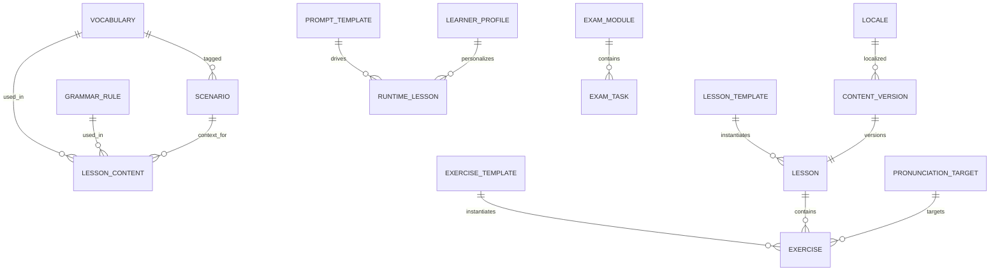

# Data Model Overview — Content & Language Platform

## Document Info

| Attribute | Value |
|-----------|--------|
| Version | 1 |
| Status | Draft |

---

## 1. Purpose

This document provides the **high-level data model** for the AI Language Coach content and language platform: core entities, relationships, and how they support vocabulary, grammar, scenarios, lessons, exercises, exam prep, pronunciation, prompts, and runtime-generated content at scale (thousands of lessons and scenarios, multiple languages).

---

## 2. Scope

- **In scope**: Logical entity groups; key relationships; storage strategy (relational, document, blob); versioning and localization at model level; runtime generation inputs/outputs.
- **Out of scope**: Physical DDL (see database-schema.md); API contracts (backend docs); UI-only content (i18n strings).

---

## 3. Core Entity Groups

| Group | Purpose | Scale target |
|-------|---------|--------------|
| **Foundation** | Locales, CEFR levels, content types, taxonomy codes | Reference (hundreds of rows) |
| **Vocabulary** | Lemmas, translations, examples, phonemes, CEFR, frequency | 10k–100k+ terms per language |
| **Grammar** | Rules, structures, examples, CEFR, links to vocabulary | 1k–10k rules per language |
| **Scenarios** | Real-life situations, goals, phrases, cultural notes, AI instructions | Thousands per language |
| **Lessons & exercises** | Templates and instantiated lessons/exercises; versioned | Thousands of lessons; 10k+ exercises |
| **Prompts** | Prompt templates, input/output schemas, safety constraints | Hundreds of templates |
| **Exam prep** | Modules, tasks, question formats, scoring | Hundreds of tasks per exam type |
| **Pronunciation** | Targets, phonemes, stress, audio refs, scoring thresholds | 5k–20k targets per language |
| **Cultural context** | Cultural notes, do/don't, scenario-specific | Attached to scenarios/vocabulary |
| **Runtime & telemetry** | Generated lessons, expansion signals, quality scores | Generated on demand; telemetry stored |

---

## 4. Key Relationships

| From | To | Relationship | Cardinality |
|------|-----|--------------|-------------|
| **Vocabulary** | Lesson content / Scenario | Used in, tagged to | N:M (via join or JSON refs) |
| **Grammar rule** | Lesson content / Vocabulary | Used in, applies to | N:M |
| **Scenario** | Lesson / Exercise | Context for; roleplay template | 1:N |
| **Lesson template** | Lesson | Template → instance | 1:N |
| **Exercise template** | Exercise | Template → instance | 1:N |
| **Lesson** | Exercise | Lesson contains exercises | 1:N |
| **Prompt template** | Runtime lesson / AI output | Drives generation | 1:N |
| **Content version** | Lesson / Scenario / Exercise | Version history | 1:N per content entity |
| **Locale** | All content entities | Localized variant | 1:N (content has locale or locale_id) |
| **Exam module** | Exam task | Module contains tasks | 1:N |
| **Pronunciation target** | Vocabulary / Exercise | Target word; used in drill | N:M |

---

## 5. Storage Strategy

| Data type | Storage | Rationale |
|-----------|---------|------------|
| **Structured reference** (locales, CEFR, content types) | PostgreSQL | Relational; small; strong consistency |
| **Vocabulary, grammar, scenarios** (core fields) | PostgreSQL | Query by level, tag, scenario; indexing |
| **Lesson/exercise definitions** (structure + content refs) | PostgreSQL + JSONB | Flexible content payload; query by template_id, level |
| **Large text / rich content** (prompt bodies, long descriptions) | PostgreSQL (TEXT/JSONB) or object store | Prefer DB for queryability; blob for audio/media |
| **Media** (audio, images) | Object storage (S3/Blob) | Reference by URL or asset_id in DB |
| **Prompt templates** | PostgreSQL | Versioned; query by purpose, language |
| **Runtime-generated content** | PostgreSQL (cache) or ephemeral | Cache for reuse; TTL or invalidation |
| **Telemetry / expansion signals** | Event store or analytics DB | Aggregate for content expansion; not primary content |

---

## 6. Versioning and Localization (Overview)

- **Versioning**: Every content entity that can be edited has a version (e.g. `content_version` table or `version` column). Published vs draft; major/minor or linear version number. See content-versioning.md.
- **Localization**: Content is keyed by `locale` (BCP 47) or `teaching_language` + `learner_locale` where needed. Vocabulary and grammar are per language; lessons can have one or more locale variants. See localization-model.md.

---

## 7. Runtime Content Generation (Model View)

- **Inputs**: Learner profile (level, goals, weak skills, past progress), scenario choice, vocabulary/grammar filters, prompt template id, constraints (length, difficulty).
- **Outputs**: Lesson or exercise instance (or structured spec for frontend); may be cached by (profile_hash, template_id, scenario_id, seed) to avoid duplicate generation.
- **Persistence**: Generated lesson can be stored as a lesson instance with `source: runtime` and `generator_prompt_id`; optional TTL for cache invalidation.

---

## 8. Scalability Assumptions

- **Vocabulary**: Indexed by language, CEFR level, part_of_speech, scenario_tags; partition by language if needed.
- **Lessons**: Indexed by template_id, level, locale, status; pagination and filter; no single table scan of all lessons.
- **Scenarios**: Indexed by locale, difficulty, topic; support thousands without denormalizing into lessons.
- **Prompts**: Versioned; immutable after publish; new version = new row or version id.
- **Multi-language**: All content tables have `locale` or `language_id`; separate rows or variant table per locale.

---

## 9. Dependencies

- **database-schema.md**: Physical tables and indexes.
- **content-entities.md**: Detailed entity definitions.
- **content-versioning.md**: Version lifecycle and rules.
- **localization-model.md**: Locale and variant strategy.
- **runtime-content-generation.md**: Runtime generation logic and caching.

---

## 10. Assumptions

- Primary teaching language at launch: Dutch (nl); learner UIs and feedback can be in multiple locales (en, nl, etc.).
- CEFR A0–C2; exam prep aligned to known Dutch exams (e.g. A2, B1, civic).
- AI-generated content is always validated (automated + optional human review) before use in production lessons.
- Content is authored or generated per teaching language; translation of content is a separate localization workflow.
