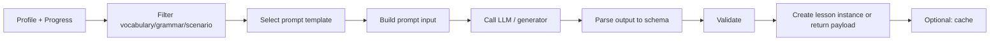

# Runtime Content Generation — Logic and Caching

## Document Info

| Attribute | Value |
|-----------|--------|
| Version | 1 |
| Status | Draft |

---

## 1. Purpose

This document defines **runtime content generation logic**: how the system dynamically generates or assembles lessons using learner profile, past progress, weak skills, scenario choice, vocabulary/grammar datasets, and AI prompts. It covers inputs, outputs, caching, and invalidation.

---

## 2. Scope

- **In scope**: Generation triggers; input parameters; use of prompt templates and content datasets; assembly of lesson/exercise payload; cache key and TTL; personalization rules.
- **Out of scope**: AI provider integration (see integrations); frontend rendering (see UI spec).

---

## 3. Generation Triggers

| Trigger | When | Output |
|---------|------|--------|
| **Next lesson** | User requests "next lesson" or home recommendation | One lesson instance (from template + content refs or generated) |
| **Scenario start** | User starts a scenario simulation | Conversation context (scenario + prompt template); no persistent lesson row required, or create session with scenario_id |
| **Reflection lesson** | User completes reflection entry; "generate lesson" | One lesson instance (from reflection + prompt template) |
| **Daily / adaptive** | Scheduled or on login | Recommendation set (lesson ids or specs) |
| **Exam prep** | User selects exam module | Task set (exam_tasks) or generated practice |

---

## 4. Inputs to Runtime Generation

| Input | Source | Use |
|-------|--------|-----|
| **Learner profile** | profiles table | level (CEFR), goals, target_level, native_language, optional weak_skills (from progress analytics) |
| **Past progress** | progress / lesson_completions | Completed lesson ids; scores; avoid repeating; reinforce weak areas |
| **Weak skills** | Derived from progress or explicit | Vocabulary/grammar to reinforce; scenario types to practice |
| **Scenario choice** | User or recommendation | scenario_id → scenario row (context, phrases, AI instructions) |
| **Vocabulary filter** | From scenario or level | vocabulary_term_ids or (locale, cefr_level, scenario_tags) query |
| **Grammar filter** | From scenario or level | grammar_rule_ids or (locale, cefr_level) query |
| **Prompt template** | prompt_templates table | By code (e.g. reflection_lesson_generation, quiz_from_vocabulary) |
| **Constraints** | Request or default | max_exercises, difficulty_range, length |

---

## 5. Generation Flow (Conceptual)

1. **Resolve learner context**: level, goals, weak_skills, completed_lesson_ids.
2. **Filter content**: Vocabulary and grammar by level and scenario (if scenario_id provided); scenario row by id.
3. **Select prompt template**: By purpose (e.g. reflection_lesson, vocabulary_quiz); locale = teaching language.
4. **Build prompt input**: From prompt_input_schema; inject vocabulary sample, scenario context, learner level, constraints.
5. **Call generator**: LLM or rule-based; get raw output.
6. **Parse and validate**: Against prompt_output_schema; content-quality rules (length, no PII, pedagogy checks).
7. **Create lesson instance**: Insert into lessons table with source=runtime, content_payload=parsed; or return payload for ephemeral use.
8. **Cache** (optional): Key = hash(profile_hash, template_id, scenario_id, reflection_id, seed); TTL e.g. 24h; reuse for same context.

---

## 6. Caching

| Strategy | When | Key | TTL |
|----------|------|-----|-----|
| **Lesson instance cache** | After generating a lesson | (user_id or profile_hash, template_code, scenario_id, date_or_seed) | 24h or session |
| **Recommendation list** | After computing "next lesson" | (user_id, date) | Short (e.g. 1h) |
| **No cache** | Scenario conversation turns | Per turn; no cache | — |
| **Prompt output cache** | Expensive generation | (template_id, input_hash) | Configurable |

- **Invalidation**: When prompt template version changes, invalidate cache entries that use that template. When user level or progress changes, invalidate recommendation cache for that user.
- **Storage**: runtime_lesson_cache table (see database-schema) or Redis; key = hash; value = lesson_id or payload.

---

## 7. Personalization Rules

| Rule | Implementation |
|------|----------------|
| **Level** | Only include vocabulary/grammar ≤ learner level; optionally +1 level for stretch. |
| **Avoid repeat** | Exclude lesson_ids already completed (or completed in last N days) from "next lesson" unless explicit "review". |
| **Weak skills** | If weak_skills present, bias selection toward vocabulary_rule_ids or scenario categories that need practice. |
| **Goals** | If goal = "exam", bias toward exam prep modules and exam-aligned tasks. |
| **Scenario** | If user chose scenario, use that scenario's vocabulary and key_phrases in generation. |
| **Length** | Respect max_exercises or duration_min from request or profile preference. |

---

## 8. Validation and Safety (Runtime)

- **Output schema**: Generated lesson/exercise must conform to lesson content_payload schema and exercise payload schema; reject or retry if invalid.
- **Content quality**: Run content-quality-rules (no PII, no harmful content, length bounds); reject if fail.
- **Moderation**: If generated text is shown to user (e.g. reflection lesson body), run through moderation API before persisting or returning.
- **Rate limit**: Per-user or per-session limit on runtime generation calls to control cost and abuse.

---

## 9. Failure Modes

| Failure | Behavior |
|---------|----------|
| **LLM timeout** | Return fallback: pre-authored lesson or "try again" message. |
| **Invalid output** | Retry once with same input; if still invalid, fallback to static lesson or error. |
| **Missing vocabulary/scenario** | Do not generate; return recommendation from static catalog. |
| **Cache miss** | Generate on demand; populate cache. |

---

## 10. Dependencies

- **prompt-input-schema.md**, **prompt-output-schema.md**: Input/output shapes for generator.
- **prompt-template-catalog.md**: Template codes and purposes.
- **content-quality-rules.md**: Validation rules.
- **ai-content-generation-policies.md**: Safety and pedagogy constraints.
- **database-schema.md**: runtime_lesson_cache, lessons (source=runtime).
