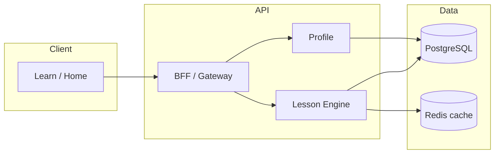

# CEFR curriculum path, daily plan, weak areas & revision — Implementation-grade specification

**Feature slug**: `cefr-curriculum-path`  
**Extends**: FD-01 (Onboarding & Profile), FD-02 (Core Lessons), E-14 (Personalization), optionally FD-10 (Gamification)  
**Version**: 1 (deep-dive)  
**Status**: Implementation-grade (pending final sign-off in `final/cefr-curriculum-path.md`)  
**Related**: `docs/feature-extensions/cefr-curriculum-path-overview.md`, `docs/implementation/features/cefr-curriculum-path.md`, `docs/curriculum/populating-level-curriculum.md`

---

## Dependency summary (existing product)

| Question | Answer |
|----------|--------|
| **Existing modules this depends on** | **Authentication** (all routes); **Profile** (`current_level`, `target_level`, locale prefs); **Lesson Engine** (`lessons`, `lesson_progress`, GET/POST progress per core-lessons spec); **Entitlements** (cap at lesson start — unchanged); **Gamification** (optional hooks); **Personalization / home session set** (consumer of path + today). |
| **Existing screens this touches** | `src/app/app/home/page.tsx` (Home), `src/app/app/learn/page.tsx` (Lesson discovery), `src/app/app/learn/[lessonId]/page.tsx` (+ flashcards/quiz subroutes), `src/app/app/settings/profile/page.tsx`, `src/app/onboarding/page.tsx`, `src/app/app/progress/page.tsx`. |
| **Migrations required** | **Yes** — additive PostgreSQL migrations for `curriculum_manifests`, `curriculum_units`, `curriculum_unit_lessons`, `user_curriculum_state`, `exercise_attempts`, `revision_sessions` (see §12; mirrors `docs/implementation/data-model.md` §1A). Optional: `daily_plan_snapshots` if Today is server-authoritative per calendar day. |
| **New integrations** | **No hard requirement for MVP**. Optional later: CMS webhook for manifest publish; Analytics provider new event names; premium gate on revision count via existing **Entitlements** only. |
| **New demo data** | **Yes** — import or map `data/curriculum/nl-NL/A2/` to lesson cards; align `external_id`; seed `user_curriculum_state` + partial `lesson_progress` for path demos (see §18, §25). |

---

## 1. Purpose

Define **how** the product binds a learner to a **CEFR study level**, an **ordered curriculum** (manifest → units → lessons), a **suggested daily queue**, **persisted progress** (reusing FD-02 mechanics), **weak-area signals** from assessment data, and **revision sessions** (mixed exercises from completed content)—so backend, frontend, data, and QA can implement without contradicting `docs/features/deep-dives/final/core-lessons.md` or entitlement rules.

---

## 2. Core Concept

- **Curriculum manifest**: One published graph per `(locale, CEFR level)` (e.g. `nl-NL` + A2) with `schema_version`, ordered **units**, each with ordered **lesson references** (`lessons.id` or `lessons.external_id` matching stable IDs such as `a2-u01-l01` from local JSON).
- **Active study level**: `user_curriculum_state.active_cefr_level_id` (or equivalent) may equal profile `current_level` by default but is **user-editable**; drives which manifest loads.
- **Path progress**: Derived **read model**: walk manifest order; compare each lesson to `lesson_progress.status === completed` to find **next lesson**, **unit completion %**, and **path completion %**.
- **Daily plan**: A small **ordered list of lesson ids** for “today” (e.g. 1–3 items), computed from next incomplete path lessons, capped by `daily_lesson_target`, **skipping** lessons already completed today if product chooses deduplication, and still subject to **FD-02 free cap** on each new lesson **start**.
- **Weak areas**: Aggregates from **`exercise_attempts`** (per question/exercise outcome) tagged with `topic_tags` / skill keys from content metadata; thresholded for UI (“Practice verbs”).
- **Revision session**: Short-lived set of **`exercise_ids`** sampled deterministically from pools linked to **already completed** lessons; submissions write to `exercise_attempts` with `attempt_context=revision_session` and update session row — **does not** replace `lesson_progress` for those lessons.

---

## 3. Why This Feature Exists

- **Learner clarity**: Reduces “what should I do now?” friction versus flat catalog sort.
- **Curriculum integrity**: Content teams can ship **ordered** syllabi aligned to CEFR without breaking micro-lesson runtime.
- **Retention**: Daily plan + weak-area loops support habit and remediation.
- **Business**: Supports integration-exam positioning and premium differentiation (optional revision limits) without duplicating FD-02 lesson authoring.

---

## 4. User Problems Solved

| Problem | How this feature addresses it |
|---------|--------------------------------|
| Overwhelming lesson list | Default **Path** tab shows only the next units and lessons in order. |
| Unclear daily goal | **Today** surfaces 1–3 concrete actions tied to path. |
| Lost thread after days away | **Next** recomputed from manifest + `lesson_progress`; **Continue** still works for in-progress lesson (FD-02). |
| Repeated mistakes | **Weak areas** list from failed attempts; one-tap practice. |
| Forgetting earlier material | **Revision** pulls exercises from completed lessons only. |

---

## 5. Scope

### 5.1 In scope

- CRUD-read APIs for **curriculum structure** (manifest, units, lesson order) for app locale + level.
- **Study context** API: get/update active study level, optional `daily_lesson_target`, pacing preference.
- **Path projection** API: next lesson id, unit breakdown with done/total lessons.
- **Today** API: ordered lesson ids + metadata for home/learn.
- **Exercise attempt** ingestion on quiz/exercise submit (lesson run + revision).
- **Weak areas** read API: aggregated tags above threshold.
- **Revision**: create session (draw exercises), submit answers, complete session.
- Feature flag **`curriculum_path_enabled`** (client + server): when off, UI and BFF omit path/today/revision; catalog behaves as today.

### 5.2 Out of scope (v1)

- ML-based adaptive sequencing beyond simple rules.
- Auto-changing user level based on performance (manual + onboarding only unless separate product decision).
- LLM-generated revision items (revision uses **existing** exercise templates / payloads from completed lessons).
- Full CMS authoring UI (import pipeline + DB tables only; JSON interim per `docs/curriculum/populating-level-curriculum.md`).

---

## 6. Main Personas

| Persona | Needs |
|---------|--------|
| **Structured learner** | Strict order, visible unit progress, daily plan. |
| **Exam-oriented** | Same path; later: filter units by `exam_tags` on lessons (cross-link FD-09). |
| **Free user** | Path visible; each **new** lesson start still hits **free cap** (FD-02). |
| **Returning user** | Next + Continue coherent; Today may show unfinished in-progress first. |
| **Content/admin** | Stable `external_id`; manifest versioning; import validation. |

---

## 7. User Journeys

| Journey | Steps | Failure / exit |
|---------|--------|----------------|
| **Set study level** | Settings profile (or onboarding) → choose A2/B1/… → save study context → path reloads | Invalid level → 400; no manifest → empty path + message “Content coming soon.” |
| **Follow path** | Learn → **Path** tab → see units → tap next lesson → same FD-02 run (`/app/learn/[lessonId]`) | Lesson 404 / unpublished → error state; cap → 403 modal. |
| **Complete day** | Home **Today** → lesson 1 → complete → returns; lesson 2 …; optional “Day done” celebration | Cap mid-queue → show upsell; remaining items greyed or hidden per product rule. |
| **Weak area** | After low quiz score or from Progress → **Weak areas** → tap tag → launch micro-drill (subset of exercises or short revision) | No attempts yet → empty state. |
| **Revision** | Progress or Learn → **Revision** → start session → answer N items → summary | Not enough completed lessons → empty state; premium block → upsell if configured. |

---

## 8. Triggering Events / Inputs

| Trigger | Actor | Input | System behaviour |
|---------|-------|--------|------------------|
| Open Path | Client | GET `/v1/curriculum/path` (auth) | Resolve user locale + `active_cefr_level_id`; load manifest; join `lesson_progress`; compute next + units. |
| Open Today | Client | GET `/v1/curriculum/today` | Compute queue from path + `daily_lesson_target` + date boundary. |
| Change study level | Client | PATCH `/v1/users/me/study-context` `{ active_cefr_level }` | Validate; upsert `user_curriculum_state`; invalidate caches. |
| Lesson checkpoint / complete | Client | Existing POST `/v1/progress/lesson` (FD-02) | Unchanged; path/today projections re-read on next fetch. |
| Exercise outcome | Client | POST `/v1/progress/exercise-attempt` (batch or per item) | Insert `exercise_attempts`; update weak-area aggregates (materialized or on read). |
| Start revision | Client | POST `/v1/revision/sessions` | Validate min completed lessons; sample exercises; return session id + items. |
| Submit revision | Client | POST `/v1/revision/sessions/:id/submit` | Score; store attempts; mark session completed; optional Gamification. |

---

## 9. States / Lifecycle

### 9.1 Curriculum content (server)

| State | Meaning |
|-------|---------|
| **draft** | Manifest not visible to apps. |
| **published** | Active for `(locale, level)`; optional `published_at`. |
| **superseded** | New `schema_version`; old retained for audit; app uses latest published. |

### 9.2 User curriculum state

- Single row per `user_id` in `user_curriculum_state` (or embed in profile if product prefers one table; spec assumes dedicated table for clarity).
- Updates on: study level change, optional pacing change.

### 9.3 Revision session

| State | Transitions |
|-------|-------------|
| `in_progress` | Created → user submits → |
| `completed` | Terminal; score set |
| `abandoned` | Timeout or explicit discard (optional); analytics only |

### 9.4 Daily plan

- **Ephemeral or snapshot**: Either compute on read (idempotent for calendar day + timezone) or store `daily_plan_snapshots` for analytics consistency. Recommended: **compute on read** for MVP; persist optional event `daily_plan_served` with payload hash.

---

## 10. Business Rules

| ID | Rule |
|----|------|
| PATH-BR-01 | Path ordering **must** follow `curriculum_unit_lessons.sort_order` within unit and `curriculum_units.sort_order` across units. |
| PATH-BR-02 | **Next lesson** = first lesson in manifest order without `lesson_progress.status=completed` (treat missing row as not completed). |
| PATH-BR-03 | **In-progress** lesson earlier in path than “next” still shows as **Continue** (FD-02); Today may prioritize it. |
| PATH-BR-04 | Changing `active_cefr_level` does **not** delete `lesson_progress` for other levels; user may switch back and see old completions. |
| PATH-BR-05 | Free-tier **lesson start cap** (FD-02) applies whenever the client calls **GET /lessons/:id** to start or resume a **lesson run**. **Revision** and standalone exercise-only flows must **not** use that path for cap increment unless product explicitly treats them as a new lesson (**PATH-BR-05a**: revision completion does not increment `lessons_completed_count`; **PATH-BR-05b**: optional premium limit on `revision_sessions` per day). |
| PATH-BR-06 | Weak-area tag appears when `wrong_count >= threshold` (e.g. 2) in rolling window (e.g. 14 days) for same tag. |
| PATH-BR-07 | Revision session draws only from lessons with `lesson_progress.status=completed` and published exercises. |
| PATH-BR-08 | `external_id` in manifest must resolve to exactly one published `lessons` row per locale or API returns 503 for that slot (content error). |

---

## 11. Configuration Model

| Key | Type | Description |
|-----|------|-------------|
| `feature.curriculum_path_enabled` | bool | Master switch. |
| `curriculum.default_locale` | string | Fallback if profile locale missing (e.g. `nl-NL`). |
| `curriculum.daily_lesson_target_default` | int | Default 2. |
| `curriculum.weak_area.threshold_wrong` | int | e.g. 2 |
| `curriculum.weak_area.lookback_days` | int | e.g. 14 |
| `revision.session.exercise_count` | int | e.g. 8 |
| `revision.session.max_per_day_free` | int | optional; 0 = unlimited |
| `revision.session.max_per_day_premium` | int | optional |

Admin/content: manifest publish toggles, `schema_version` bump procedure.

---

## 12. Data Model

Aligned with `docs/implementation/data-model.md` §1A. Summary:

- **`curriculum_manifests`**: locale, `cefr_level_id`, `schema_version`, title, source, `published_at`.
- **`curriculum_units`**: `curriculum_manifest_id`, `external_id` (e.g. `a2-u01`), `title`, `sort_order`, optional summary JSON.
- **`curriculum_unit_lessons`**: `curriculum_unit_id`, `lesson_id` (FK), `sort_order`.
- **`user_curriculum_state`**: `user_id`, `active_cefr_level_id`, `curriculum_manifest_id` (optional FK cache), `daily_lesson_target`, `pacing_preference`, `updated_at`.
- **`exercise_attempts`**: `user_id`, `lesson_id`, `exercise_id`, `correct`, `topic_tags`, `attempt_context`, `revision_session_id`, `created_at`.
- **`revision_sessions`**: `user_id`, `exercise_ids` (JSONB), `source_lesson_ids`, `status`, `score`, timestamps.

**Indexes**: manifest by `(locale, cefr_level_id, published)`; attempts by `(user_id, created_at)`; GIN on `topic_tags` if PostgreSQL.

---

## 13. Read Models / Projections

| Projection | Inputs | Output |
|------------|--------|--------|
| **UserPathView** | manifest + unit_lessons + lesson titles + lesson_progress | `units[]` with `{ unit_id, title, completed_count, total_lessons, lessons: [{ lesson_id, external_id, title, status }] }`, `next_lesson_id`, `path_percent_complete` |
| **TodayView** | UserPathView + daily_lesson_target + user timezone date + in_progress lesson | `items[]` lesson cards in order; `reason` per item (continue, next, revision_optional) |
| **WeakAreasView** | exercise_attempts aggregates | `tags[]` with `{ tag, wrong_count, right_count, last_wrong_at }` filtered by threshold |
| **RevisionDeckView** | completed lesson ids + exercise pools | Candidate exercises; internal to create session |

---

## 14. APIs / Contracts

Base `/v1`, auth required. Error shape consistent with existing API (401, 403, 404, 422).

### 14.1 GET `/v1/curriculum/path`

**Response 200**

```json
{
  "locale": "nl-NL",
  "cefr_level": "A2",
  "manifest_version": 1,
  "path_percent_complete": 12.5,
  "next_lesson": { "id": 1001, "external_id": "a2-u01-l01", "title": "…" },
  "units": [
    {
      "external_id": "a2-u01",
      "title": "Dagelijkse routines en tijd",
      "completed_lessons": 0,
      "total_lessons": 4,
      "lessons": [
        { "id": 1001, "external_id": "a2-u01-l01", "title": "…", "progress": "not_started" }
      ]
    }
  ]
}
```

**404**: No published manifest for level. **200** with empty units if flag off and BFF chooses to return legacy shape — prefer **404** or omit endpoint when disabled.

### 14.2 GET `/v1/curriculum/today`

**Response 200**

```json
{
  "plan_date": "2026-03-25",
  "items": [
    { "lesson_id": 1001, "role": "continue", "reason": "in_progress" },
    { "lesson_id": 1002, "role": "next", "reason": "path_order" }
  ]
}
```

### 14.3 GET `/v1/users/me/study-context`

Returns `active_cefr_level`, `daily_lesson_target`, `pacing_preference`, optional `curriculum_manifest_id`.

### 14.4 PATCH `/v1/users/me/study-context`

Body: partial fields; validate level exists and manifest published.

### 14.5 POST `/v1/progress/exercise-attempt`

Body (example):

```json
{
  "lesson_id": 1001,
  "attempts": [
    { "exercise_id": 301, "correct": false, "topic_tags": ["present_tense", "routine"] }
  ],
  "context": "lesson_run"
}
```

Idempotent optional: `client_attempt_uuid`.

### 14.6 POST `/v1/revision/sessions`

Body: `{ "exercise_count": 8 }` optional override cap.  
**Response**: `{ "session_id": "…", "exercises": [ … resolved payloads … ] }`.

### 14.7 POST `/v1/revision/sessions/:id/submit`

Body: answers + scoring client or server-side validation; **Response**: score, weak tags update.

> **Note**: Add rows to `docs/implementation/apis.md` when contracts are frozen; until then this deep-dive is source for OpenAPI generation.

---

## 15. Events / Async Flows

| Event | When | Consumers |
|-------|------|-----------|
| `curriculum_path_viewed` | Client (optional) | Analytics |
| `study_context_updated` | After PATCH study-context | Analytics, Personalization cache bust |
| `daily_plan_served` | After GET today | Analytics |
| `exercise_attempt_recorded` | After POST attempts | Weak-area projection, optional real-time SR |
| `revision_session_started` / `revision_session_completed` | Revision flow | Gamification (optional), Analytics |
| `daily_plan_completed` | Client or server when all Today items done | Gamification optional |

Async: optional queue to recompute materialized weak-area table if read path is too heavy.

---

## 16. Integrations / Dependencies

| Integration | Usage |
|-------------|--------|
| **Auth** | All endpoints user-scoped. |
| **Entitlements** | Optional revision/day limits; lesson cap unchanged (FD-02). |
| **CDN / media** | Unchanged; lessons still reference media in `content_payload`. |
| **Analytics** | New event names; properties: `cefr_level`, `manifest_version`, `unit_external_id`, `revision_session_id`. |
| **CMS** (future) | Publishes manifests; webhook → import job → DB. |

**No new third-party vendor required** for MVP.

---

## 17. UI / UX Design

- **Information architecture**: Learn screen: tabs **Path** | **Browse** (existing discovery). Home: section **Today’s plan** above or below existing Continue/Recommended.
- **Copy**: Distinguish **“Your level in profile”** vs **“Level you’re studying now”** to avoid confusion (PATH-BR-04).
- **Empty states**: No manifest; no weak areas; not enough content for revision — each with single CTA (Browse, Complete a lesson).
- **Accessibility**: Tab order for unit accordion; progress rings with text equivalents.
- **Design system**: Reuse `Card`, `ProgressBar`, `Button`, lesson list items from existing Learn UI.

---

## 18. Main Screens / Components

| Screen / route (existing) | Change |
|---------------------------|--------|
| `src/app/app/learn/page.tsx` | Add **Path** tab; embed `CurriculumPathView` (units accordion + next CTA). |
| `src/app/app/home/page.tsx` | Inject `TodayPlanSection` from GET today; deep-link to `/app/learn/[id]`. |
| `src/app/app/settings/profile/page.tsx` | **Study level** control + `daily_lesson_target` slider/select. |
| `src/app/onboarding/page.tsx` | Optional final step “Confirm study level” writing study-context. |
| `src/app/app/progress/page.tsx` | Path completion %, weak areas list, revision CTA. |
| `src/app/app/learn/[lessonId]/page.tsx` (+ quiz) | On quiz submit, call **exercise-attempt** API with tags; show weak CTA on fail. |

**New (suggested)**

| Route | Component |
|-------|-----------|
| `src/app/app/revision/page.tsx` or modal | `RevisionSessionPage`: session player reusing quiz/exercise renderers from FD-02. |

**Frontend modules**: `src/features/lessons/` extended with `curriculum/` subfolder (hooks: `useCurriculumPath`, `useTodayPlan`, `useStudyContext`).

---

## 19. Permissions / Security

- All curriculum and progress endpoints: **authenticated user only**; never return another user’s attempts.
- **Rate limit** POST revision session creation (anti-abuse).
- **Content integrity**: Manifest import runs as admin job; app only reads published.
- **PII**: Study level is profile-tier data; same retention as profile (EU residency per BNFR-001).

---

## 20. Edge Cases / Failure Cases

| Case | Handling |
|------|----------|
| Lesson removed from manifest but progress exists | Hide from path; keep progress; show maintenance message if “next” broken — **PATH-BR-08** prevents in validated publish. |
| User completes lesson out of order (Browse) | Path marks lesson done; **next** skips to following incomplete in manifest order. |
| Timezone midnight | Use user profile timezone or UTC per config for `plan_date`. |
| Duplicate exercise in revision | Dedupe by `exercise_id` in session builder. |
| All Today items completed early | Show “You’re done for today” + optional revision/weak CTAs. |
| Feature flag off mid-session | Client finishes current lesson; path APIs 404 → hide widgets. |

---

## 21. Non-Functional Requirements

| NFR | Target |
|-----|--------|
| GET path | p95 &lt; 500ms with warm cache (manifest small); CDN not required for JSON. |
| Manifest cache | Redis or in-process TTL 5–15 min per `(locale, level, version)`. |
| Availability | Degraded mode: hide Path; Learn Browse still works. |
| Consistency | Eventual consistency OK for weak-area aggregates (≤ 1 min lag acceptable). |

---

## 22. Analytics / Auditability

- Funnel: `path_viewed` → `lesson_started` (existing) → `lesson_completed` → `today_plan_completed`.
- Revision: duration, item count, score distribution.
- Audit log (admin): manifest publish, import job id, who published.

---

## 23. Testing Requirements

- **Unit**: next-lesson algorithm; today queue builder; revision sampler determinism (seed).
- **Integration**: PATCH study-context → GET path reflects new level; complete lesson → path percent updates; exercise attempts → weak areas.
- **Contract**: OpenAPI / Pact for new endpoints when added to `docs/implementation/apis.md`.
- **E2E**: User sets A2 → sees first unit → completes lesson → next updates → Today updates; revision happy path.
- **Migration tests**: Forward-only add tables; seed minimal manifest.

---

## 24. Recommended Architecture

- **Lesson Engine** (or monolith module) owns: manifest read, path projection, today builder, revision sampler, exercise-attempt write.
- **Profile service** owns: study-context PATCH (or BFF aggregates profile + curriculum state).
- **BFF** optional: single `GET /home/session` extended to embed `today` + `path_summary` to reduce round-trips (aligns with E-14).
- **Importer**: CLI or admin job: `data/curriculum/**/*.json` → validates IDs → upserts DB → cache bust.



---

## 25. Suggested Implementation Phasing

| Phase | Deliverable | Demo data |
|-------|-------------|-----------|
| **P0a** | Migrations + import A2 JSON → DB; GET path (read-only) | Seed manifest + map `external_id` to `MOCK_LESSONS` or DB lessons |
| **P0b** | Settings study-context + Path tab UI | Demo user mid-unit |
| **P0c** | GET today + Home section | Demo user with in_progress + next |
| **P1a** | POST exercise-attempt from quiz | Demo user with weak tags |
| **P1b** | Weak areas UI + revision session APIs | Completed lessons + revision flow |
| **P1c** | Optional Gamification + analytics events | — |

---

## 26. Summary

This specification adds a **curriculum orchestration layer** on top of **existing FD-02 lesson run and progress**, with **new persisted entities** for manifests, study context, granular attempts, and revision sessions. The **UI** extends **Home, Learn, Settings profile, Progress**, and optionally **Onboarding**, with **new revision** surface. **Migrations and demo seed are required**; **new external integrations are not** for MVP. For product rationale and sign-off history, see `docs/feature-extensions/final/cefr-curriculum-path-final.md` and reviews/audits in `docs/features/deep-dives/reviews/` and `audits/` for this slug.

---

## Document history

| Version | Location |
|---------|----------|
| Draft iteration | `versions/cefr-curriculum-path-spec-v1.md` |
| Reviews | `reviews/cefr-curriculum-path-spec-review-v1.md`, `…-v2.md` |
| Audit | `audits/cefr-curriculum-path-spec-audit.md` |
| Final pointer | `final/cefr-curriculum-path.md` |
