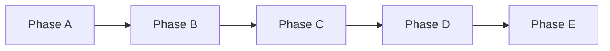

# Dependency Map

## Document Info

| Attribute | Value |
|-----------|--------|
| Version | 1 |
| Status | Draft |

---

## 1. Purpose

This document defines **critical path**, **blocking dependencies**, and **parallelization opportunities** so that sequencing is clear and teams can schedule work without violating dependencies.

---

## 2. Scope

- **In scope**: Phase-level and stream-level dependencies; critical path; what can run in parallel; what must be sequential.
- **Out of scope**: Task-level dependencies within a single stream (those are in stream-specific plans).

---

## 3. Phase-Level Dependencies

- **A → B:** Phase B cannot start until Phase A exit criteria are met (auth, env, data model, design system base, CI/CD, feature flags).
- **B → C:** Phase C (AI and speech) requires a working core experience (onboarding, lessons, progress) so that scenario and voice have a home in the app.
- **C → D:** Phase D (payments, entitlements) gates premium features (voice, scenarios) that are built in C; D also adds hardening that assumes C is stable.
- **D → E:** Phase E (reflection, location, exam, optimization) is post-launch expansion; launch happens at end of D.

---

## 4. Critical Path (Within Phase A)

| Order | Work item | Blocked by | Blocks |
|-------|-----------|------------|--------|
| 1 | Repo + env + secrets | None | Auth, CI/CD, all backend |
| 2 | Auth backend (signup, login, session) | Repo, env | Auth UI, all authenticated APIs |
| 3 | Data model (users, profiles) + migrations | Repo | Profile API, onboarding |
| 4 | CI/CD + first deploy to staging | Repo, Auth (optional) | All staging verification |
| 5 | Design system base + app shell | Repo (frontend exists) | All UI |
| 6 | Feature flags + observability baseline | Repo, deploy | Phase B feature rollout |

**Critical path (shortest sequence that blocks everything):** Repo → Auth backend → Data model → CI/CD. Design system and observability can start once repo exists and do not block each other; they can run in parallel with Auth and Data.

---

## 5. Critical Path (Phase B)

| Order | Work item | Blocked by | Blocks |
|-------|-----------|------------|--------|
| 1 | Profile and onboarding API | Phase A; Data (profiles) | Onboarding UI |
| 2 | Onboarding UI | Profile API contract | Lesson work (user has profile) |
| 3 | Lesson engine API + lesson schema/seed | Data (lessons table) | Lesson UI |
| 4 | Lesson UI (list, run, flashcards, quiz) | Lesson API | Progress and gamification |
| 5 | Progress API + gamification | Data (progress, gamification tables) | Home and recommendations |
| 6 | Home and recommendations | Progress, lesson list | Phase B exit |

**Parallel:** Lesson seed data can be built alongside lesson engine API. Lesson UI can start as soon as lesson API contract is stable (mock or staging).

---

## 6. Critical Path (Phase C)

| Order | Work item | Blocked by | Blocks |
|-------|-----------|------------|--------|
| 1 | LLM adapter + moderation | Phase B; Integration spec | Scenario API |
| 2 | Scenario API (list, start, turn, end) | LLM adapter | Scenario UI |
| 3 | Scenario UI | Scenario API | — |
| 4 | Speech adapter (STT, TTS, pronunciation) | Phase B; Integration spec | Voice API |
| 5 | Voice API + listening API | Speech adapter | Voice UI, listening UI |
| 6 | Voice UI + listening UI | Voice/listening API | Pronunciation feedback UI |
| 7 | Pronunciation feedback UI | Voice API (pronunciation) | Phase C exit |

**Parallel:** Scenario API+UI and Speech adapter can start in parallel once Phase B is done. Voice API and Scenario API do not depend on each other. Voice UI and Scenario UI can be built in parallel once respective APIs exist.

---

## 7. Critical Path (Phase D)

| Order | Work item | Blocked by | Blocks |
|-------|-----------|------------|--------|
| 1 | Stripe integration + webhook | Phase C; Integration spec | Entitlement service |
| 2 | Entitlement service + usage tracking | Stripe webhook; Data (subscriptions) | Gating and upsell UI |
| 3 | Entitlement gating (backend) + upsell UI | Entitlement service | Notifications |
| 4 | Notifications (email, optional push) | — | Analytics funnel |
| 5 | Analytics funnel events | — | Hardening |
| 6 | Production hardening (monitoring, alerting, runbook) | — | Launch checklist |
| 7 | GDPR export/delete | Data, Backend | Launch |
| 8 | Launch content + moderation ops | Content stream | Launch |

**Parallel:** Notifications and analytics can run in parallel with entitlement work. Hardening and GDPR can run in parallel. Launch content can start earlier (during C or early D).

---

## 8. Stream-to-Stream Blocking

| Blocked stream | Blocking stream | Dependency |
|-----------------|-----------------|------------|
| Frontend (any feature) | Backend | API contract or stub for that feature |
| Backend (new feature) | Data | Schema and migration for that feature |
| Backend (integrations) | Integrations | Adapter and credentials |
| All (deploy) | DevOps | CI/CD and env |
| Backend (auth) | Integrations | Auth provider (own or OAuth) |
| QA (E2E) | Frontend + Backend | Feature implemented and deployable |
| Content (seed) | Data | Lesson/content schema |

---

## 9. Parallelization Matrix

| Work stream A | Work stream B | Can run in parallel? | Condition |
|---------------|---------------|----------------------|-----------|
| Design system (A) | Data model (A) | Yes | From start of Phase A |
| Design system (A) | Auth backend (A) | Yes | After repo exists |
| Lesson engine API (B) | Lesson seed data (B) | Yes | After lesson schema exists |
| Lesson UI (B) | Progress backend (B) | Partially | Lesson UI needs lesson API; progress can follow |
| Scenario API (C) | Speech adapter (C) | Yes | Both need Phase B only |
| Scenario UI (C) | Voice UI (C) | Yes | After respective APIs exist |
| Stripe + entitlements (D) | Notifications (D) | Yes | No dependency |
| Upsell UI (D) | Analytics funnel (D) | Yes | No dependency |
| Hardening (D) | GDPR flows (D) | Yes | No dependency |
| Frontend (any) | Backend (same feature) | No | API contract first or parallel with contract agreed |

---

## 10. Risk: Blocking Items

| Item | If delayed | Mitigation |
|------|------------|------------|
| Auth (A) | All of B, C, D blocked | Time-box A; defer OAuth to B if needed |
| Lesson engine API (B) | Lesson UI and progress blocked | Define API contract early; stub for FE |
| LLM adapter (C) | Scenario blocked | Sandbox and adapter in Phase A or very early C |
| Stripe webhook (D) | Entitlement sync broken | Idempotency and tests; verify before launch |
| Data migrations | Backend feature work blocked | Migrations early in each phase; no big-bang schema |

---

## 11. Recommended Sequencing (Summary)

1. **Phase A:** Repo → (Auth + Data model + Design system in parallel) → CI/CD → Observability + Feature flags → Gate.
2. **Phase B:** Onboarding API+UI → Lesson engine + seed → Lesson UI → Progress + gamification → Home → Gate.
3. **Phase C:** (LLM + Scenario API+UI) and (Speech + Voice/listening API+UI) in parallel where possible → Moderation and fallbacks → Gate.
4. **Phase D:** Stripe + Entitlements → Gating + Upsell UI → (Notifications + Analytics + Hardening + GDPR in parallel) → Launch content → Checklist → Gate.
5. **Phase E:** Reflection → Location → Exam + content ops → Multi-language readiness → Cost/performance.
