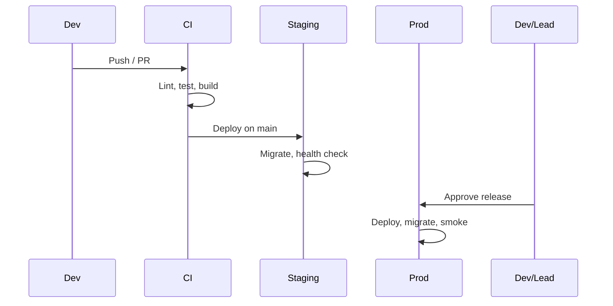

# DevOps and Environment Plan

## Document Info

| Attribute | Value |
|-----------|--------|
| Version | 1 |
| Status | Draft |

---

## 1. Purpose

This document covers **CI/CD**, **environments**, **secrets**, and **deploy flow** so that the team can build, test, and deploy the application reliably from Phase A through production launch.

---

## 2. Scope

- **In scope**: Repo structure; CI pipeline; CD to staging and production; environment definitions; secret management; deploy and rollback process.
- **Out of scope**: Cloud provider choice (plan is provider-agnostic); detailed infra as code (only principles and required capabilities).

---

## 3. Assumptions

- Code in Git; main (or release) branch is deployable; feature branches for work.
- At least one cloud or host (e.g. AWS, GCP, Azure, Vercel, Railway) for staging and production.
- PostgreSQL and Redis available (managed or self-hosted); object storage for media.
- EU region for production (GDPR and latency).

---

## 4. Repo Structure

| Area | Recommendation |
|------|----------------|
| **Layout** | Monorepo with `apps/api`, `apps/web` (or `frontend`), optional `packages/shared`; or separate repos for API and web with shared contract |
| **Config** | Root or per-app: package.json, tsconfig, eslint, prettier; env example at root or per app |
| **Docs** | docs/ (this plan and specs); README with setup and run instructions |
| **CI** | .github/workflows or .gitlab-ci or similar at root |
| **Migrations** | In API repo or apps/api; versioned; run on deploy or separate step |
| **Secrets** | Never in repo; .env.example with placeholder names only; .env* in .gitignore |

---

## 5. Environments

| Environment | Purpose | Data | Secrets |
|-------------|----------|------|--------|
| **Local** | Developer machine | Local DB and Redis or Docker | .env.local from template |
| **Test / CI** | Automated tests | Ephemeral or shared test DB | Env vars in CI; test keys |
| **Staging** | Integration and QA | Copy of prod schema; anonymized or seed data | Staging secrets in vault or CI |
| **Production** | Live users | Real data | Vault or managed secrets only |

Staging should mirror production in topology (API, DB, Redis, object storage) where practical; can be smaller scale.

---

## 6. CI Pipeline

| Stage | Triggers | Actions |
|-------|----------|---------|
| **Lint** | Every push/PR | ESLint/Prettier (or equivalent); fail on error |
| **Type check** | Every push/PR | TypeScript strict; fail on error |
| **Unit tests** | Every push/PR | Backend and frontend unit tests; coverage optional |
| **Build** | Every push/PR | Build API and frontend; fail if build fails |
| **Integration tests** | PR or main | Run API integration tests against test DB; migrations run |
| **E2E** | Main or nightly | Optional: Playwright/Cypress against staging or preview |
| **Security** | PR or main | Dependency scan (e.g. npm audit, Snyk); no critical vulnerabilities |

CI runs on every PR; merge to main (or release) triggers CD to staging. No deploy on every PR unless preview envs are used.

---

## 7. CD to Staging

| Step | Action |
|------|--------|
| 1 | On merge to main (or release branch): trigger CD |
| 2 | Build artifacts (API image or bundle; frontend static assets) |
| 3 | Run migrations (or separate migration job) against staging DB |
| 4 | Deploy API to staging; health check |
| 5 | Deploy frontend to staging (static host or same origin) |
| 6 | Smoke test: health, login, one critical path (e.g. lesson load) |
| 7 | Notify (e.g. Slack) with link and commit |

Rollback: redeploy previous artifact or revert migration (if safe); document in runbook.

---

## 8. CD to Production

| Step | Action |
|------|--------|
| 1 | Trigger: manual approval or tag (e.g. v1.0.0) or release branch |
| 2 | Build from release commit; same as staging |
| 3 | Run migrations against prod DB (with backup or blue-green if needed) |
| 4 | Deploy API (rolling or blue-green); health check |
| 5 | Deploy frontend (CDN or static host); cache invalidation if needed |
| 6 | Smoke test: health, login, payment flow (test mode or small amount) |
| 7 | Monitor errors and latency; rollback if critical failure |

Production deploy only after Phase D gate and launch checklist. No auto-deploy to prod unless explicitly agreed.

---

## 9. Secrets Management

| Environment | Storage | Access |
|--------------|---------|--------|
| **Local** | .env.local (gitignored); copy from .env.example | Developer only |
| **CI** | CI secret store (e.g. GitHub Secrets); injected as env | CI only |
| **Staging** | Vault or cloud secret manager; injected at deploy | Deploy pipeline and staging only |
| **Production** | Vault or cloud secret manager; least privilege | Deploy pipeline and prod runtime only |

Rotation: document which secrets to rotate (API keys, webhook secrets); test rotation in staging first. No long-lived credentials in code or config files.

---

## 10. Deploy Flow (Summary)

---

## 11. Rollback and Hotfix

| Scenario | Action |
|----------|--------|
| **Broken deploy** | Revert to previous image/commit; redeploy; fix forward in branch |
| **Migration failure** | If migration is backward-compatible, fix and redeploy; if not, restore DB from backup and fix migration; document |
| **Hotfix** | Branch from main; fix; PR; merge; deploy to staging then prod; tag hotfix version |
| **Feature flag kill** | Disable feature via flag; no deploy required for flag-controlled features |

Runbook: document "Rollback API" and "Rollback frontend" steps; test rollback once in staging.

---

## 12. Required Capabilities by Phase

| Phase | CI | Staging CD | Production | Secrets |
|-------|-----|------------|------------|---------|
| A | Lint, test, build | Deploy on main | — | .env.example; local and CI |
| B | + integration tests | Same | — | Staging secrets if needed |
| C | Same | Same | — | Staging + integration keys |
| D | Same | Same | Deploy on approval/tag | Vault for prod |
| E | Same | Same | Same | Same |

---

## 13. Dependencies

- **Backend/Frontend**: Both must build and pass tests; migrations in API.
- **Integrations**: Secrets for each provider (see integrations-implementation-plan).
- **Security**: No secrets in logs or artifacts; HTTPS only in prod.

---

## 14. Risks

- **Migration breaks prod**: Always test migrations on staging with prod-like data copy; have backup.
- **Secret leak**: Audit logs and build artifacts for secrets; use scanning in CI.
- **Long deploy**: Optimize build (cache deps); consider parallel jobs.

---

## 15. Readiness and Done Criteria

- **Phase A**: CI runs on every PR; staging deploy on merge to main; .env.example complete; no secrets in repo.
- **Phase D**: Production env provisioned; CD to prod with approval; secrets in vault; rollback and hotfix documented.
- **Phase E**: No new DevOps requirement unless scale (e.g. multi-region) is added.
