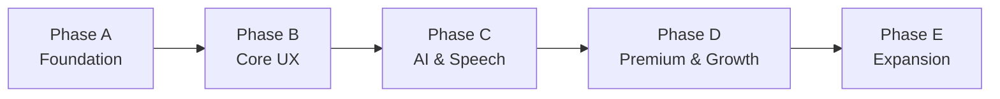
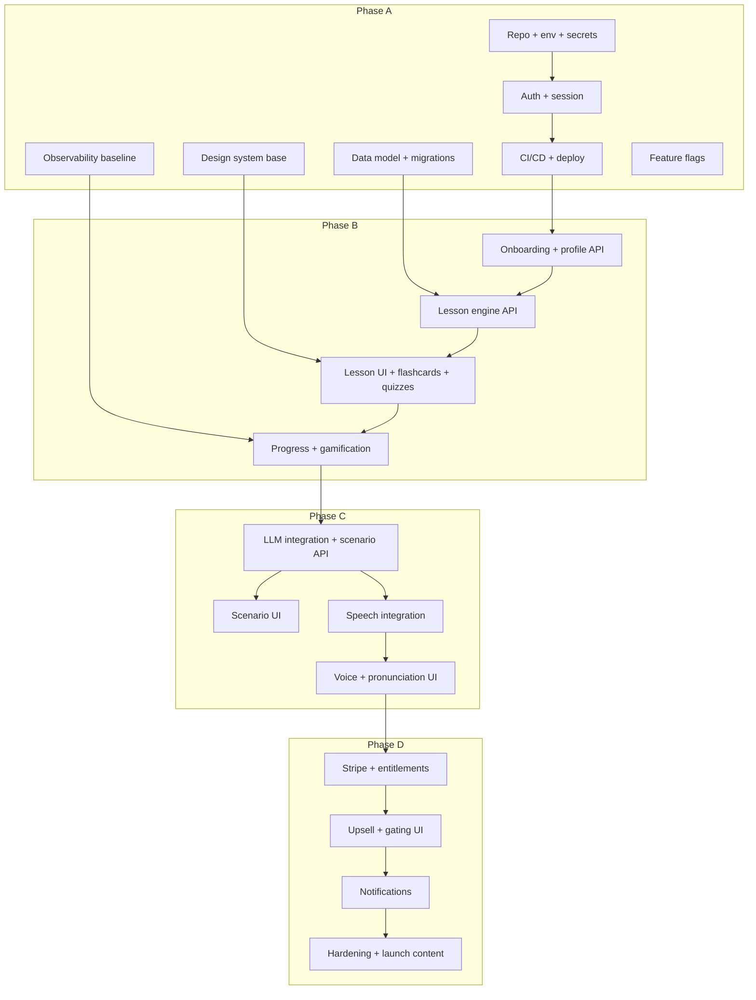

# Implementation Roadmap Overview

## Document Info

| Attribute | Value |
|-----------|--------|
| Version | 1 |
| Status | Draft |

---

## 1. Purpose

This document is the **master implementation roadmap** for the AI Language Coach. It summarizes delivery strategy, phases (A–E), critical path, workstream structure, recommended execution order, and pre-coding and pre-launch readiness. It is the single entry point for understanding how the full product is built and launched.

---

## 2. Scope

- **In scope**: Full production-ready product delivery plan; phased increments (A→B→C→D→E); all major capabilities from product and feature specs; mobile-web-first; backend and integration execution order; QA, DevOps, security, and launch readiness.
- **Out of scope**: Actual code generation; day-by-day sprint schedules; fixed calendar dates (use relative order and gates only unless dates are explicitly required).

---

## 3. Delivery Strategy

| Principle | Application |
|-----------|-------------|
| **Phased delivery** | Five phases (A–E). Each phase has clear goals, included/excluded capabilities, and exit criteria. No "big bang" launch of everything at once. |
| **Foundation first** | Phase A establishes repo, auth, env, CI/CD, observability baseline, design system foundation, and data model. Nothing in B–E ships without A exit. |
| **Core before AI** | Phase B delivers the core learner experience (onboarding, lessons, flashcards, quizzes, progress, gamification) so that AI and speech (Phase C) layer on a working product. |
| **Monetization after value** | Phase D adds subscriptions, entitlement gating, and growth loops after learners have a usable path (B) and AI/voice value (C). |
| **Hardening in phase** | Security, privacy, observability, and testability are built into each phase, not deferred. Phase D includes explicit production hardening. |
| **Lean-team viable** | Plan assumes a small initial team (see Staffing doc). Parallelization is identified so that 2–4 people can advance multiple streams where dependencies allow; critical path is explicit so sequencing is clear when team is minimal. |

---

## 4. Phase Summary

| Phase | Goal | Key capabilities | Exit criterion (summary) |
|-------|------|-------------------|---------------------------|
| **A** | Foundation and platform readiness | Repo, auth, env, CI/CD, observability, design system, data model, feature flags, secrets | Auth works; envs deployable; design tokens and component base; schema and migrations in place; feature flags evaluable |
| **B** | Core learner experience | Onboarding, profile, lesson browse, guided lessons, flashcards, quizzes, progress, gamification, recommendations | User can complete onboarding, do lessons and quizzes, see progress and basic XP/streak |
| **C** | AI and speech experience | AI text simulations, AI feedback, listening practice, STT/TTS, pronunciation, voice tutor, fallbacks | User can run a scenario (text), do a voice session, and get pronunciation feedback |
| **D** | Premium, growth, readiness | Subscriptions, entitlement gating, upsell, notifications, advanced analytics, launch content, production hardening | Paying user can subscribe; free user sees caps and upsell; monitoring and incident response in place |
| **E** | Expansion and optimization | Daily reflection, location prompts, advanced exam prep, content ops, multi-language readiness, cost/performance | Reflection and location features live; exam prep extended; ops and scale readiness documented |

---

## 5. Critical Path (Dependency Order)

**Critical path (simplified):** Repo → Auth → CI/CD → Onboarding/Profile API → Lesson engine → Lesson UI (and progress/gamification) → LLM integration → Scenario UI → Speech integration → Voice UI → Stripe/entitlements → Upsell/gating → Notifications → Hardening. Parallel work: design system and data model with auth; observability and feature flags with Phase A; backend lesson engine and frontend lesson UI once API contract exists; analytics instrumentation alongside each phase.

---

## 6. Workstream Structure

| Stream | Phase A | Phase B | Phase C | Phase D | Phase E |
|--------|---------|---------|---------|---------|---------|
| **Product/UX** | Specs lock; design system direction | Onboarding and lesson UX; copy | AI/voice UX; fallbacks | Upsell and notification UX | Reflection; location; exam UX |
| **Frontend** | App shell; routing; design tokens; auth UI | Onboarding; lessons; flashcards; quizzes; progress | Scenario; voice; listening; pronunciation UI | Entitlement gates; upsell; notifications | Reflection; location; exam |
| **Backend** | Auth; env; API skeleton | Profile; lesson engine; progress; gamification | LLM adapter; scenario API; speech adapter; voice API | Entitlements; Stripe; notification send | Reflection API; location API; content ops |
| **Data** | Schema; migrations; seed | Profile; lessons; progress tables | Conversations; voice sessions; pronunciation | Subscriptions; usage; events | Reflection; content versioning |
| **Integrations** | Secrets; env; auth (OAuth if used) | — | LLM; Speech; moderation | Stripe; email; push; analytics | — |
| **QA** | Test env; smoke; auth tests | E2E onboarding and lesson flow | E2E scenario and voice; AI/speech validation | Billing and entitlement tests; security | Regression; performance |
| **DevOps** | CI/CD; envs; deploy pipeline | — | — | Production hardening; alerting | Scale and cost tuning |
| **Security/Privacy** | Consent model; secrets; HTTPS | Profile and progress data handling | Audio retention; moderation | GDPR export/delete; audit | — |
| **Content/Operations** | — | Seed lessons; metadata model | — | Launch content set; moderation ops | Content ops process; exam content |
| **Growth/Monetization** | — | — | — | Stripe; upsell; funnel events | Referral; experiments |

---

## 7. Recommended Execution Order

**Before any Phase A development:**

1. Confirm product and feature specs are baselined (Business, Feature Domain, UI/UX, Backend, Data, Integrations).
2. Confirm environment and secret strategy (Integrations: security-secrets, environments).
3. Confirm design direction (design system foundation: tokens, typography, components to build first).
4. Create repo structure and branch strategy; set up project board (epics/features from Backlog doc).
5. Complete Implementation Readiness Checklist (docs/implementation/implementation-readiness-checklist.md).

**Phase A (sequential where blocking):**

1. Repo + env + secrets (DevOps + Backend).
2. Auth (Backend) + Auth UI (Frontend) in parallel after API contract.
3. CI/CD and first deploy to staging (DevOps).
4. Data model and migrations (Data + Backend).
5. Design system foundation and app shell + routing (Frontend).
6. Observability baseline (Backend + Frontend + DevOps).
7. Feature flags (Integrations + Frontend/Backend).
8. Phase A gate: all exit criteria met (see delivery-phases.md).

**Phase B:**

1. Profile and onboarding API + onboarding UI (Backend + Frontend).
2. Lesson engine API + lesson content seed (Backend + Data + Content).
3. Lesson UI, flashcards, quizzes (Frontend).
4. Progress and gamification (Backend + Frontend).
5. Phase B gate.

**Phase C:**

1. LLM integration and scenario API (Integrations + Backend).
2. Scenario UI (Frontend).
3. Speech integration (STT, TTS, pronunciation) (Integrations + Backend).
4. Voice and listening UI (Frontend).
5. Phase C gate.

**Phase D:**

1. Stripe and entitlement service (Integrations + Backend).
2. Entitlement gating and upsell UI (Frontend + Backend).
3. Notifications (email + optional push) (Integrations + Backend).
4. Analytics and funnel events (Integrations).
5. Production hardening (DevOps, Security, QA).
6. Launch content and moderation ops (Content).
7. Phase D gate → Launch readiness (see launch-checklist.md).

**Phase E:**

1. Daily reflection and location features (Backend + Frontend + Integrations).
2. Advanced exam prep and content ops (Content + Backend).
3. Multi-language and scale readiness (all streams).
4. Cost and performance optimization.

---

## 8. What Can Be Parallelized

| Combination | When | Notes |
|-------------|------|--------|
| Design system + Data model | Phase A | No dependency between them |
| Auth API + Auth UI | Phase A | After API contract agreed; can be same person or pair |
| Lesson engine API + Lesson content seed | Phase B | Backend and Data/Content in parallel |
| Lesson UI + Progress backend | Phase B | Once lesson API exists; progress can follow lesson completion |
| LLM integration + Scenario API | Phase C | Same stream; scenario API depends on LLM |
| Speech integration + Voice UI | Phase C | Voice UI can start with mocks; then wire to real API |
| Stripe + Entitlement service | Phase D | Entitlement service consumes Stripe webhooks |
| Upsell UI + Notifications | Phase D | After entitlements; can be parallel |
| QA automation | Every phase | Tests written alongside features; not only at end |

---

## 9. Minimum vs Ideal Team Shape

| Role | Minimum (Phase A–B) | Ideal (Phase C–D) |
|------|----------------------|-------------------|
| **Product/UX** | 1 (product + UX direction) | 1 product + 1 UX/design |
| **Frontend** | 1 | 1–2 |
| **Backend** | 1 | 1–2 |
| **Full-stack** | Optional (can cover FE or BE gap) | 1 |
| **QA** | Part-time or shared | 1 dedicated |
| **DevOps** | Part-time or shared | 1 or shared |
| **Content** | Part-time or product | 1 for launch content |

**Minimum viable for Phase A–B:** 2–3 (e.g. 1 full-stack + 1 frontend, or 1 BE + 1 FE + 0.5 product/UX). **Ideal for Phase C–D:** 4–6 (FE, BE, product/UX, QA, DevOps or content). See staffing-and-operating-model.md.

---

## 10. Before Coding Starts

- [ ] Implementation Readiness Checklist signed off (specs, env, design direction, repo, backlog).
- [ ] Phase A scope and exit criteria agreed.
- [ ] First milestones (e.g. "Auth working in staging") scheduled in project tool.
- [ ] Ownership per workstream assigned (even if one person covers multiple).

---

## 11. Before Launch

- [ ] Launch checklist completed (docs/implementation/launch-checklist.md).
- [ ] Phase D exit criteria met.
- [ ] Production hardening and monitoring in place.
- [ ] GDPR and privacy flows (consent, export, delete) implemented and tested.
- [ ] Billing and entitlement tested in production-like env.
- [ ] Go/no-go decision with stakeholders.

---

## 12. Assumptions

- Backend is Node.js or Python (per product context); exact choice is an open decision but does not change phase order.
- Cloud provider is abstracted (EU region); no provider-specific lock-in in the plan.
- Initial launch is Netherlands (Dutch); multi-language is Phase E readiness, not Day 1.
- No native app in Phase A–D; mobile web first; native is future expansion.
- Integrations follow the Integration Spec (identity, LLM, speech, Stripe, etc.); implementation order follows integrations-implementation-plan.md.

---

## 13. Dependencies on Other Docs

- **Product/Feature specs**: docs/final/* (business, feature-domain, ui-ux, backend, data).
- **Integration specs**: docs/final/integrations/* (identity, ai-llm, speech, payments, etc.).
- **Implementation plans**: delivery-phases, workstream-breakdown, dependency-map, milestones-and-gates, and stream-specific plans (frontend, backend, data, integrations, DevOps, security, QA, etc.).

---

## 14. Risks (Summary)

- **Critical path slip**: Auth or lesson engine delay blocks all downstream. Mitigation: Phase A exit gate; no Phase B start until A is done.
- **Scope creep in Phase B**: Adding AI or payments before Phase C/D. Mitigation: Strict phase scope; move scope to next phase or backlog.
- **Integration readiness**: LLM or Stripe not ready when Phase C/D starts. Mitigation: Sandbox and env setup in Phase A; integration implementation plan orders provider setup.
- **Team size**: Too few to parallelize. Mitigation: Focus on critical path first; defer non-blocking work (e.g. advanced gamification) to later phase.

See risk-register.md for full list.

---

## 15. Open Questions

- Backend language (Node vs Python) and framework.
- Exact trial length (7 vs 14 days) for Stripe.
- Whether to ship Phase B to a closed beta before starting Phase C.
- Content authoring: DB-only vs CMS in Phase B (recommendation: DB + seed for Phase B; CMS in Phase E if needed).

See open-decisions-log.md for full list and owners.
