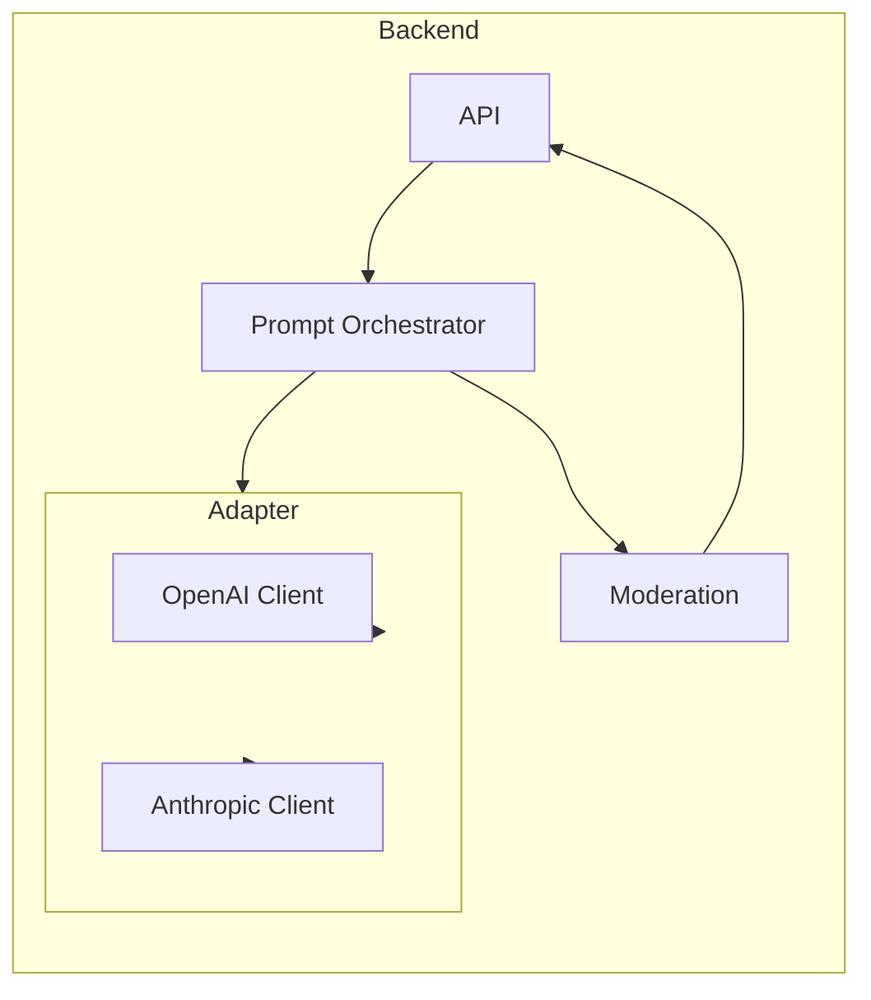

# AI / LLM Integration

## Document Info

| Attribute | Value |
|-----------|--------|
| Version | 1 |
| Status | Draft |

---

## 1. Purpose

This document specifies the **AI/LLM integration** for the AI Language Coach: content generation, tutoring, correction feedback, scenario simulation, prompt orchestration, moderation/safety, usage control, model routing, cost control, and fallbacks. It enables engineers to implement a production-grade, maintainable LLM integration.

---

## 2. Why This Integration Is Needed

- **Scenario simulations** (FD-03): AI acts as conversation partner in Dutch; user types or speaks; AI responds in character and may correct gently.
- **Voice tutor** (FD-04): LLM generates responses that are then spoken via TTS.
- **Daily reflection** (FD-07): LLM generates personalized lesson content from user’s notes/photos/location.
- **Feedback** (FD-11): LLM generates post-activity feedback (grammar, vocabulary, suggestions).
- **Corrections**: Inline correction suggestions during conversation.

---

## 3. Product Capabilities Supported

- FD-03 (scenario simulations), FD-04 (voice tutor), FD-07 (daily reflection), FD-11 (AI feedback). All AI-generated text must be moderated (IS-017) and indicated as AI (IS-016).

---

## 4. Decision Status

| Item | Status |
|------|--------|
| LLM for conversation | **Required now** |
| LLM for feedback / generation | **Required now** |
| Primary provider | **Required now**: OpenAI |
| Fallback provider | **Required now**: Anthropic (or second OpenAI model) |
| Moderation | **Required now** (provider-native or custom) |

---

## 5. Recommended Providers and Comparison

| Provider | Strengths | Weaknesses | Cost (approx) |
|----------|-----------|------------|---------------|
| **OpenAI** | GPT-4o/gpt-4o-mini; fast; good for instruction-following; EU region option | Vendor lock-in; rate limits | ~$0.15–2.50/1M tokens (model-dependent) |
| **Anthropic** | Claude; strong safety; long context | Slightly higher latency; rate limits | ~$0.25–3/1M tokens |

**Chosen recommendation**: **OpenAI as primary** (gpt-4o or gpt-4o-mini for cost-sensitive paths), **Anthropic as fallback** when OpenAI is unavailable or for specific use cases (e.g. long reflection context). Rationale: broad adoption, EU availability, good Dutch support; Anthropic for resilience and optional safety-focused routes.

---

## 6. High-Level Architecture



- **API** receives request (e.g. conversation turn, generate lesson).
- **Prompt Orchestrator** builds system + user messages; injects user context (level, scenario, language); selects model and provider (primary/fallback).
- **LLM Adapter** abstracts provider: same interface for OpenAI and Anthropic; implements retry, timeout, circuit breaker; returns text or stream.
- **Moderation** runs on **output** (and optionally input) before returning to client; blocks or rewrites if policy violation.

---

## 7. Prompt Orchestration Layer

### 7.1 Responsibilities

- **System prompt**: Define role (e.g. "You are a Dutch conversation partner in a café scenario. Speak only in Dutch. User level: A2. Correct errors gently.").
- **User context injection**: CEFR level, scenario id, learning goal, native language (for corrections), and optionally reflection summary (for daily lesson). Never inject raw PII beyond what’s necessary (e.g. "User is a parent" not full profile dump).
- **Response shaping**: Request JSON for structured outputs where needed (e.g. feedback schema); request plain text for conversation. Specify max_tokens to control length and cost.
- **Language**: Explicitly instruct "Respond only in Dutch" for conversation and scenario; for feedback to learner, support locale (e.g. feedback explanation in English if learner’s UI is English).

### 7.2 Example System Prompt (Scenario)

```
You are a friendly Dutch café barista. The user is practicing Dutch (level A2). 
Respond only in Dutch, in short sentences (1-2). If the user makes a small 
grammar or vocabulary mistake, repeat the correct form naturally in your reply 
once, then continue. Keep the conversation going with one question or prompt. 
Do not use inappropriate content. Do not break character.
```

### 7.3 Example System Prompt (Daily Lesson Generation)

```
Generate a short Dutch vocabulary lesson (5-7 phrases with English translation) 
based on the user's day: [reflection summary]. User level: A2. Format: JSON 
with keys "title", "phrases" (array of { "dutch", "english" }), "tip" (one 
sentence). Only educational, appropriate content.
```

---

## 8. Provider Abstraction (Adapter)

- **Interface**: `generate(messages: Message[], options: { model?, max_tokens?, temperature? }): Promise<GenerateResult>`.
- **GenerateResult**: `{ text: string, usage?: { prompt_tokens, completion_tokens }, model_used }`.
- **Implementations**: OpenAIAdapter (calls OpenAI API), AnthropicAdapter (calls Anthropic API). Same interface so orchestrator does not care which provider is used.
- **Selection**: Config or feature flag (e.g. primary=openai, fallback=anthropic). On primary failure (timeout, 5xx, rate limit), call fallback once. If both fail, return 503 to client.

---

## 9. Model Selection Strategy

| Use case | Primary model | Fallback | Rationale |
|----------|----------------|----------|-----------|
| Scenario / conversation turn | gpt-4o-mini or gpt-4o | claude-3-haiku or claude-3-sonnet | Balance cost and quality; mini sufficient for short turns |
| Daily lesson generation | gpt-4o or claude-3-sonnet | Other | Longer output; slightly higher quality |
| Feedback summary | gpt-4o-mini | claude-3-haiku | Structured short output |
| Voice tutor (same as scenario) | gpt-4o-mini | — | Low latency; TTS will speak it |

**Token budgeting**: For conversation, limit history to last N turns (e.g. 10) to stay under context window and control cost. For reflection, summarize reflection in <500 tokens before sending.

---

## 10. Safety and Moderation

- **Input**: Optional input moderation (user message) to block abuse or prompt injection. Use provider Moderation API (OpenAI: `moderations` endpoint) or custom blocklist.
- **Output**: **Always** moderate LLM output before returning to user (IS-017). Use OpenAI Moderation API or Anthropic’s safety features; or custom blocklist + provider safety. If output is flagged, return generic message ("I couldn't generate a response for that. Try rephrasing.") or retry once with stricter instruction.
- **Protected categories**: No violence, hate, adult content, self-harm. Align with provider policy and EU expectations. If child-directed content is ever supported, apply stricter boundaries.

---

## 11. Required Credentials

| Credential | Purpose | Where | Frontend-safe? |
|------------|---------|--------|----------------|
| `INTEGRATION_OPENAI_API_KEY` | OpenAI API calls | Backend env | No |
| `INTEGRATION_ANTHROPIC_API_KEY` | Anthropic API calls | Backend env | No |

**Obtain**: OpenAI key from platform.openai.com; Anthropic from console.anthropic.com. Use separate keys per environment (e.g. test project for dev). **Scope**: Billing and usage per project if supported.

---

## 12. Request/Response Patterns

### OpenAI Chat Completion (example shape)

**Request (internal to adapter):**
```json
{
  "model": "gpt-4o-mini",
  "messages": [
    { "role": "system", "content": "You are a Dutch café barista..." },
    { "role": "user", "content": "Mag ik een koffie?" }
  ],
  "max_tokens": 150,
  "temperature": 0.7
}
```

**Response (from provider):**
```json
{
  "choices": [{ "message": { "content": "Natuurlijk! Wilt u een grote of een kleine?" }, "finish_reason": "stop" }],
  "usage": { "prompt_tokens": 120, "completion_tokens": 15 }
}
```

Adapter returns: `{ text: "Natuurlijk! ...", usage: {...}, model_used: "gpt-4o-mini" }`. Orchestrator then runs moderation on `text`; if pass, return to API response.

---

## 13. Caching Opportunities

- **Same scenario + same user message**: Generally do not cache (conversation is stateful). For **static** content (e.g. "Explain this grammar rule for A2"), cache by (model, prompt hash) with TTL (e.g. 1 hour) to reduce cost. Implement in orchestrator or adapter with Redis key.
- **Daily lesson**: Cache by (user_id, date, reflection_hash) for same day so repeated requests get same lesson.

---

## 14. Cost Control

- **Per-user limits**: Fair-use cap (e.g. N conversation turns per day for premium; see Business doc). Enforce in API before calling LLM.
- **Per-request**: Set `max_tokens` (e.g. 150 for turn, 500 for feedback). Use gpt-4o-mini for high-volume paths.
- **Monitoring**: Log `usage.prompt_tokens` and `usage.completion_tokens` per request; aggregate by day and by user (or tenant). Alert if daily spend exceeds threshold. Use provider dashboard for billing.

---

## 15. Retry, Timeout, Circuit Breaker

- **Timeout**: 30 s for completion; 60 s for long generation. Do not block client longer.
- **Retry**: On 5xx or timeout, retry once with exponential backoff (e.g. 2 s). Then try fallback provider if configured.
- **Rate limit (429)**: Retry after Retry-After header or 60 s; then fallback. Do not retry indefinitely.
- **Circuit breaker**: After N consecutive failures (e.g. 5) for a provider, open circuit for 2 min; fail fast to fallback or 503. Half-open: one test request; if success, close.

---

## 16. Observability

- **Log**: Provider, model, prompt_tokens, completion_tokens, duration, success/failure. Do not log full prompts or responses (may contain PII).
- **Metrics**: `llm_requests_total` (provider, model, use_case); `llm_duration_seconds`; `llm_tokens_total` (prompt, completion); `llm_failures_total`; `llm_fallback_used_total`.
- **Tracing**: Span per LLM call with provider and model in span attributes.

---

## 17. Frontend and Backend Boundaries

- **Frontend**: Sends user message or trigger (e.g. "generate my daily lesson") to **our API**. Never calls OpenAI/Anthropic directly; never sees API key.
- **Backend**: All LLM calls server-side; orchestrator and adapter run in backend only.

---

## 18. Data and Privacy

- **User content**: Conversation text and reflection may contain PII. Send only what’s needed for the prompt. Prefer EU-based inference if provider offers (OpenAI EU, Anthropic as per DPA).
- **Retention**: Do not store raw prompts in logs long-term. Conversation turns are stored in our DB for session and feedback; retention per Data doc. Provider may log for abuse; ensure DPA and no training on our data (per provider policy).

---

## 19. Testing

- **Unit**: Adapter mock; orchestrator with mock adapter; prompt building with different levels/scenarios.
- **Integration**: Call OpenAI/Anthropic in test with small prompt; verify response shape; verify moderation blocks bad output.
- **Sandbox**: Use separate OpenAI/Anthropic project for dev/test to avoid production usage.

---

## 20. Rollout

- Start with OpenAI only; add Anthropic as fallback after validation. Feature-flag model selection (e.g. 100% mini, then A/B gpt-4o for some traffic).
- Monitor cost and latency; tune max_tokens and model choice.

---

## 21. Risks and Open Questions

| Risk | Mitigation |
|------|------------|
| Cost spike | Per-user caps; max_tokens; circuit breaker; alerts |
| Latency | Timeout; streaming for long output (if supported in our API); mini model |
| Safety bypass | Output moderation always; blocklist; human review sample |
| Vendor lock-in | Adapter pattern; two providers; prompt format portable |

**Open questions**: (1) Streaming for conversation (improves perceived latency; requires API and client support). (2) Fine-tuning for Dutch (future; not Phase 1). (3) Custom moderation pipeline (keyword + provider moderation).
