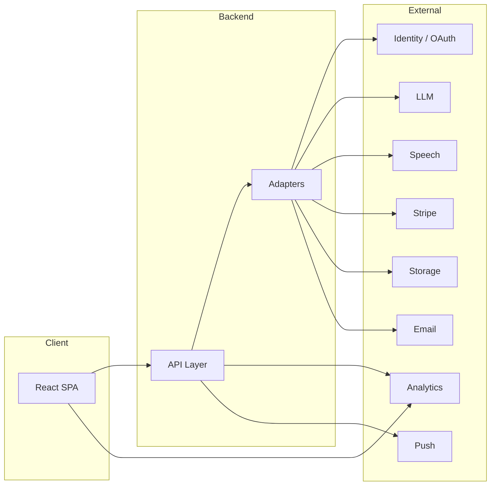

# Integration Architecture Overview

## Document Info

| Attribute | Value |
|-----------|--------|
| Version | 1 |
| Status | Draft |

---

## 1. Purpose

This document describes the **high-level integration architecture** for the AI Language Coach: where external systems sit relative to the frontend and backend, integration boundaries, and patterns used consistently across integrations.

---

## 2. Integration Boundary Principle

- **Rule**: The **backend** is the only component that holds **secrets** and calls **paid or sensitive external APIs** (LLM, Speech, Payments, Email, Storage, Push). The frontend never receives API keys for these.
- **Exceptions**: (1) **Analytics** — frontend may send events to the analytics provider using a **write-only** or **public** key (e.g. PostHog project API key or Sentry DSN) that is safe to expose in the bundle per provider docs. (2) **Feature flags** — client SDK key is designed for client exposure; server SDK key stays on backend. (3) **Web Push** — frontend needs **VAPID public key** to subscribe; private key stays on backend.
- **Identity**: Frontend sends credentials (email/password or OAuth redirect) to **our backend**; backend issues session or JWT. Backend may call OAuth provider (Google/Apple) to validate token or exchange code. Frontend never calls OAuth provider directly for server-side flows (or uses OAuth client-side only for login redirect, then backend validates).

---

## 3. Request Flow Patterns

### 3.1 Backend-Only Integration (LLM, Speech, Payments, Email, Storage)

1. Client calls **our API** (e.g. `POST /v1/conversation/turn`).
2. API validates auth and entitlement; forwards to internal service.
3. Service uses **adapter** to call external provider (LLM, Speech, etc.).
4. Adapter handles retry, timeout, circuit breaker; returns result or throws.
5. API returns response to client. **Client never sees provider API key or raw provider response** (only our DTO).

### 3.2 Webhook Ingestion (Stripe, optional: Push delivery status)

1. Provider sends HTTP POST to **our backend** webhook URL (e.g. `https://api.example.com/webhooks/stripe`).
2. Backend **verifies signature** (e.g. Stripe-Signature) before processing.
3. Backend processes idempotently (dedupe by event id); updates Entitlements/DB; returns 2xx.
4. No client involvement.

### 3.3 Frontend + Backend (Analytics, Feature flags, Web Push subscribe)

- **Analytics**: Frontend sends events (with optional user id after login); backend may also send server-side events (e.g. conversion). Identity merge (anonymous → authenticated) handled by provider or our backend linking anonymous id to user id.
- **Feature flags**: Frontend and backend each call provider with respective SDK keys; backend can override or seed context (user id, entitlement).
- **Web Push**: Frontend requests browser permission; gets push subscription (uses VAPID public key); sends **subscription object** to our backend; backend stores it and later sends via push service (e.g. web push library). Backend holds VAPID private key.

---

## 4. Adapter and Anti-Corruption

- **Adapter pattern**: Each external provider is called through an **adapter** (or facade) that:
  - Accepts our internal DTOs.
  - Translates to provider request format.
  - Calls provider (with retry/timeout/circuit breaker).
  - Maps provider response (or error) to our internal result or domain exception.
- **Anti-corruption**: Our domain model (e.g. "ConversationTurn", "Entitlement") is not the same as the provider's (e.g. Stripe Subscription object). We persist only what we need and map in the adapter or a dedicated mapping layer. Provider API changes are contained in the adapter.

---

## 5. Security and Secrets

- **Secrets**: All provider API keys and webhook secrets live in **environment variables** or a **secret manager** (e.g. AWS Secrets Manager, HashiCorp Vault). Never in code or client.
- **Frontend-safe values**: Only values explicitly designed for client exposure: Sentry DSN, PostHog project API key (if provider allows), Feature flag client SDK key, VAPID public key. Documented in integration-security-secrets.md.
- **TLS**: All outbound and inbound integration traffic over HTTPS. Webhook URLs must be HTTPS in production.

---

## 6. Observability

- **Logging**: Every outbound call to an external provider logs: provider name, operation, duration, success/failure (no PII in logs). Use a correlation id (request_id) so backend request and integration call can be traced together.
- **Metrics**: Count and latency per provider and operation (e.g. `integration_llm_requests_total`, `integration_llm_duration_seconds`). Failure rate and circuit breaker state.
- **Tracing**: If using OpenTelemetry, create a span for each external call; propagate trace id so integration latency appears in the same trace as the API request.

---

## 7. Failure and Degradation

- **Transient failures**: Retry with backoff (see integration-error-handling-and-retries.md). After N failures, **circuit breaker** can open; return 503 or fallback (e.g. "Voice unavailable, use text").
- **Permanent failures**: Do not retry indefinitely; log and alert; return clear error to client.
- **Degraded mode**: Where possible, define what "degraded" means (e.g. no TTS but text-only scenario still works). Document in each integration doc.

---

## 8. Environment and Isolation

- **Environments**: Development, Test, Staging, Production. Each has its own provider **sandbox/test** or **live** credentials where applicable (Stripe: test vs live keys; OpenAI: separate org or usage limits per env).
- **Local development**: Use env files (`.env.local`) or local secret store; never commit secrets. Prefer provider sandboxes for local (e.g. Stripe test mode, OpenAI test project).

---

## 9. Summary Table: Who Calls Whom

| Integration | Client → | Backend → | Webhook → Backend |
|-------------|-----------|------------|--------------------|
| Identity | Our API (login/signup) | OAuth provider (token exchange) | — |
| AI/LLM | Our API | LLM API | — |
| Speech | Our API (audio upload or stream) | STT/TTS/Pronunciation API | — |
| Payments | Our API (create session); redirect to Stripe Checkout | Stripe API (create session, customer) | Stripe → our URL |
| Push | Our API (register subscription) | Push service (send) | — |
| Media | Our API (get signed URL); direct upload to storage URL if used | Storage API (sign URL, list) | — |
| Analytics | Analytics provider (events) | Analytics provider (server events) | — |
| Observability | Sentry (errors) | Sentry / OTel (traces) | — |
| Email | — | Email provider API | — |
| Feature flags | Provider (evaluate) | Provider (evaluate) | — |
| Moderation | — | Moderation API or LLM | — |
| Geolocation | Browser API only | — | — |

---

## 10. References

- **Patterns**: integration-implementation-patterns.md
- **Secrets**: integration-security-secrets.md
- **Errors**: integration-error-handling-and-retries.md
- **Environments**: integration-environments.md
