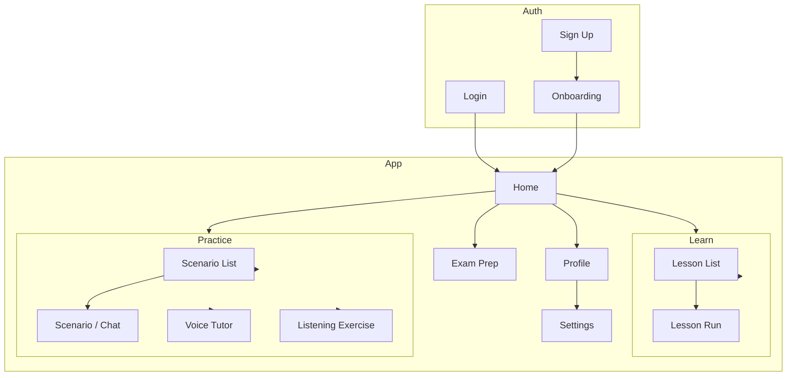

# UI/UX Architecture — Mobile-Web-First React + Vite

## Document Info

| Attribute | Value |
|-----------|--------|
| Phase | 6 – UI/UX Architecture |
| Status | **Final** |
| Source | ui-ux-architecture-v1.md; audit passed |

---

## 1. Purpose and Scope

This document defines the **UI/UX architecture** for the AI Dutch Coach client application: **mobile-web-first**, **React + Vite + TypeScript**, responsive and touch-optimized, with a path to React Native or native apps. It provides the structure needed for engineers to implement the frontend without rethinking the product model.

**In scope**: Screen inventory, navigation model, information architecture, page-level responsibilities, component taxonomy, state ownership, client-side caching, error/loading/empty states, responsive rules, permission flows, lesson and simulation UI patterns, audio patterns, accessibility, localization, PWA/offline, analytics instrumentation, design system foundations.

**Out of scope**: Visual design (colors, typography tokens in design system); backend API contracts (Backend doc).

---

## 2. Technical Stack and Delivery

| Aspect | Choice | Rationale |
|--------|--------|------------|
| **Framework** | React 18+ | Component model; ecosystem; future React Native alignment |
| **Build** | Vite | Fast dev and build; ESM; mobile-friendly bundles |
| **Language** | TypeScript | Type safety; refactor; API contracts |
| **Styling** | Tailwind CSS | Utility-first; responsive; design tokens; small bundle |
| **Delivery** | Mobile-web-first | Primary: phone viewport; responsive to tablet/desktop |
| **PWA** | Optional | Installable; service worker for static assets; offline shell or message |
| **Future** | Same API | React Native or native can reuse API; only view layer differs |

---

## 3. Information Architecture and Navigation Model

### 3.1 Top-Level Structure

### 3.2 Route Map (React Router)

| Route | Screen | Auth | Description |
|-------|--------|------|--------------|
| `/` | Landing or Home | Optional | Redirect: unauthenticated → landing/login; authenticated → home |
| `/login` | Login | No | Email/password or OAuth |
| `/signup` | Sign up | No | Registration |
| `/onboarding` | Onboarding | Yes | Profile, level, goals, consent (multi-step) |
| `/home` | Home | Yes | Dashboard: streak, XP, recommendations, nav |
| `/learn` | Learn | Yes | Lesson list / browse |
| `/learn/:lessonId` | Lesson Run | Yes | Single lesson (vocabulary, grammar, quiz) |
| `/practice` | Practice | Yes | Entry: scenarios, voice, listening |
| `/practice/scenario/:scenarioId` | Scenario Run | Yes | Chat simulation |
| `/practice/voice` | Voice Tutor | Yes | Voice conversation |
| `/practice/listening/:exerciseId` | Listening Run | Yes | Audio + questions |
| `/exam` | Exam Prep | Yes | Exam type and component list |
| `/exam/:component/:exerciseId?` | Exam Exercise | Yes | Reading/listening/speaking/writing/KNM practice |
| `/profile` | Profile | Yes | User info, streak, achievements |
| `/settings` | Settings | Yes | Profile edit, consent, subscription, help |
| `/reflection` | Daily Reflection | Yes | Add entries; view generated lesson (premium) |
| `*` | 404 | — | Not found |

- **Nested routes**: Optional (e.g. `/practice/*` for scenario/voice/listening). Layout component wraps authenticated routes (sidebar or bottom nav on mobile).

### 3.3 Navigation Model (Mobile)

- **Primary**: Bottom navigation bar (phone) with 4–5 items: Home, Learn, Practice, Exam, Profile (or combined "More").
- **Secondary**: Back, header actions (e.g. Settings from profile). No deep nested stacks beyond 2 levels where possible to avoid back confusion.
- **Modals**: Upsell (premium), consent prompts, permission requests (microphone, location). Dismissible; do not block without escape path.

---

## 4. Screen Inventory

| Screen | Purpose | Key Elements | FD / Journey |
|--------|---------|--------------|--------------|
| **Landing** | Marketing; sign up / log in CTA | Hero, value prop, CTA | — |
| **Login** | Authenticate | Email/password or OAuth | Auth |
| **Sign up** | Register | Form; link to login | Auth |
| **Onboarding** | Profile, level, goals, consent | Multi-step form; progress indicator | FD-01 |
| **Home** | Dashboard | Streak, XP, today progress, recommended next (lesson/scenario), nav | FD-10, Daily loop |
| **Learn** | Browse/start lessons | Lesson list or cards; filter by topic/level | FD-02 |
| **Lesson Run** | Do lesson | Cards, exercises, quiz; progress bar; exit/save | FD-02 |
| **Practice** | Choose practice type | Cards: Scenario, Voice, Listening | FD-03, FD-04, FD-05 |
| **Scenario Run** | Chat with AI | Chat UI; input; end button; AI indicated | FD-03 |
| **Voice Tutor** | Speak with AI | TTS area; record button; transcript optional; speed/replay | FD-04 |
| **Listening Run** | Audio exercise | Audio player; questions; submit; transcript after (IS-015) | FD-05 |
| **Exam** | Exam prep entry | List: Reading, Listening, Speaking, Writing, KNM | FD-09 |
| **Exam Exercise** | Single exam practice | Passage/audio + questions; timer optional | FD-09 |
| **Pronunciation Feedback** | Post-voice feedback | Score; tips; replay (FD-06) | FD-06 |
| **Feedback Summary** | Post-activity feedback | Scores (grammar, vocab, pronunciation, etc.); next steps | FD-11 |
| **Profile** | User and progress | Avatar, level, streak, achievements, settings link | FD-10 |
| **Settings** | Preferences and account | Profile edit, notifications, consent toggles, subscription, export/delete | FD-01, FD-12, BFR-008 |
| **Reflection** | Daily reflection | Add entry (note, photo, location); view "Your day" lesson | FD-07 |
| **Upsell / Paywall** | Premium conversion | Benefits; Start trial; restore | FD-12 |
| **404** | Not found | Message; link to home | — |

---

## 5. Page-Level Responsibilities

| Page | Responsibilities | State Owned | API Calls |
|------|------------------|-------------|-----------|
| **Home** | Render dashboard; fetch recommendations, streak, XP; route to learn/practice/exam | Recommendation list, streak, XP (server state) | GET /me, GET /home/recommendations, GET /gamification/summary |
| **Lesson Run** | Load lesson content; run flow (cards, quiz); submit progress; show feedback | Lesson content, current step, answers (local + submit) | GET /lessons/:id, POST /progress/lesson |
| **Scenario Run** | Load scenario; send/receive messages; enforce entitlement; end and get feedback | Messages (local + append); session id | GET /scenarios/:id, POST /conversation/turn, POST /conversation/end |
| **Voice Tutor** | Manage TTS/STT; send user audio/text to backend; show transcript; end session | Audio state, transcript, session id | POST /voice/start, POST /voice/turn, POST /voice/end |
| **Settings** | Load/save profile and consent; link to payment; trigger export/delete | Form state; consent toggles | GET/PATCH /profile, GET/PATCH /consent, POST /export, POST /delete-account |
| **Onboarding** | Multi-step form; validate; save partial; redirect to home on complete | Step index, form fields | POST /onboarding (partial or full) |

- **Server state**: Prefer single source of truth from API; cache with TTL (e.g. React Query or SWR). **Client state**: UI-only (modals, form draft, current step). **Ownership**: Page or layout owns route-level data; shared state (e.g. auth, entitlement) in context or store.

---

## 6. Component Taxonomy

### 6.1 Layers

| Layer | Examples | Responsibility |
|-------|----------|----------------|
| **Pages / Views** | HomePage, LessonRunPage, ScenarioRunPage | Route-level; fetch and pass data to sections |
| **Sections** | HomeRecommendations, LessonCardList, ChatThread | Logical blocks within a page |
| **Components** | Button, Card, Input, BottomNav, Header | Reusable UI; presentational or with minimal logic |
| **Patterns** | LessonCard, MessageBubble, AudioPlayer, PermissionGate | Domain-specific reusable (lesson, chat, audio, entitlement) |
| **Design primitives** | Text, Icon, Spacer, Container | Design system base |

### 6.2 Key Patterns

| Pattern | Use | Props (conceptual) |
|---------|-----|---------------------|
| **LessonCard** | Lesson list item | title, level, topic, progress, onStart |
| **MessageBubble** | Chat (user vs. AI) | message, isUser, timestamp; AI indicated (IS-016) |
| **AudioPlayer** | Listening exercise; TTS replay | src, onEnd, controls, noTranscriptDuring (IS-015) |
| **RecordButton** | Voice input | onStart, onStop, disabled (consent/entitlement) |
| **PermissionGate** | Wrap feature needing permission | permission (microphone, location), fallback, children |
| **EntitlementGate** | Wrap premium feature | feature, fallback (upsell), children |
| **UpsellModal** | Paywall | onClose, onStartTrial, source (e.g. cap_reached) |
| **ConsentCard** | Onboarding/settings | type, description, granted, onChange |

### 6.3 Design System Foundations

- **Tokens**: Colors (primary, secondary, background, surface, error, success); typography (scale, font family); spacing (4px base); radii; shadows. Tailwind config extends these.
- **Touch targets**: Minimum 44×44 px (IS-012). Spacing between tappable elements.
- **Accessibility**: Focus visible; aria-labels where needed; semantic HTML (buttons, links, headings). Respect `prefers-reduced-motion` (IS-013).
- **Localization**: All user-facing strings via i18n (e.g. react-i18next); keys by screen/component; BCP 47 locale (IS-024). RTL not required for NL/EN/DE.

---

## 7. State Ownership Strategy

| State Type | Owner | Example |
|------------|--------|---------|
| **Auth** | Global (context or store) | user, token, logout |
| **Entitlement** | Global; refetched on focus or after payment | isPremium, trialEnd, usage (lessons today) |
| **Route/Page data** | Page or layout | lesson content, recommendations, profile |
| **Form** | Local (component state or form lib) | onboarding steps, settings form |
| **UI** | Local | modal open, current step, loading |
| **Server cache** | React Query / SWR | lessons, scenarios, exam content; stale-while-revalidate |

- **No business logic in client**: Entitlement and usage limits enforced by API; client only shows/hides based on API response. **Optimistic UI**: Optional for non-critical actions (e.g. toggle consent); critical (payment, progress) wait for server.

---

## 8. Client-Side Caching Strategy

| Data | Strategy | TTL / Invalidation |
|------|----------|---------------------|
| **User / profile** | Cache after fetch; invalidate on profile update | Session or 5 min |
| **Entitlement** | Cache; invalidate on payment webhook (refetch on focus) | Short (1–2 min) or on window focus |
| **Recommendations** | Stale-while-revalidate | 5 min |
| **Lesson content** | Cache by lesson id | Long (content immutable) or until version change |
| **Static assets** | Service worker cache (PWA) | Cache-first for assets |
| **API errors** | No cache; retry with backoff | — |

- **Offline**: Show "You're offline" for API-dependent screens; optional: cache last lesson for read-only. No write when offline except queue (future).

---

## 9. Error, Loading, and Empty States

| State | Approach | Example |
|-------|----------|---------|
| **Loading** | Skeleton or spinner per section; avoid full-page spinner where possible | Home: skeleton cards for recommendations |
| **Empty** | Clear message + CTA | No lessons yet: "Complete onboarding" or "Start your first lesson" |
| **Error (network)** | Inline or toast: "Something went wrong. Try again." + Retry | Lesson load failed |
| **Error (auth)** | Redirect to login; optional message | 401 → /login |
| **Error (entitlement)** | Show upsell modal instead of feature | Access voice → paywall |
| **Partial** | Show what’s available; explain missing | E.g. recommendations without streak if streak API failed |

- **No silent failures**: User must see feedback for critical actions (submit lesson, send message, start trial).

---

## 10. Permission Flows

| Permission | When Asked | UI | If Denied | Persistence |
|------------|------------|-----|-----------|-------------|
| **Microphone** | First time user starts voice (FD-04) or pronunciation (FD-06) | In-context modal or system prompt; explain why | Message: "Voice needs microphone"; offer text scenario or settings link | Consent flag in profile (BFR-009); device permission separate |
| **Location** | When user enables "Location tips" in settings (FD-08) | Settings toggle + system prompt; explain use and retention | Feature off; can re-enable in settings | BR-3; short retention (Data doc) |
| **Notifications** | Onboarding or first time "Remind me" | Optional step or modal; explain | No push; in-app only | Consent flag; push token stored if granted |
| **Photo / Media** | When user adds photo in reflection (FD-07) | In-context when tapping "Add photo" | Cannot add photo; note-only reflection | Consent flag; IS-018 |

- **Re-request**: Do not repeatedly prompt if user denied; provide Settings path to change. **Transparency**: Short copy explaining why each permission is needed and that it can be turned off (BFR-009).

---

## 11. Lesson and Simulation UI Patterns

### 11.1 Lesson Run (FD-02)

- **Layout**: Full-screen or near full-screen content; progress bar at top; one primary CTA (Next, Submit).
- **Cards**: One card per step (vocab, grammar, multiple choice); swipe or tap Next. **Quiz**: Questions one by one or list; submit at end; show score and correct answers.
- **Exit**: "Exit" or back; confirm if mid-lesson ("Progress will be saved up to last checkpoint").

### 11.2 Scenario / Chat (FD-03)

- **Layout**: Message list (scroll to bottom); input at bottom (text); send button. **AI indicated**: Label or icon "AI" on assistant messages (IS-016).
- **Input**: Text only for text scenario; optional voice button if scenario supports voice (FD-04). **End**: "End conversation" → feedback summary (FD-11).

### 11.3 Voice Tutor (FD-04)

- **Layout**: Area for TTS playback (waveform or static visual); large record button; optional transcript below. **Controls**: Speed, Replay last sentence. **End**: "End" → summary and optional pronunciation feedback (FD-06).

### 11.4 Listening (FD-05)

- **Layout**: Audio player (play, pause, seek); no transcript during attempt (IS-015). Questions below; submit when done. **After submit**: Show score and optional transcript (accessibility, IS-015).

---

## 12. Audio Recording and Playback Patterns

| Pattern | Use | Notes |
|---------|-----|--------|
| **Record** | Voice input (STT) | Get stream from getUserMedia; send chunks or full blob to API; show recording indicator. Handle denied permission. |
| **Playback (TTS)** | AI response in voice tutor | Play audio URL or stream from API; show loading until first byte; replay button. |
| **Playback (listening)** | Pre-recorded exercise audio | Audio element or same; controls; no transcript during attempt. |
| **Feedback** | Pronunciation (FD-06) | Play user recording back optional; show score and tips. |

- **Latency**: Loading state while waiting for TTS/STT; consider streaming for TTS. **Errors**: "Audio failed to load. Try again."

---

## 13. Responsive Behavior and Constraints

| Viewport | Behavior |
|----------|----------|
| **Phone (default)** | Single column; bottom nav; full-screen lesson/chat. Max width ~428px for content where appropriate. |
| **Tablet** | Same structure; optional side nav or wider content area. Touch targets still ≥44px. |
| **Desktop** | Centered content max-width; same routes and components. Not primary but supported. |

- **Constraints**: Mobile web may not have background location; location prompts may fire "on next open" near venue (FD-08). **Orientation**: Support portrait and landscape; critical UI (e.g. record button) visible in both.

---

## 14. UX Guidelines: Short vs. Long Sessions

| Session Type | Guideline |
|--------------|-----------|
| **Micro-learning (short)** | One lesson or one scenario = 5–15 min. Clear "Done" and reward (XP, streak). Next CTA obvious. |
| **Long (voice, exam sim)** | Allow pause or save; show progress. Warn before exit ("Progress saved"). |
| **Re-engagement** | First action after lapse should be low friction (one lesson or one flashcard set). |

---

## 15. Offline and Degraded Mode

| Scenario | Behavior |
|----------|----------|
| **Offline** | Show "You're offline" on API-dependent screens; do not allow submit. Optional: cached static and last lesson read-only. |
| **Slow network** | Loading states; timeouts after N s with Retry. |
| **PWA installed** | Service worker caches static assets; app shell loads; API calls still require network. |
| **No microphone** | Voice and pronunciation disabled or text fallback (FD-04). |
| **No location** | Location tips off (FD-08). |

---

## 16. Accessibility (Summary)

- **WCAG 2.1 AA** (IS-011): Contrast, focus, labels, errors. **Touch targets** ≥44px (IS-012). **Reduced motion** (IS-013). **Audio**: Text alternatives for non-listening audio (IS-014); listening exercises may omit transcript during attempt (IS-015). **Semantic structure**: Headings, landmarks, live regions for dynamic content (e.g. chat).

---

## 17. Localization-Ready Frontend

- **i18n**: All strings via keys (e.g. `t('home.title')`). Locale from user preference or browser; BCP 47 (IS-024). **Date/number**: Format by locale (IS-022). **RTL**: Not in initial scope; document if added later.

---

## 18. Analytics Instrumentation Points

| Event | When | Payload (conceptual) |
|-------|------|----------------------|
| **screen_view** | Route change | screen_name, previous_screen |
| **onboarding_step** | Onboarding step complete | step_id, duration |
| **lesson_start** | Lesson Run opened | lesson_id, source |
| **lesson_complete** | Lesson submitted | lesson_id, score, duration |
| **scenario_start / end** | Scenario opened / ended | scenario_id, turns |
| **voice_session_start / end** | Voice started / ended | duration |
| **trial_start** | Trial started | source |
| **entitlement_check** | Paywall shown | feature, reason (cap, direct) |
| **consent_update** | Consent changed | type, granted |

- **No PII in payloads**; user id hashed or server-side only per policy. **BFR-013**: Conversion funnel events (trial_start, payment_success, etc.) required for backend.

---

## 19. Premium Upsell and Onboarding Flows

- **Upsell surfaces**: (1) When free user hits lesson or scenario cap (FD12-FR-003). (2) When user taps premium-only feature (EntitlementGate fallback). (3) After high-engagement moment (e.g. first scenario done) — soft CTA. **Upsell modal**: Benefits; "Start free trial"; "Restore purchase" if applicable; dismissible. **Onboarding**: No paywall during onboarding; first paywall only after value (e.g. after first lesson or first cap).

---

## 20. Assumptions and Dependencies

- **Assumptions**: React Router (or similar) for routing; one of React Query/SWR for server state; Tailwind for styling. Design tokens and component library can start minimal and grow. **Dependencies**: Backend API (auth, profile, lessons, conversation, voice, entitlement); User Workflows doc; Feature Domain (FD-*); Industry (IS-011–IS-015, IS-020–IS-022, IS-024).

---

## 21. Requirements Traceability

| Requirement | Where in UI |
|-------------|-------------|
| IS-011 (WCAG 2.1 AA) | Design system; focus, contrast, labels; §16 |
| IS-012 (touch 44px) | Design system; §6.3 |
| IS-013 (reduced motion) | CSS prefers-reduced-motion; §6.3 |
| IS-014, IS-015 (audio) | AudioPlayer; no transcript during listening; §11.4, §12 |
| IS-016 (AI indicated) | MessageBubble; scenario/voice labels; §6.2, §11.2 |
| IS-020–IS-022, IS-024 (i18n, BCP 47) | §17; i18n and locale |
| BFR-009 (consent) | ConsentCard; PermissionGate; §10 |
| FD-12 (entitlement) | EntitlementGate; UpsellModal; §6.2, §19 |
| ARCH-002 (single API) | All data via API client; no direct external calls for product data |

---

## 22. Open Questions

| ID | Question | Owner |
|----|----------|--------|
| OQ-1 | Bottom nav: 4 vs. 5 items (e.g. separate Exam vs. under Practice)? | Product |
| OQ-2 | PWA: Offline shell with "You're offline" only, or cache last lesson? | Product / Engineering |
| OQ-3 | State library: Context only vs. Zustand/Redux for auth and entitlement? | Engineering |
