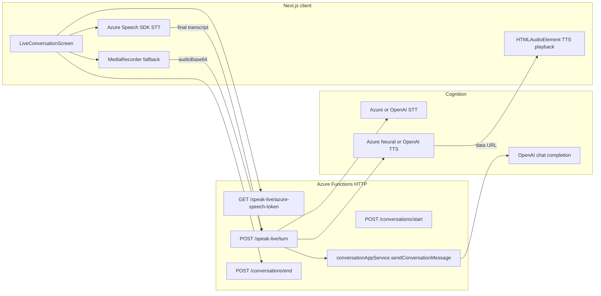

# Speak Live — architecture

## Overview

## Backend modules (actual paths)

| Document name | Implementation |
|-----------------|----------------|
| `LiveSessionController` | HTTP routes in `backend/src/http/registerHttpFunctions.ts` (`speak-live/*`, `conversations/*`) |
| `LiveSpeechRecognitionService` | `getSpeechToTextService()` → `azureSpeechToTextService` / `openAiSpeechToTextService` |
| `LiveConversationOrchestrator` | `conversationAppService.sendConversationMessage` + Speak Live prep (`speakLive` block, FSM) |
| `ScenarioGroundingService` | `domain/speakLive/*` (`speakLiveFsm`, `scenarioIntentGrounding`, train station slots) |
| `TurnEvaluationTurn` | `messages/enrich` + pronunciation paths (optional per product) |
| `LiveRecapService` | `endConversation` + `trainStationLiveRecapInput` / summary builders |
| `AzureSpeechPlaybackService` | `speakLiveTtsGateway.generateSpeakLiveAssistantSpeech` + `azureNeuralReferenceTts` |

## Key routes

- `POST /api/conversations/start` — begins thread; `conversationSurface: 'speak_live'` seeds `SpeakLiveStateJson`.
- `GET /api/speak-live/azure-speech-token` — subscription token for browser SDK (short TTL).
- `POST /api/speak-live/turn` — **either** `transcript` **or** `audioBase64`+`mimeType` → LLM turn → TTS.
- `POST /api/conversations/{threadId}/end` — recap / structured summary for UI.

## Latency strategy

1. **Show partial text immediately** from Azure `recognizing` events.
2. **Show “Thinking”** as soon as the user commits a turn (before HTTP returns).
3. **Stream assistant text** — v1 returns full text with turn response; optional future NDJSON reuse from text chat.
4. **Play TTS** as soon as `audioUrl` is available; text is already on screen.
5. **Server-side** caps long assistant strings before TTS (`SPEAK_LIVE_TTS_MAX_CHARS`).

## Failure handling

| Failure | Behavior |
|---------|-----------|
| Azure token 503 | Client disables browser STT for session; MR + server STT used. |
| `/speak-live/turn` 400 empty transcript | Return to idle; user retries. |
| TTS / audio element error | `audio_failed` banner; user can dismiss and retry. |
| Network slow | “Still working…” after ~2.4s while `processing`. |

## Security

- Azure **subscription key** never ships to the browser; only **issued token** + region.
- OpenAI keys remain server-side only.
