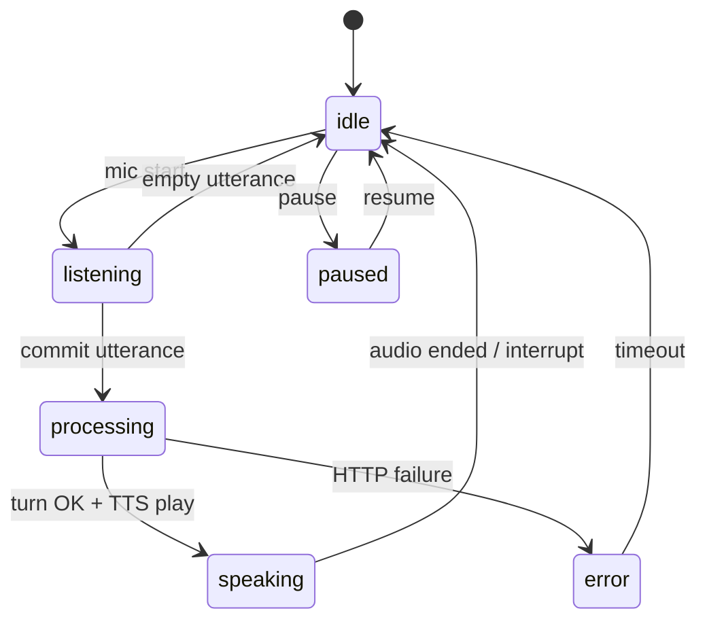

# Speak Live — client & server state machines

## Client UI states (`LiveSessionStatus`)

| State | Meaning | User-visible |
|-------|---------|--------------|
| `idle` | Ready for next utterance | Mic idle |
| `listening` | Capturing speech | Partial transcript, timer |
| `processing` | `POST /speak-live/turn` in flight | “Assistant is replying…” |
| `speaking` | Playing assistant audio | Status badge **Speaking** |
| `paused` | User paused | Mic disabled until resume |
| `ended` | Reserved for future explicit session end UI | — |
| `error` | Recoverable error | Short error state → idle |

### Transitions (simplified)

**Interrupt**: from `speaking` or `processing`, user can stop audio / abandon in-flight request (client stops audio; in-flight fetch may still complete — server idempotency is message-append per turn).

## Server Speak Live FSM (persisted)

Persisted in `ConversationThreads.SpeakLiveStateJson` (see migration `004_speak_live_fsm_state.sql`). Phases include `greeting`, `intent_detection`, `clarification`, `execution`, `closing` with **deterministic merges** of model `speakLiveSignals` and scenario slot detectors (train station).

The HTTP voice loop **does not replace** this FSM: each `speak-live/turn` calls the same `sendConversationMessage` path as text, so **one thread** accumulates grounded history for recap.

## End-session sheet (UX branch)

| Choice | Action |
|--------|--------|
| End and evaluate | `POST .../end` → navigate recap |
| Continue talking | Close sheet |
| Save on device + exit | LocalStorage bookmark + exit Talk hub |

## Phase 2 ideas

- WebSocket or gRPC streaming for **server-push partial STT** (no browser SDK).
- **pronunciation assessment** on same audio clip parallel to turn.
- **Voice picker** plumbed from client → `speakLiveTurn` → TTS voice SSML.
