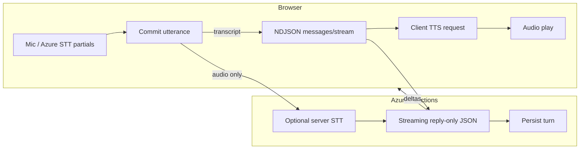

# Live speech latency optimization

This document describes how FluentCopilot Speak Live reduces **real** and **perceived** latency for voice turns.

## Architecture (after optimization)

### Key behaviors

1. **Partials while listening** — Azure Speech SDK `recognizing` updates the “Hearing you” caption immediately.
2. **Faster phrase end (Azure browser STT)** — See [Azure browser STT endpointing](#azure-browser-stt-endpointing) below.
3. **Transcript path does not block on TTS** — When a final transcript exists, the client calls `POST …/messages/stream`, renders assistant text (and streaming deltas), then starts **TTS in a non-blocking async** while the UI shows status `replying` (“Reply on screen — loading Dutch voice…”).
4. **Audio-only path** — Still uses `POST /speak-live/turn` (server STT + bundled LLM + TTS). Heavier; prefer browser/Azure STT when possible.
5. **Shorter model output for Speak Live** — `AI_CONVERSATION_SPEAK_LIVE_REPLY_MAX_OUTPUT_TOKENS` (default **340**, range 120–720) applies to Stage A when `speakLive` context is present. Prompt adds **brevity** rules (2–3 short Dutch sentences).
6. **Shorter TTS input** — Server and client cap assistant text sent to TTS (~**1200** chars) for live turns.

## Instrumentation

### Client: `LiveSpeechTurnTimer`

Defined in `src/features/speak-live/live/liveSpeechLatencyTrace.ts`.

- Anchor: `performance.now()` when the mic arms successfully (`beginListening`).
- Fields: first partial, final transcript, prepare-audio duration, server STT duration, LLM request → first delta → done, TTS start/end, playback start, **total**, **bottleneck** (heuristic).
- **DEV**: `console.info('[LiveSpeechLatency]', trace)` on `finish()`.
- **DEV UI**: expanded “Dev debug” shows **Latency (last turn)** plus full JSON (`lastLatencyTrace`).

### Server

Existing `perf` snapshots on HTTP handlers remain; extend later with token estimates if needed.

## What stayed out of the hot path (by design)

- **Enrichment** (coaching, save words, long summary) still runs **after** the turn via `/messages/enrich` — not before the assistant reply.
- **Heavy pronunciation / recap / evaluation** — post-session or separate endpoints; not inlined before the live reply.

## Remaining bottlenecks

| Area | Notes |
|------|--------|
| LLM | Largest variable; tune `OPENAI_MODEL_CONVERSATION` / Azure deployment, prompts, `AI_CONVERSATION_SPEAK_LIVE_REPLY_MAX_OUTPUT_TOKENS`, recent message window (`AI_CONVERSATION_RECENT_MESSAGES_MAX`). |
| Server STT | WebM path on Functions can be slow; browser transcript path avoids it. |
| TTS | Network + provider; text is already visible while audio generates. |
| Cold start | First Azure Functions invocation after idle. |

## Files touched (latency work)

- `src/features/speak-live/live/liveSpeechLatencyTrace.ts` — trace + timer + bottleneck.
- `src/features/speak-live/live/LiveConversationScreen.tsx` — decoupled TTS, timers, UI states, dev panel.
- `src/features/speak-live/live/useLiveSpeakStt.ts` — Time segmentation, silence timeouts, `speechStart` / `speechEnd` / finals **DEV logs** (`[SpeakLiveAzureStt]`).
- `src/lib/api/apiConfig.ts` — `getSpeakLiveAzure*()` tunables for browser Azure STT (`NEXT_PUBLIC_SPEAK_LIVE_*`).
- `src/features/speak-live/live/liveSpeakTypes.ts`, `LiveStatusBadge.tsx`, `LiveTranscriptThread.tsx`, `LiveSessionControls.tsx` — `replying` status + copy.
- `src/lib/api/conversationClient.ts` — `onFirstStreamDelta`.
- `backend/src/services/ai/config/aiProviderConfig.ts` — Speak Live reply token cap.
- `backend/src/services/ai/providers/OpenAiConversationAiProvider.ts`, `AzureOpenAiConversationAiProvider.ts` — use cap for reply-only.
- `backend/src/domain/speakLive/speakLiveFsmPrompt.ts` — brevity instruction.
- `backend/src/services/speak-live/speakLiveTurnService.ts` — TTS char cap.

See also [live-speech-performance-budgets.md](./live-speech-performance-budgets.md).

## Azure browser STT endpointing

Speak Live can use the **Azure Speech SDK in the browser** (`NEXT_PUBLIC_SPEAK_LIVE_BROWSER_AZURE_STT=1`) for **continuous** recognition: `recognizing` (partials) and `recognized` (final segments). Final transcript commit latency is dominated by **how much trailing silence** the service requires before emitting a final result, plus `stopContinuousRecognitionAsync` when the learner releases the mic.

### Defaults (tuned for short Dutch scenario replies)

| Setting | Property | Default | Role |
|--------|----------|---------|------|
| Segmentation strategy | `Speech_SegmentationStrategy` | **Time** | Predictable silence-based phrase end (vs `Default` / `Semantic`). |
| Segmentation silence | `Speech_SegmentationSilenceTimeoutMs` | **380 ms** | Silence after the last word before a **final** `recognized` event. Lower → faster commit, higher risk of splitting on a short breath. |
| End silence | `SpeechServiceConnection_EndSilenceTimeoutMs` | **~seg + 22%** (floor/ceiling clamp **340–720**) | Service trailing silence; aligned with segmentation unless overridden. |
| Initial silence | `SpeechServiceConnection_InitialSilenceTimeoutMs` | **12000 ms** | How long the mic can stay open before the **first** word without “no match”; kept generous so learners can think before short answers. |
| Max phrase (Time strategy) | `Speech_SegmentationMaximumTimeMs` | **60000 ms** | Longer monologues: service may shorten required silence as phrase length approaches this cap (per Azure docs). |

**Previous tuning:** segmentation was **520 ms** and end silence `min(1200, seg+200)`. The new pair is **tighter** so finals arrive sooner after the learner stops, while **InitialSilence** stays high to protect *“mic open, then speak”* for short answers.

### Environment overrides (client)

| Variable | Range / values | Purpose |
|----------|----------------|---------|
| `NEXT_PUBLIC_SPEAK_LIVE_SEGMENTATION_SILENCE_MS` | 280–900 | Primary endpointing knob. |
| `NEXT_PUBLIC_SPEAK_LIVE_END_SILENCE_TIMEOUT_MS` | 300–1200 | Explicit end-silence; when unset, derived from segmentation. |
| `NEXT_PUBLIC_SPEAK_LIVE_INITIAL_SILENCE_MS` | 5000–30000 | Longer thinking pause before first word. |
| `NEXT_PUBLIC_SPEAK_LIVE_SEGMENTATION_MAX_PHRASE_MS` | 8000–120000 | Long-answer / question-style monologue ceiling for Time strategy. |
| `NEXT_PUBLIC_SPEAK_LIVE_SEGMENTATION_STRATEGY` | `Default` \| `Time` \| `Semantic` | `Semantic` may improve boundary quality but can add latency; default **`Time`** for snappy commits. |
| `NEXT_PUBLIC_SPEAK_LIVE_STT_DEV_LOG` | `1` / `true` | Enables `[SpeakLiveAzureStt]` logs in non-dev builds (optional). |

### Tradeoffs

- **Shorter segmentation (e.g. 320–380 ms):** best for **short** replies (“Ja”, “Spoor vier”, “Hoe laat?”). Risk: **premature phrase end** on micro-pauses mid-sentence or between compound words.
- **Medium (380–480 ms):** balance for **question-style** lines and short clauses (recommended default **380**).
- **Longer (520–700 ms):** safer for **hesitant** delivery; noticeably slower end-of-utterance feel.
- **`Semantic` strategy:** can reduce bad splits on incomplete questions; typically **not** the first choice when optimizing for **time-to-final**.

### DEV-only live perf overlay

In **development** builds only, Speak Live shows a floating **“Live perf”** control (bottom-right, collapsible) with the last turn’s `LiveSpeechLatencyTrace` (partial/final transcript timing, LLM, TTS, playback, total, bottleneck, LLM→text, text→audio, model label, prompt size estimate) plus optional **`done.perf`** server deltas. **Production:** the component returns `null` (`NODE_ENV === 'production'`).

Code: `src/features/speak-live/live/LiveSpeechPerfOverlay.tsx`, wired from `LiveConversationScreen.tsx`. Stream `done` may include `speakLiveStreamMeta` (`stageAModelLabel`, `replyPromptCharsEstimate`) for the overlay trace fields.

### DEV instrumentation

When `NODE_ENV=development` or `NEXT_PUBLIC_SPEAK_LIVE_STT_DEV_LOG=1`, the client logs **`[SpeakLiveAzureStt]`** with:

- `recognize_config` — timeouts and strategy at session start  
- `session_started`  
- `speech_start_detected`  
- `first_partial` — first non-empty partial (includes deltas vs speech start)  
- `speech_end_detected`  
- `final_recognized` — per final segment (char count, not full text)  
- `session_stop_commit` — joined transcript length, **`utteranceDurationMs`**, `speechStartToStopMs`, `firstPartialToStopMs`, and the **silence timeouts** used for that session  

Code: `src/features/speak-live/live/useLiveSpeakStt.ts`, timeouts in `src/lib/api/apiConfig.ts`.
