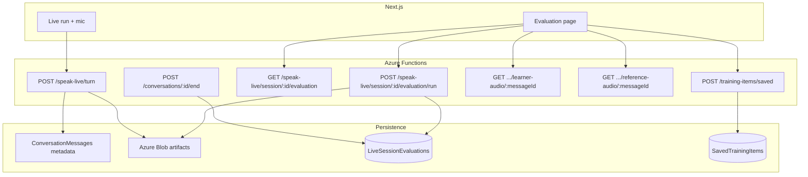

# Speak Live — post-session voice evaluation

## Purpose

After a **Speak Live** session ends, learners receive a **voice coach report** (not a text-only recap): session-level scores, per-turn playback (learner + reference Dutch), Azure-backed pronunciation/fluency signals where audio exists, LLM coaching grounded in transcript + scenario recap, and actions to **save drills** into the training queue.

## Architecture

## Flow

1. **During session** — `POST /speak-live/turn` may send **both** `transcript` and `audioBase64` so the server can skip STT while still **storing learner audio** on the user message (`metadata.learnerAudioBlobPath`).
2. **End session** — `POST /conversations/:id/end` writes the recap summary to the thread and seeds **`LiveSessionEvaluations`** as `pending` for Speak Live threads.
3. **Evaluation page** — `GET /speak-live/session/:threadId/evaluation` returns status; the client calls **`POST .../evaluation/run`** once, then polls until `complete` or `failed`.
4. **Pipeline** (orchestrator) — For each learner user message: optional **Azure pronunciation assessment** (open response) + timing-derived rhythm/naturalness heuristics + **LLM session JSON** + **reference TTS** (Azure/OpenAI via existing Speak Live TTS gateway). Result JSON is stored in SQL.
5. **Playback** — Learner clip via blob path; reference clip prefers persisted blob, else inline `data:` URL from TTS.

## Routes

| Layer | Method | Path |
|-------|--------|------|
| Next.js | GET | `/app/talk/live/session/:sessionId/evaluation` |
| API | GET | `/api/speak-live/session/:threadId/evaluation` |
| API | POST | `/api/speak-live/session/:threadId/evaluation/run` |
| API | GET | `/api/speak-live/session/:threadId/learner-audio/:messageId` |
| API | GET | `/api/speak-live/session/:threadId/reference-audio/:messageId` |
| API | POST | `/api/training-items/saved` |

`sessionId` in the product URL is the **conversation thread id** (UUID).

## Environment

- **Azure Speech** (pronunciation + optional TTS): same variables as existing pronunciation / Speak Live TTS paths.
- **Blob storage** (`AZURE_STORAGE_CONNECTION_STRING`): required for durable learner/reference audio; without it, evaluation still runs but learner playback may be absent and reference audio may remain inline only.

## Operational notes

- Long sessions: evaluation is **synchronous** inside `POST .../evaluation/run` — for very long threads consider moving work to a queue (future enhancement).
- **Retry**: failed rows can be re-run; the client exposes **Retry** which triggers another `POST .../evaluation/run`.

## Related docs

- [live-voice-evaluation-schema.md](./live-voice-evaluation-schema.md) — JSON contracts.
- [live-voice-save-for-later.md](./live-voice-save-for-later.md) — training queue + Library linkage.
