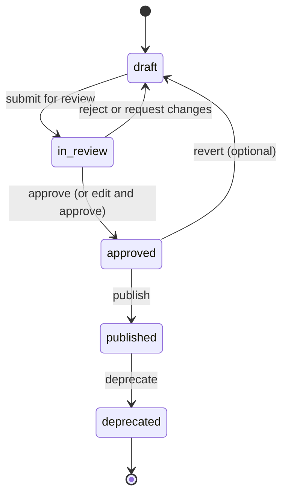

# Content Publishing Flow

## 1. Purpose

This document defines how content is **promoted** from draft → reviewed → approved → published → deprecated: versioning strategy, rollback support, content release batches, targeting rules, and backward compatibility. It aligns with the existing content-release-process and content versioning.

## 2. Scope

- **In scope**: Status transitions; versioning (linear version, content_version snapshot); rollback; release batches; targeting (locale, level, segment); backward compatibility for in-progress learners.
- **Out of scope**: Actual deployment or CDN invalidation (release pipeline); only engine and content-store contract.

## 3. Status Transitions

- **draft**: Created by engine or author; not visible in production.
- **in_review**: In review queue; not visible in production.
- **approved**: Human or auto-approved; ready to publish; not yet live.
- **published**: Live; has content_version snapshot; served to users.
- **deprecated**: Superseded or retired; may still be served for sessions that started on old version.

## 4. Versioning Strategy

- **Entity version**: Each content entity has a linear version number (integer); incremented on every update (draft or published).
- **content_version**: On publish, a snapshot row is created in content_versions (entity_type, entity_id, version, snapshot_payload, published_at, published_by). This allows rollback by re-pointing “current” to a previous version or by restoring snapshot.
- **Immutability**: Published content is not edited in place; edits create new version (draft) and then new publish.

## 5. Rollback Support

- **Rollback**: Create new content_version pointing to previous snapshot, or mark current as deprecated and “restore” previous version as current. Existing sessions that started with old version continue to use that version (session-level version pinning).
- **Engine role**: Engine does not perform rollback; it only produces content and registers publish candidates. Rollback is performed by release/admin process that updates content_versions and status.

## 6. Content Release Batches

- **Batch**: A set of artifacts (e.g. 50 vocabulary packs, 10 dialogues) approved together and published in one release.
- **Release batch id**: Optional; link PublishRecords to a release_batch_id so that “publish release X” can roll back all of X if needed.
- **Engine**: When completing review with “approve”, engine (or review service) can assign release_batch_id to PublishRecord; actual “go live” and cache invalidation happen in content-release-process.

## 7. Targeting Rules

- **locale**: Content is published per locale; e.g. nl, en-GB.
- **cefr_level**: Optional; content may be targeted to level (A1–B2) for recommendation.
- **segment**: Optional; e.g. “integration_exam”, “daily_life”; used for filtering in discovery.
- **Engine**: Artifacts carry locale, cefr_level, scenario_id, topic; publish record stores these; release process may use them for targeting (e.g. only show to certain segments).

## 8. Backward Compatibility

- **In-progress learners**: When a lesson or exercise is updated and republished, learners who already started the lesson see the version at session start (version pinning). New learners get the latest published version.
- **Engine**: Engine produces new versions; it does not manage session pinning (runtime/backend responsibility).

## 9. PublishRecord (Recap)

- **artifact_type**, **artifact_id**, **content_version_id** (after snapshot created), **published_at**, **published_by**, **release_batch_id** (optional), **targeting_rules** (optional).

## 10. Dependencies

- docs/final/data/content-versioning.md
- docs/final/pipelines/content-release-process.md
- content-artifact-model.md
- content-review-queue-design.md

## 11. Recommended Decisions

- Engine (or review completion handler) creates PublishRecord when decision = approve; release pipeline picks up approved/publish candidates and performs content_version snapshot, status update, cache invalidation.
- Version number is incremented on entity when publish is applied (or when draft is updated); content_versions store full snapshot for rollback.
