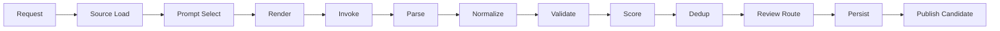

# Generation Pipeline Architecture

## 1. Purpose

This document defines the **generation pipeline** in stages: from request formation through source loading, prompt selection, rendering, model invocation, structured output parse, normalization, validation, scoring, deduplication, review routing, persistence, and publish candidate registration. The pipeline is the core orchestration of the content generation engine.

## 2. Scope

- **In scope**: Stage-by-stage flow; inputs/outputs per stage; interfaces between stages; error handling; batch vs single-item; resumability (for batch); idempotency where applicable.
- **Out of scope**: Implementation of external services (LLM, DB); only contracts and flow.

## 3. Pipeline Stages (Overview)

| Stage | Name | Input | Output | Failure behavior |
|-------|------|-------|--------|------------------|
| 1 | Request formation | Trigger, params | GenerationRequest | Invalid params → 400, no continue |
| 2 | Source data loading | GenerationRequest | SourceData | Missing data → fail or partial |
| 3 | Prompt selection | Request, use_case | PromptTemplateRef | Missing template → 404 |
| 4 | Prompt rendering | Template, variables | RenderedPrompt | Missing var → fail |
| 5 | Model invocation | RenderedPrompt, config | RawModelResponse | Retry then fail |
| 6 | Structured output parse | Raw response, output_schema | ParsedOutput \| ParseError | Retry once then fail |
| 7 | Normalization | ParsedOutput | NormalizedArtifact(s) | Schema error → fail |
| 8 | Rule validation | NormalizedArtifact(s) | ValidationReport | Continue; report attached |
| 9 | Scoring | Artifact + report | QualityScore | Always produce score |
| 10 | Deduplication | Artifact(s) | Deduplicated list | Optional; drop or merge dupes |
| 11 | Review routing | Artifact, score, policy | ReviewQueueItem \| AutoApprove | Always route or auto-approve |
| 12 | Persistence | Artifact(s), provenance | StoredArtifact (ids) | DB error → fail, retry per policy |
| 13 | Publish candidate registration | StoredArtifact, decision | PublishRecord (when approved) | Only when approved |

## 4. Stage Details

### 4.1 Request Formation

- **Input**: Trigger (e.g. CLI args, API body, job config), params (artifact_type, locale, cefr_level, scenario_id, max_items, etc.).
- **Logic**: Validate params against a request schema; resolve defaults; build GenerationRequest.
- **Output**: GenerationRequest { id?, artifact_type, locale, params, batch_id?, priority? }.
- **Failure**: Invalid or missing required params → return validation error; pipeline stops.

### 4.2 Source Data Loading

- **Input**: GenerationRequest.
- **Logic**: Load scenario, vocabulary, templates, or other context needed for prompt variables (e.g. scenario goals, key_phrases, existing vocab for dedup).
- **Output**: SourceData { scenario?, vocabulary?, templates?, ... }.
- **Failure**: Critical source missing (e.g. scenario not found) → fail request; optional sources missing → continue with partial data.

### 4.3 Prompt Selection

- **Input**: GenerationRequest (use_case, artifact_type), optionally locale.
- **Logic**: Look up template by use_case and artifact_type; resolve version (latest active or specified).
- **Output**: PromptTemplateRef (code, version, body, input_schema, output_schema, constraints, safety).
- **Failure**: No template → 404; pipeline stops.

### 4.4 Prompt Rendering

- **Input**: PromptTemplateRef, variables (from request + source data), input_schema.
- **Logic**: Validate variables against input_schema; inject into template body; produce system_prompt if any.
- **Output**: RenderedPrompt { prompt, system_prompt?, max_tokens, temperature }.
- **Failure**: Validation or missing required var → fail.

### 4.5 Model Invocation

- **Input**: RenderedPrompt, model config (model_id, provider).
- **Logic**: Call provider.invoke(...); log usage; apply retry/fallback per prompt-execution-framework.
- **Output**: RawModelResponse { raw_response, model_id, usage, finish_reason }.
- **Failure**: Timeout, error, rate limit after retries → fail; no persist.

### 4.6 Structured Output Parse

- **Input**: RawModelResponse.raw_response, output_schema (Zod/JSON Schema).
- **Logic**: Extract JSON; validate against output_schema; map to typed ParsedOutput<T>.
- **Output**: ParsedOutput<T> or ParseError.
- **Failure**: Parse or schema validation fail → retry once with “valid JSON only”; if still fail, return ParseError; pipeline stops for this item.

### 4.7 Normalization

- **Input**: ParsedOutput<T>.
- **Logic**: Map parsed shape to engine artifact type(s); assign client_generated_id if not present; set locale, cefr_level, scenario from request; ensure required fields.
- **Output**: NormalizedArtifact | NormalizedArtifact[].
- **Failure**: Required field missing or wrong type → fail; no persist.

### 4.8 Rule Validation

- **Input**: NormalizedArtifact(s).
- **Logic**: Run validators: schema, pedagogy, safety, duplication, CEFR, scenario completeness, etc. (see content-validation-and-quality-gates.md).
- **Output**: ValidationReport { passed, checks[], overall_score?, artifact_ref }.
- **Failure**: Validation does not stop pipeline; report is attached; downstream may reject persist if passed=false.

### 4.9 Scoring

- **Input**: NormalizedArtifact(s), ValidationReport.
- **Logic**: Compute quality score from report and optional heuristics (length, diversity, etc.).
- **Output**: QualityScore per artifact; attached to artifact for review routing.

### 4.10 Deduplication

- **Input**: NormalizedArtifact(s), optional existing store or in-batch set.
- **Logic**: Compare against existing content (e.g. same lemma+locale) or within batch; drop or merge duplicates.
- **Output**: Deduplicated list of artifacts; optional dedup report.

### 4.11 Review Routing

- **Input**: NormalizedArtifact(s), QualityScore, policy (per artifact_type).
- **Logic**: If policy.auto_approve(artifact, score) → mark AutoApprove; else create ReviewQueueItem (artifact, score, report, template_version).
- **Output**: For each artifact: ReviewQueueItem (pending_review) or AutoApprove.

### 4.12 Persistence

- **Input**: NormalizedArtifact(s) with provenance (prompt_template_id, prompt_version, model_id, input_hash, validation_report_summary); batch_id if any.
- **Logic**: Map to store entities; call repository.save(...); set status = draft or approved (if auto-approved).
- **Output**: StoredArtifact { artifact_type, id, client_generated_id?, version }.
- **Failure**: DB error → fail; retry per policy; no partial persist of half batch unless explicitly designed.

### 4.13 Publish Candidate Registration

- **Input**: StoredArtifact(s) that are approved (auto or after human approval).
- **Logic**: When content is approved for publish, create PublishRecord and optionally content_version snapshot; do not actually “go live” in this pipeline (publish flow runs separately, e.g. content-release-process).
- **Output**: PublishRecord(s); pipeline may only “mark as publish candidate” and let release pipeline do the rest.

## 5. Batch vs Single-Item

- **Single**: One GenerationRequest → one or more artifacts; full pipeline once.
- **Batch**: Many GenerationRequests (e.g. 100 scenarios × 3 levels); run pipeline per item with shared batch_id; concurrency limited; progress and errors aggregated; resumability: persist progress so failed batch can resume from last successful item.

## 6. Flow Diagram

## 7. Error Handling Summary

- **Before invoke**: Validation errors → stop; return error to caller.
- **Invoke/parse**: Retry per framework; then fail item; in batch, continue next item.
- **After parse**: Validation failure → do not persist; attach report; optionally retry generation with different params.
- **Persist failure**: Retry; then fail item or batch.

## 8. Dependencies

- content-generation-engine-overview.md
- prompt-execution-framework.md
- content-validation-and-quality-gates.md
- content-review-queue-design.md
- content-publishing-flow.md

## 9. Recommended Decisions

- Implement a `GenerationPipeline` orchestrator that receives GenerationRequest and returns PipelineResult (success, stored_artifacts, errors, validation_reports).
- Each stage is a function or adapter; easy to test in isolation and to swap (e.g. mock provider).
- Batch runner iterates over requests, calls pipeline, aggregates results, and optionally persists batch metadata (batch_id, counts, errors).
