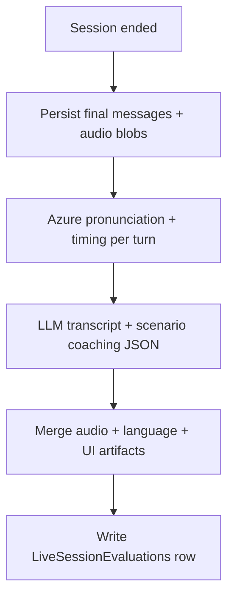

# Speak Live — post-session evaluation pipeline

After the learner ends a session, FluentCopilot runs a **second pipeline** that is allowed to be slower and more thorough than the live loop.

## Trigger points

1. Client calls `POST /conversations/{threadId}/end`.
2. Server marks the thread `completed`, stamps recap JSON into `SummaryText`, sets `SpeakLivePostSessionPhase` to `evaluating`, and seeds `LiveSessionEvaluations` (`seedPendingLiveEvaluation`).
3. Client navigates to the evaluation surface and calls `POST /speak-live/session/{threadId}/evaluation/run` (or relies on the implicit run from the UI).

## High-level stages

## Service boundaries

| Component                         | Responsibility |
| --------------------------------- | -------------- |
| `PostSessionEvaluationService`    | Facade over `buildLiveSessionEvaluationRecord` |
| `VoiceEvaluationService`          | Azure open-response pronunciation on stored audio |
| `liveSessionEvaluationLlm.ts`     | Structured coaching JSON (per turn + session) |
| `liveSessionEvaluationOrchestrator.ts` | Deterministic merges, reference TTS, headline scores |

## Three evaluation lenses (per turn)

1. **Raw audio** — Azure scores + pause/hesitation heuristics (`audioScores`, `audioFindings`).
2. **Transcript + normalized text** — grammar, construction, naturalness (`languageScores`, `languageEvaluation`).
3. **Scenario + level** — alignment with goals and register (`scenarioGoalFit`, CEFR-aware `turnLanguageEvaluation`).

### `TurnLanguageEvaluation`

Each `TurnEvaluation` may include:

- `grammarScore`, `sentenceConstructionScore`, `naturalnessScore`, `levelFitScore`
- `whatWorked[]`, `grammarIssues[]`, `sentenceStructureIssues[]`
- `improvedVersion`, `whyItIsBetter`, `levelBasedComment`

Scores must reflect the **selected learner level** (parsed from the Speak Live summary stamp via `learnerCefrLevelForLiveEvaluation`). The LLM system prompt in `liveSessionEvaluationLlm.ts` encodes A1/A2/B1 expectations.

## Session-level scores

`LiveSessionEvaluation.overallScores` now includes an explicit **`clarityScore`** (average of per-turn `combinedScores.clarityScore`) alongside pronunciation, fluency, rhythm, and naturalness.

## DEV diagnostics

Set `SPEAK_LIVE_EVALUATION_DEV_DIAGNOSTICS=1` on the API host to include coarse-grained `evaluationDiagnostics` on evaluation GET responses:

- `audioScoring`
- `languageCoaching`
- `finalAssembly`

The Speak Live evaluation page surfaces these strings in **development** builds.

## Failure + retry

Failures mark `SpeakLivePostSessionPhase = failed` and store the error string on `LiveSessionEvaluations`. The UI already exposes a retry action.

## Related docs

- [live-vs-post-session-architecture.md](./live-vs-post-session-architecture.md)
- [live-speech-fast-path.md](./live-speech-fast-path.md)
