# Content generation system (scale, validation, governance)

| Attribute | Value |
|-----------|--------|
| Status | **Implementation contract** |
| Curriculum pipeline (A2 nl-NL) | `scripts/a2_curriculum_schema.py`, `scripts/generate_a2_nl_curriculum.py`, `data/curriculum/nl-NL/A2/*.json` |
| Broader AI pipeline | `src/content-engine/` (Zod artifacts, orchestrator, quality gate) |

---

## 1. Purpose

Produce **consistent, CEFR-aligned, machine-validated** lesson **bundles** at **120–160 lesson** scale with **AI acceleration** and **human QA** — without scattering copy inside UI code.

---

## 2. Why structured generation is needed

- **Volume**: Hand-authoring 132 lessons in React is **not** maintainable.
- **Quality**: Without schema, **AI drift** (wrong level, wrong register) is invisible until user report.
- **Reuse**: Grammar modules, lemmas, and interactions must **compose** across lessons.
- **Runtime**: `GuidedLessonPage` already expects **strict** bundle shapes (`a2Catalog.ts`).

---

## 3. Role of AI vs human review

| Phase | AI | Human |
|-------|-----|--------|
| **Outline** | Propose module/lesson titles, can-dos | Approve themes & band placement |
| **Draft** | Generate steps, markdown, interaction JSON | Spot-check NL naturalness |
| **Validate** | Run schema + automated gates | Resolve **exceptions** |
| **Publish** | Assemble bundle + hashes | Sign-off on **manifest** slice |

**Rule**: AI **never** publishes without **schema pass** + **designated** human approval for **production** channel.

---

## 4. Content generation workflow (recommended)

```mermaid
flowchart LR
  A[Authoring brief] --> B[AI / template draft]
  B --> C[JSON per lesson / unit]
  C --> D[Schema validator]
  D --> E[Quality gate NL + level]
  E --> F[Human QA sample + diff]
  F --> G[Merge to data/curriculum]
  G --> H[generate_a2_nl_curriculum.py]
  H --> I[catalog.bundle.json]
  I --> J[App import + types check]
```

---

## 5. Recommended source formats

| Layer | Format | Location (today / target) |
|-------|--------|----------------------------|
| **Units** | JSON array | `data/curriculum/nl-NL/A2/units.json` (or split files) |
| **Lessons** | One JSON per lesson OR bulk | `data/curriculum/nl-NL/A2/lessons/*.json` |
| **Grammar modules** | Python-generated fragments | `scripts/a2_grammar_modules.py` |
| **Media manifest** | JSON map `id → url` | future `content_refs` |
| **AI artifacts** (scenarios, blueprints) | Zod-validated | `src/content-engine/schemas/*.ts` |

---

## 6. Lesson schema expectations (conceptual)

Minimum fields the **runtime + QA** depend on (see `populating-level-curriculum.md` for field-level detail):

- **Identity**: `id`, `unit_id`, `locale`, `cefr_level`
- **Catalog**: `title`, `description`, `topic`, `type`, `durationMinutes`
- **Pedagogy**: `objective`, `can_do_outcomes[]`, `grammar_primary`, `grammar_primary_label`, `grammar_points[]`, `target_vocabulary_lemmas[]`, `micro_outcomes[]`, `prior_lesson_ids[]`
- **Plan**: `lesson_plan.steps[]` with `learner_title`, `activity`, `skill_focus`, optional `interaction`, `recycle_lemmas`, `common_error_tags`, `listening_level`
- **Assessment**: `quiz_ideas`, `success_criteria`
- **Provenance**: `author`, `last_updated`, `sources_consulted`

**Future**: discriminated `step.type` + payload (see `lesson-engine.md` §8.2).

---

## 7. Required metadata per lesson

| Field | Use |
|-------|-----|
| `grammar_primary` | Spine validation; analytics; review grammar threads |
| `can_do_outcomes` | Completion UI; QA checklist |
| `target_vocabulary_lemmas` | Review extraction; flashcards |
| `metadata.archetype` | Variety tracking across module |
| `metadata.primary_skills` | Search/filter |
| `metadata.voice_optional` | UX gating |

---

## 8. Required metadata per module (unit)

| Field | Use |
|-------|-----|
| `a2_band` | Path UI band chips |
| `objectives_can_do` | Module card |
| `grammar_focus[]` | Authoring alignment |
| `vocabulary_domains[]` | Search / review mixing |
| `lesson_ids[]` | Ordering |
| `integration_scripts_summary` | Scenario QA |

---

## 9. Grammar and vocab coverage rules

- **`grammar_primary`** ∈ allowlist from `a2_curriculum_schema.py` / `a2-grammar-spine.md`.
- **Each module**: at least **one** lesson introduces or **deepens** each claimed `grammar_focus` ID.
- **Vocabulary**: lemmas must appear in **≥2 steps** (use + recycle) within lesson where possible.
- **Duplication**: same **example sentence** not repeated across **>2** lessons unless tagged `intentional_recycle`.

---

## 10. Naming rules

- **Stable IDs** — never change meaning in place.
- **Slugs**: kebab-case ASCII for URLs; Dutch **display** strings in `title` fields.
- **Grammar IDs**: only spine vocabulary.

---

## 11. Duplication avoidance

- **Content hash** per lesson body (normalized markdown) in CI — flag **near-duplicates**.
- **Lemma histogram** — flag overused lemmas in a single module.
- **Cross-lesson plagiarism** — min hash distance for NL paragraphs.

---

## 12. CEFR alignment validation

Automated checks (extend `generate_a2_nl_curriculum.py`):

- **Sentence length** percentiles vs band (heuristic).
- **Forbidden patterns** list for A2 (e.g. heavy **zouden** counterfactuals in A2.1).
- **Grammar_primary** vs **band** matrix (config table).

**Human**: sample **10%** of new lessons per batch with **structured rubric**.

---

## 13. Natural Dutch & pedagogical quality validation

| Check | Method |
|-------|--------|
| **Spell/grammar** | `nl` language tools in CI (optional) |
| **Register** | Lint: **u** in service lessons vs **je** in peer chat |
| **Instruction mix** | EN instructions ≤ X% of tokens (policy) |
| **Task authenticity** | Rubric: “Could a learner say this tomorrow?” |

**Content-engine alignment**: reuse `src/content-engine/review/qualityGate.ts` patterns for **non-curriculum** artifacts; **merge** scoring vocabulary over time.

---

## 14. Review item extraction rules

- Every lesson with **≥4** target lemmas → enqueue **max 10** for SRS (configurable).
- **Self-check** items with `common_error_tags` → create **weak-spot** candidates (not always new SRS cards).
- **Grammar_primary_label** → **one** grammar reminder card per lesson completion (current behaviour).

---

## 15. Batch generation strategy

| Batch | Size | Gate |
|-------|------|------|
| **Pilot** | 1 module | Full human read |
| **Alpha** | +2 modules | 20% human read + all schema |
| **Beta** | +remaining | 10% human + automated only on clean diff |

**Branching**: feature branches carry **draft** bundles; **main** carries **published** `schema_version`.

---

## 16. Audit / review prompts strategy

Store **versioned** prompts under `docs/curriculum/prompts/` (existing pattern) with:

- **Input**: lesson JSON skeleton + band + spine ID + anti-patterns list
- **Output**: **only** JSON matching schema (no markdown fences in production path)
- **Self-critique** pass: second prompt checks **level** + **register**

---

## 17. Human QA workflow

1. Open **diff** in admin or PR.
2. Run **preview** route with `?draft=1` (future) or local dev bundle swap.
3. Checklist: can-dos, audio presence, self-check keys, tags, **offensive** content scan.
4. Approve → bump `provenance.last_updated` + merge.

**Admin surface today**: `src/app/admin/*` — extend for **curriculum** batches when needed.

---

## 18. Versioning / publishing

- **`schema_version`** in manifest — bump on breaking field changes.
- **Content version**: git tag or `catalog.bundle.json` build id in app **About** screen (future).
- **Rollback**: keep **previous bundle** artifact in storage for hotfix.

---

## 19. Risks of uncontrolled AI generation

| Risk | Mitigation |
|------|------------|
| Level creep | Automated CEFR heuristics + spine matrix |
| Wrong answers in self-check | Golden tests per `interaction` id |
| Toxic / biased scenarios | Blocklist + human spot |
| Copyright | Originality prompt + n-gram overlap check |
| Inconsistent IDs | Schema + CI `tsc` import of bundle |

---

## 20. Example lifecycle — one module (M02 food & shopping)

1. **Brief**: 11 lessons, band A2.1, spine IDs: modals, imperatives, comparatives (thin).
2. **Generate** lesson shells (objectives + steps empty).
3. **Fill** each lesson: AI draft → editor tweak NL.
4. **Inject** grammar modules from `a2_grammar_modules.py` for relevant steps.
5. **Validate** `python3 scripts/generate_a2_nl_curriculum.py` (or project script).
6. **Run** `npx tsc --noEmit` (types import bundle).
7. **QA** lessons 2, 7, 11 fully + random 2 others.
8. **Publish** PR → main → deploy.

---

## 21. Unification note (assumption)

**Today** two parallel concepts exist:

- **A2 bundle** (strict lesson records) — **production path** for Learn.
- **`lessonBlueprintSchema` in content-engine** — oriented to **AI pipelines / scenarios**.

**Target**: either **map** blueprints → A2 lesson records in one **import** step, or **collapse** to a **single** canonical lesson schema re-exported from `src/types/lesson.ts`. Document the chosen direction in ADR when implemented.

---

## 22. Related files

- `docs/curriculum/populating-level-curriculum.md`
- `docs/curriculum/prompts/*.md`
- `src/content-engine/pipelines/orchestrator.ts`
- `scripts/a2_curriculum_schema.py`
