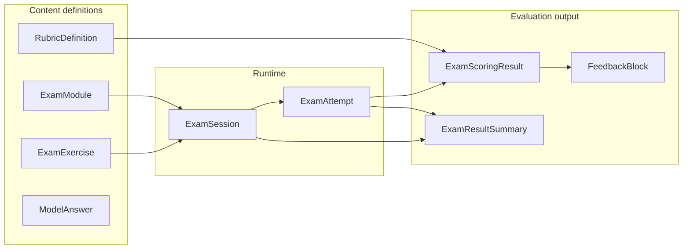

# Exam Prep — schema overview

| Attribute | Value |
|-----------|--------|
| Status | **Implementation contract** |
| Code | `src/lib/schemas/exam/*` (Zod + inferred TypeScript types) |
| Samples | `content/exam/samples/*.json` |
| Validator | `npm run validate-exam` → `tools/validate-exam-content.ts` |
| Scoring engine | [`exam-scoring-engine.md`](./exam-scoring-engine.md) — `src/lib/exam-scoring/*` |
| Product docs | [`exam-prep-architecture.md`](./exam-prep-architecture.md), [`exam-prep-readiness-audit.md`](./exam-prep-readiness-audit.md) |

---

## 1. What this layer adds

Exam Prep schemas describe:

1. **Content** — modules, exercises (per domain), rubric definitions, model answers.
2. **Runtime** — sessions (multi-item), attempts (one submission per exercise).
3. **Evaluation** — rubric-based scoring results, structured feedback blocks, session summaries.

They **do not** replace **Practice** schemas (`src/lib/schemas/practice/*`) or **lesson/review** schemas. They **bridge** to `ReviewItem`-shaped hints via `reviewCandidates` / `reviewItemsGenerated` (downstream ingest maps into `reviewItem.schema.ts`).

---

## 2. Entity cheat sheet

| Schema | File | Role |
|--------|------|------|
| **ExamMode, constraints, modality** | `examShared.schema.ts` | `training` vs `simulation`; session completion; response modality |
| **ExamTypeKey, RubricDomainKey** | `examType.schema.ts` | Domain keys; `mixed` for multi-domain sessions/modules; rubrics exclude `mixed` |
| **ExamTypeDefinition** | `examType.schema.ts` | Optional catalog row (scoring strategy, I/O types) |
| **RubricDefinition** | `rubricDefinition.schema.ts` | Versioned categories, weights, max points |
| **ModelAnswer** | `modelAnswer.schema.ts` | Ideal / acceptable Dutch (and optional EN) for an exercise |
| **Speaking / writing specs** | `speakingExam.schema.ts`, `writingExam.schema.ts` | Subtypes, authoring fields, attempt payloads, typed rubric score maps |
| **ExamExercise** | `examExercise.schema.ts` | Discriminated union: `speaking` \| `writing` \| `listening` \| `reading` \| `kmn` (+ `closedSpec`) |
| **ExamAttempt** | `examAttempt.schema.ts` | Raw + normalized response, support usage, optional embedded `ExamScoringResult` |
| **ExamScoringResult** | `scoringResult.schema.ts` | Per-category rows + totals; **not** `practice/scoringResult` |
| **FeedbackBlock** | `feedbackBlock.schema.ts` | Learner-facing structured feedback + review extraction candidates |
| **ExamModule** | `examModule.schema.ts` | Top-level prep pack; `exerciseRefs` + optional `sections` |
| **ExamSession** | `examSession.schema.ts` | Ordered exercises, attempt refs, completion, optional timers |
| **ExamResultSummary** | `examResultSummary.schema.ts` | Aggregated report + readiness + next steps |

---

## 3. Content vs runtime vs results



| Layer | Examples |
|--------|----------|
| **Content** | JSON under `content/exam/**`; versioned rubrics; deterministic exercise ids |
| **Runtime** | User session state, attempt records, audio/blob refs |
| **Results** | Scoring snapshots, feedback DTOs, analytics payloads |

---

## 4. Example flow

**Exercise → attempt → scoring → feedback → summary → review**

1. Learner starts **`ExamSession`** (`mode: training | simulation`) with `exerciseRefs[]`.
2. For each item, app creates **`ExamAttempt`** (`rawResponse` discriminated by `kind`).
3. **Evaluation engine** (future) reads **`RubricDefinition`** (`id` + `version`) and produces **`ExamScoringResult`** (`rubricScores[]`, optional `speakingRubricScores` / `writingRubricScores`).
4. **Feedback engine** builds **`FeedbackBlock`** (richer in training; deferred in simulation).
5. On completion, **`ExamResultSummary`** aggregates attempts; lists **`reviewItemsGenerated`** (suggested SRS cards) and **`suggestedNextSteps`**.
6. Ingest maps review candidates → **`ReviewItem`** + SRS; mistakes → **`MistakeEvent`** (extend `source` / ids in a future migration — today lesson-shaped ids are a known bridge; see audit).

---

## 5. Relation to Practice, review, mastery

| System | Relation |
|--------|----------|
| **Practice** | **No shared scoring schema.** Reuse UI primitives and AI **transport** only. |
| **Review (SRS)** | `FeedbackBlock.reviewCandidates` / `ExamResultSummary.reviewItemsGenerated` align with `reviewItem` types (`vocab`, `phrase`, `grammar`, …). |
| **Mastery / abilities** | Map from **`ExamResultSummary.categoryBreakdown`** + attempt history (implementation TBD). |
| **Mistakes** | Tag normalized error patterns into `MistakeEvent.metadata.mistakeTags` (convention to be fixed when exam `sourceType` exists). |
| **XP / missions** | Not in schemas; policy layer consumes `ExamSession` / summary events. |

---

## 6. Naming boundaries

- Import exam scoring as **`ExamScoringResult`** / `examScoringResultSchema` from `@/lib/schemas/exam`.
- Practice session scoring stays **`ScoringResult`** in `@/lib/schemas/practice/scoringResult.schema`.
- **`ExamTypeKey`** includes **`mixed`** for sessions/modules; **`RubricDomainKey`** excludes `mixed` (rubrics are always single-domain).

---

## 7. Assumptions (explicit)

1. **ISO 8601** datetimes use offset form (`...Z` or `+00:00`) per `isoDateTimeSchema`.
2. **Audio** is referenced by string ref (URL, blob id, storage key) — binaries are not embedded in JSON.
3. **Rubric `totalMaxPoints`** should equal the sum of `categories[].maxPoints` (validator warns on mismatch).
4. **AI-generated feedback** must still validate as **`FeedbackBlock`** / **`ExamScoringResult`** (structured output contract).

---

## 8. Commands

```bash
npm run validate-exam
npx tsx --tsconfig tsconfig.json tools/validate-exam-content.ts --exercise content/exam/samples/sample-speaking-exercise.json
```

---

*End of overview.*
