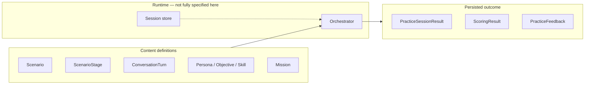

# Practice & Mastery — schema overview

| Attribute | Value |
|-----------|--------|
| Status | **Contract** — extends [`practice-system-architecture.md`](./practice-system-architecture.md) |
| Code | `src/lib/schemas/practice/*` (Zod + inferred TypeScript types) |
| Samples | `content/practice/samples/*.json` |
| Validator | `npm run validate-practice` → `tools/validate-practice-content.ts` |
| Core learning schemas | Still in `src/lib/schemas/*` (`lesson`, `reviewItem`, `mistakeEvent`, `srsItem`, `userMastery`) |

---

## 1. What this layer adds

Practice-specific schemas describe:

1. **Content** — scenarios, stages, personas, objectives, turn plans, expected skills, missions.
2. **Results** — scoring, feedback, and the **session result** aggregate that downstream systems consume.

They **do not** replace lesson or review schemas; they **reference** curriculum ids (`moduleRefs`, `vocabTargets`, `grammarTargets`, `ReviewItem`, `MistakeEvent.errorType`).

---

## 2. Entity cheat sheet

| Schema | File | Role |
|--------|------|------|
| **Scenario** | `scenario.schema.ts` | Full authored scenario: modes, access, nested stages/personas/objectives/skills |
| **Scenario catalog entry** | `scenarioCatalogEntry.schema.ts` | Browse/filter row: category, readiness, skill focus, modes, premium, weak-area patterns (`content/practice/catalog/scenarios.json`) |
| **ScenarioStage** | `scenarioStage.schema.ts` | Phase inside a scenario; optional `turnPlan` |
| **RolePersona** | `rolePersona.schema.ts` | AI interlocutor data for prompts |
| **PracticeObjective** | `practiceObjective.schema.ts` | Communicative outcome + success criteria |
| **ConversationTurn** | `conversationTurn.schema.ts` | Turn template: intents, suggested replies, scoring hooks |
| **ExpectedSkill** | `expectedSkills.schema.ts` | Measurable skill signals for analytics/mastery |
| **ScoringResult** | `scoringResult.schema.ts` | Numeric + categorical output of a session |
| **PracticeFeedback** | `practiceFeedback.schema.ts` | Learner-facing copy + structured corrections + next steps |
| **Mission** | `mission.schema.ts` | Daily/weekly bundled tasks + rewards (content contract) |
| **Mission runtime** | `missionRuntimeState.schema.ts` | Client-persisted assignments, progress, scenario streak, weekly rollups; wired from `src/lib/missions/*` |
| **AbilityTag** | `abilityTag.schema.ts` | Real-world capability node (mastery graph) |
| **ConfidenceScore** | `confidenceScore.schema.ts` | Per-subject confidence row |
| **PracticeSessionResult** | `practiceSessionResult.schema.ts` | **Main output**: turns + scoring + feedback + extractions + XP/streak hooks |
| **Skill track** | `skillTrack.schema.ts` | Catalog + level + exercise union (MCQ, typed, reading, speaking prompt, repair); distinct from scenarios and SRS |
| **Weakness insight** | `weaknessInsight.schema.ts` | Personalized weak-area headline + actions (scenario / skill track / review) + optional last-practice signal payload |
| **Ability mastery state** | `abilityMasteryState.schema.ts` | Client-persisted EMA + history per practical ability id (`byAbility`) |

Shared enums (`practiceConversationMode`, `practiceLifeArea`, `practiceAccessRules`, …) live in **`practiceShared.schema.ts`**.

---

## 3. Content vs runtime vs result



| Layer | Stored where (target) | Examples |
|--------|------------------------|----------|
| **Content** | CMS / `content/practice/**/*.json` | `sample-scenario.json` |
| **Runtime** | Server session DB + ephemeral orchestration state | Turn history, moderation flags (future fields) |
| **Result** | Analytics + learner history | `sample-practice-session-result.json` |

`PracticeSessionResult` is the **bridge object**: product should map it into `MistakeEvent` rows, `ReviewItem` inserts, SRS scheduling, `UserMastery` / future ability store, and `retentionService` XP reasons (when extended).

---

## 4. How schemas relate to each other

- **Scenario** embeds **ScenarioStage[]**, **RolePersona[]**, **PracticeObjective[]**, **ExpectedSkill[]** (authoring convenience; CMS may normalize to refs later).
- **ScenarioStage** optionally embeds **ConversationTurn[]** as `turnPlan`.
- **PracticeObjective** references **ExpectedSkill** ids and **AbilityTag** ids (strings).
- **PracticeSessionResult** references **scenarioId**, includes **ScoringResult** + **PracticeFeedback**, optional **draftReviewItems** (`ReviewItem` shape), **PracticeMistakeSignal** (reuses `mistakeErrorTypeSchema`), **AbilityProgressDelta**, **ConfidenceScore[]**, **XpAward[]**, **StreakImpact**.

---

## 5. Integration map

### Review (SRS)

- **From session:** `extractedReviewItemIds` + `draftReviewItems` (new cards).
- **Into practice:** missions of type `review_link`; recommendations in `practiceFeedback.nextPracticeSuggestions`.

### Mistakes

- **From session:** `mistakeSignals[]` align with `MistakeEvent.errorType` enum; tags can align with lesson `feedback.errorTags` / grammar spine ids.

### Mastery / abilities

- **AbilityTag** is the stable vocabulary for “can do X in real life.”
- **PracticeSessionResult.abilityProgress** carries weak → developing → strong transitions (evidence summaries for audit).

### Gamification

- **XpAward** in session result uses reasons reserved for practice (`practice_session_complete`, …). **Retention** types should gain matching `XpReason` values when implementing.
- **Mission.rewards** declares XP and `countsForStreak`; actual application is policy in `retentionService`.
- **Implemented wiring:** scenario/skill-track completion flows through `applyPracticeFeedbackClientEffects` → `processPracticeScenarioCompletion` / `processSkillTrackSessionProgress` and `retentionService` (XP, streak milestones, missions). See [`practice-retention-integration.md`](./practice-retention-integration.md).

### Learning path

- **Scenario.moduleRefs**, **vocabTargets**, **grammarTargets** tie to `Module` / `Lesson` ids for “after lesson → this scenario” rules.

### Premium / free

- **Scenario.access** (`practiceAccessRulesSchema`) describes catalog-level requirement + optional `usageLimitKey` for entitlements (server enforces).

---

## 6. Example flow (end-to-end)

1. Loader fetches **Scenario** by id (validated with `scenarioSchema`).
2. User starts session → orchestrator reads **stages** / **turnPlan** / **personas** (content) and creates runtime session (out of scope for this doc).
3. User completes session → engine emits **ScoringResult** + **PracticeFeedback** + turn log.
4. Assembler builds **PracticeSessionResult** (`practiceSessionResultSchema.parse(...)`).
5. **Review pipeline** ingests `draftReviewItems` / ids.
6. **Mastery service** updates ability proficiency from `abilityProgress` + `confidenceChanges`.
7. **Retention** applies `xpAwarded` and `streakImpact` if product rules qualify.

---

## 7. Validation

```bash
npm run validate-practice
# or
npx tsx --tsconfig tsconfig.json tools/validate-practice-content.ts --scenario path/to/scenario.json
```

The tool checks Zod validity, duplicate ids in scenarios and session results, and basic cross-references (objectives → expected skills; optional warnings on turn scoring hooks).

---

## 8. Assumptions (explicit)

- **Embedded vs referenced content:** v1 scenarios embed full nested objects for readability; a future **catalog split** (skills/personas in separate JSON) can use the same Zod shapes with `id` refs only — add `*.ref.schema` variants when needed.
- **Runtime session store** fields (e.g. `session_id`, provider metadata) are intentionally **not** duplicated on `PracticeSessionResult`; link via `metadata` or a future `sessionRef` field.
- **`xpAward.reason`** uses a practice-local enum in the schema; **align** with `src/lib/retention/types.ts` when implementing awards.

---

## 9. Ability / mastery map (practical)

- **Schema:** `abilityMasteryState.schema.ts` — snapshots per ability (`emaQuality`, `touchCount`, `lastPracticedAt`, optional `scoreHistory`).
- **Logic:** `src/lib/mastery/*` — registry → signals → score → trend → recommendations; see [`ability-mastery-layer.md`](./ability-mastery-layer.md).

---

## 10. Weakness-driven practice

- **Schema:** `weaknessInsight.schema.ts` — `WeaknessInsight`, `WeaknessAction`, `WeaknessSignalEvent` (last-practice payload).
- **Logic:** `src/lib/weakness/*` — analyzer → aggregator → ranker → `buildWeaknessInsights`; Practice Hub maps to UI VMs.
- **See also:** [`weakness-driven-practice.md`](./weakness-driven-practice.md).

---

## 11. Skill tracks (micro-practice)

- **Content:** `skillTrackCatalogSchema` — five fixed `SkillTrackId` values, each with levels `0–3` (Beginner → Confident), exercises as a discriminated union (`mcq`, `typed_check`, `reading_mcq`, `speaking_prompt`, `repair_mcq`). Authoring lives in `src/lib/skill-tracks/skillTracksCatalog.ts` (validated at load).
- **Progress:** client `localStorage` via `skillTrackProgressStorage` — `unlockedLevelIndex`, `bestScoreByLevel`, session counts (not yet merged into `PracticeSessionResult`).
- **Scoring:** `skillTrackScoring` — per-exercise attempts, session score, pass threshold for level unlock; **retention** `recordSkillTrackSessionComplete` + `XpReason.skill_track_session`.
- **Next-step schema:** `nextPracticeSuggestionSchema.kind` may be `skill_track` (for authored feedback); hub CTAs also deep-link to `/app/practice/tracks/{id}`.

---

## 12. Related documents

- [`practice-mode-audit.md`](./practice-mode-audit.md)
- [`practice-system-architecture.md`](./practice-system-architecture.md)
- [`practice-retention-integration.md`](./practice-retention-integration.md)
- [`schema-overview.md`](./schema-overview.md)
