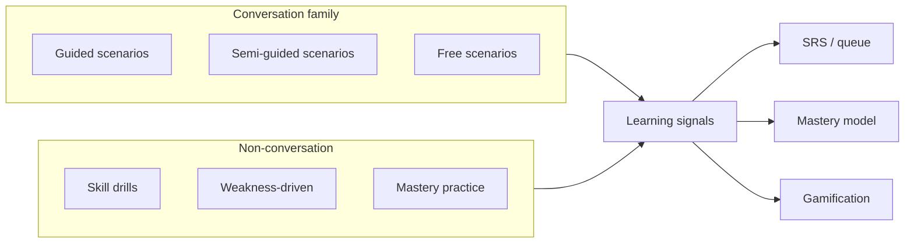
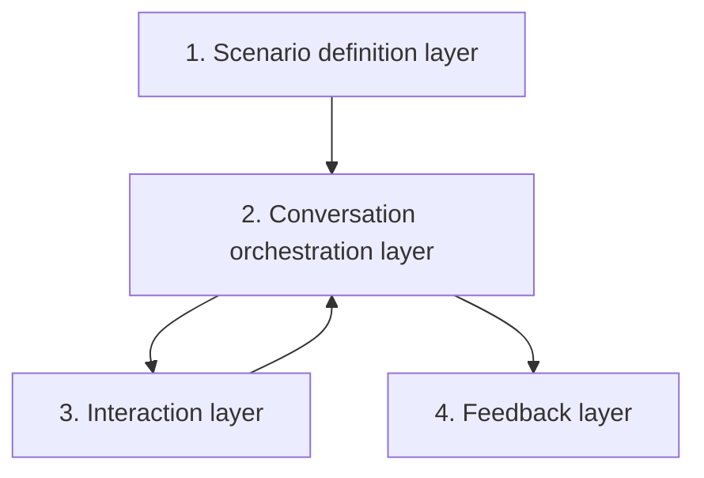
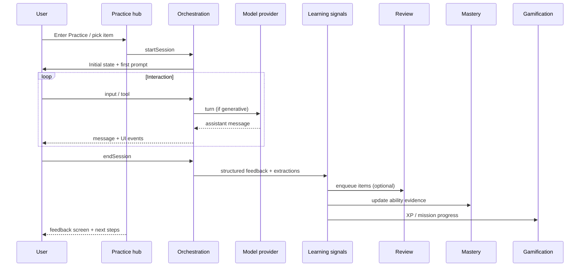

# Practice & Mastery — system architecture

**Status:** Architecture lock (design + documentation)  
**Audience:** Product, learning design, AI/conversation engineering, full-stack engineering  
**Related:** [`practice-mode-audit.md`](./practice-mode-audit.md), `docs/features/deep-dives/scenario-simulations.md`, `src/ai-conversation-engine/`, `src/lib/retention/`

**Purpose of this document:** Establish the **contract** for all future Practice-related work so we can ship incrementally without structural drift. This is **not** a UI specification or implementation ticket list.

---

## Document map

| Section | Topic |
|---------|--------|
| [1](#1-what-practice-mode-is) | What Practice is (system definition) |
| [2](#2-core-practice-modes) | Core modes (guided → drills → mastery) |
| [3](#3-scenario-progression-model) | Scenario progression (guided → semi → free) |
| [4](#4-ai-conversation-architecture) | AI conversation layers |
| [5](#5-practice-session-lifecycle) | Session lifecycle |
| [6](#6-integration-with-other-systems) | Integrations (Review, Mastery, Gamification, Path) |
| [7](#7-mastery--ability-model) | Mastery & abilities |
| [8](#8-recommendation-system-high-level) | Recommendations |
| [9](#9-premium-vs-free-architecture) | Premium vs free |
| [10](#10-ux-architecture-no-ui-build) | UX architecture (information structure) |
| [11](#11-anti-patterns-to-avoid) | Anti-patterns |
| [12](#12-implementation-guardrails) | Implementation guardrails for engineering |

---

## 1. What Practice mode is

### 1.1 Definition

**Practice** is a **learner-facing system** for applying Dutch in **situation-shaped** activities: spoken or written interaction, short skill drills, and **capability checks** that mirror real life. It sits **beside** structured curriculum, not inside it.

Practice is a **system** composed of:

- A **catalog** of practice units (scenarios, drills, missions).
- **Sessions** with a defined start, interaction loop, end, and **learning signals** output.
- **Orchestration** (rules + AI where applicable) that enforces level-appropriate language and pedagogy.
- **Integrations** that connect outcomes to review, mastery, gamification, and the learning path.

### 1.2 How Practice differs from Learn and Review

| Dimension | **Learn** (lessons) | **Review** (SRS / mistake-fix) | **Practice** |
|-----------|---------------------|--------------------------------|--------------|
| **Primary goal** | Teach, sequence, expose patterns | Retain and repair prior material | Apply language in context; build communicative confidence |
| **Structure** | Fixed steps, authored progression | Cards/queues, intervals | Scenario or drill-shaped; variable openness |
| **Success** | Step completion, lesson done | Recall accuracy, fix rate | Task/scenario outcomes + structured signals |
| **AI role** | Optional (explain, generate) | Usually minimal | Central for conversation modes; constrained by orchestration |
| **Typical cadence** | Deep, less frequent | Short, daily | Short–medium; can be daily habit |

### 1.3 When users use Practice

- After lessons: **cement** phrases in a believable setting.
- Between lessons: **maintain** Dutch without starting a full lesson.
- When **anxious** about real interactions (doctor, gemeente, work).
- When **review feels too abstract** and they want “talking to someone.”
- For **daily habit**: missions and short drills complement streak mechanics.

### 1.4 Problems Practice solves

| Learner need | How the system addresses it |
|--------------|-----------------------------|
| “I finished A2 but don’t feel confident.” | Semi-guided and free scenarios + **mastery checks** on real-life abilities; explicit “readiness” signals toward B1. |
| “I want real conversations.” | Free scenarios and voice-forward flows with persona-consistent AI; not a generic chatbot. |
| “I want to improve weak areas.” | Weakness-driven practice: drills + targeted scenarios from mistakes/tags. |
| “I want daily habit practice.” | Missions, XP/streak hooks for **qualifying** sessions, hub surfacing “today’s pick.” |

### 1.5 Grounding in current codebase

Per [`practice-mode-audit.md`](./practice-mode-audit.md): the app today exposes Practice mainly as **text simulation** (`SimulationPage`) with **mock** conversation; **`ai-conversation-engine`** already sketches **session lifecycle**, **scenario context**, and **feedback/summary** types but is **not** wired to routes or retention. This architecture **preserves** that engine as the orchestration core **once** schemas and APIs align.

---

## 2. Core Practice modes

Each mode has a **distinct pedagogical job**. Modes can share UI patterns (e.g. chat shell) but **must not** share the same orchestration rules blindly.

### 2.1 Mode overview

### 2.2 A. Guided scenarios

| Aspect | Definition |
|--------|------------|
| **Purpose** | Reduce cognitive load; complete a **clear communicative goal** with support. |
| **User type** | Early A2, anxious learners, first exposure to a setting. |
| **When it appears** | First visits to a scenario family, hub “Start here,” post-lesson warmup for matching topic. |
| **Guidance level** | High: visible goals, hints, optional choices, constrained turns. |
| **Relation to AI** | AI plays persona with **tight turn contracts** (e.g. expected intents); orchestration may use **templates or branching** before full generative freedom. |
| **Relation to scoring** | Binary or rubric-light: goal steps completed, hint usage, turn count; feeds **signals**, not high-stakes grades. |

### 2.3 B. Semi-guided scenarios

| Aspect | Definition |
|--------|------------|
| **Purpose** | Bridge from scaffolding to autonomy; realistic variation with **safety rails**. |
| **User type** | Mid A2, returning users, post-guided completion. |
| **When it appears** | After guided success; hub “Level up”; recommendations after stable performance. |
| **Guidance level** | Medium: fewer hints; **adaptive** help (on request or after failure detection). |
| **Relation to AI** | Generative dialogue with **objectives** and **difficulty caps**; branching allowed within scenario bounds. |
| **Relation to scoring** | Richer signals: coverage of target functions, repair strategies, error taxonomy; drives mastery **confidence**. |

### 2.4 C. Free scenarios

| Aspect | Definition |
|--------|------------|
| **Purpose** | Fluent-feeling practice; personality and pace closer to real life. |
| **User type** | Confident A2, pre-B1, premium users seeking depth. |
| **When it appears** | Unlocked per scenario track; premium emphasis; user explicitly chooses “Open practice.” |
| **Guidance level** | Low: optional tools only (hint, simplify, translate chunk). |
| **Relation to AI** | Full multi-turn generative; still bounded by **scenario schema** (vocab/grammar scope, persona). |
| **Relation to scoring** | Post-session primarily; optional light inline nudges; emphasis on **summary + next steps**. |

### 2.5 D. Skill drills

| Aspect | Definition |
|--------|------------|
| **Purpose** | Isolate a **micro-skill** quickly; high reps, low narrative overhead. |
| **User type** | Anyone with a identified gap (from mistakes or placement). |
| **When it appears** | Hub “Drills,” weakness strip, post-session “Practice this pattern.” |
| **Guidance level** | High for the skill; not conversational freedom. |
| **Relation to AI** | Optional: generation of items within a **drill schema**; many drills can be **non-AI** (structured UI). |
| **Relation to scoring** | Accuracy/latency/attempts; direct mapping to tags (e.g. word order, particle usage). |

**Examples:** word-order scrambles, “say the reply” timed prompts, listening bursts (short audio + 1–2 comprehension checks), pronunciation loops (premium).

### 2.6 E. Weakness-driven practice

| Aspect | Definition |
|--------|------------|
| **Purpose** | Turn **errors and weak tags** into a concrete next action. |
| **User type** | Anyone with stored mistake/tag signals (lessons, review, prior practice). |
| **When it appears** | Hub section, notifications (later), end-of-session links. |
| **Guidance level** | Depends on packaged activity (drill vs targeted scenario). |
| **Relation to AI** | Targeted scenarios use same orchestration as semi/free with **narrowed grammar/vocab scope**. |
| **Relation to scoring** | Retest of same skill; improvement updates weakness state and SRS. |

### 2.7 F. Mastery practice

| Aspect | Definition |
|--------|------------|
| **Purpose** | Evidence that the learner can **execute a real-world ability** under light pressure. |
| **User type** | A2 completing a track; “Am I ready for B1-type tasks?” |
| **When it appears** | Explicit “Check readiness” or completion of guided+semi path for an **ability**. |
| **Guidance level** | Low–medium: scenario-specific rubric; may allow one “repair” attempt. |
| **Relation to AI** | Roleplay under **rubric**; may combine AI with structured checkpoints (e.g. must complete “order + pay + thank”). |
| **Relation to scoring** | **Ability-level** outcome: weak / developing / strong; feeds readiness narrative. |

**Examples:** ordering food end-to-end; doctor visit symptom + understanding advice; work self-introduction; handling a misunderstanding in a shop.

---

## 3. Scenario progression model

### 3.1 Stages: guided → semi-guided → free

For each **scenario track** (e.g. Café), the learner progresses through **three conversation modes**. Progression is **per scenario family** (or per `scenario_track_id`), not globally “user is always free mode everywhere.”

| Stage | Learner experience (summary) | AI / orchestration |
|-------|------------------------------|-------------------|
| **Guided** | Choices, scripts, or heavily scaffolded input; clear sub-goals | Tight scripts, limited branching, explicit success conditions |
| **Semi-guided** | Typed (or spoken) production; hints on demand; richer AI reactions | Generative with objectives + A2-safe constraints |
| **Free** | Open dialogue; tools optional | Generative, persona-led, still schema-bound |

### 3.2 Unlock rules (product defaults — tunable)

Unlocks should be **data-driven** (see §12). Suggested default:

- **Semi-guided** unlocks when **guided** exit criteria met (e.g. all goal steps completed once without excessive hints).
- **Free** unlocks when **semi-guided** meets **performance threshold** (e.g. successful completion of N sessions or rubric score ≥ target).

**Assumption:** Exact numeric thresholds are content-tuned; architecture only requires **machine-readable criteria** on the scenario track.

### 3.3 What changes between stages

| Layer | Guided | Semi-guided | Free |
|-------|--------|-------------|------|
| **UI** | Choice chips, visible stepper, prominent hints | Composer + optional hint; lighter stepper | Composer; tools in overflow |
| **AI system prompt** | Shorter turns, stricter vocabulary list, explicit phase | Wider intents, still scoped | Naturalistic; must still honor scope |
| **Turn limits** | May be fixed | Soft caps + warnings | Fair-use / session length cap |
| **Feedback** | Inline acceptable; celebrate sub-goals | Mix inline + end session | Mostly post-session |

### 3.4 Confidence and mastery influence

- **Confidence** (internal estimate from signals): high confidence + strong semi-guided performance → suggest **free** and **mastery check**.
- **Mastery** (ability-level): passing a **mastery practice** for “ordering food” can **fast-track** other food-context scenarios to semi or free.
- **Regression:** optional product choice: failing badly in free → suggest **semi** again (not a technical requirement for v1).

### 3.5 Example: Café scenario

| Stage | User experience | System behavior |
|-------|-----------------|-----------------|
| **Guided** | “Tap what you want to say” / pick from 3 Dutch lines; optional Dutch audio model | AI/barista responds to **selected** intent; tracks sub-goals: greet → order → pay → thanks |
| **Semi-guided** | User types short Dutch; can open **hint** with a phrase starter | AI evaluates intent; gentle repair if off-topic; stays in A2 band |
| **Free** | Open chat; user can small-talk within café context | Persona-led; post-session summary highlights missed high-value phrases |

---

## 4. AI conversation architecture

Four **required** layers. Implementation may live in `src/ai-conversation-engine/` (orchestration, prompts) plus **new** schema-backed catalog services.

### 4.1 Layer 1 — Scenario definition layer

**Owns:** What the practice is *about*.

- **Context:** place, roles, social norms (e.g. café vs GP).
- **Persona:** tutor/character instructions, tone, constraints.
- **Goals:** communicative outcomes (order successfully, register intent).
- **Vocabulary scope:** allowed lemmas/phrases; optional “stretch” list for semi/free.
- **Grammar scope:** permitted structures for this scenario (e.g. modals, questions).
- **Progression bindings:** which **mode** (guided/semi/free) this definition supports; exit criteria references.

**Source of truth:** **Data** (JSON/YAML/DB), not React components. Align with and extend today’s `ScenarioContext`-style fields (`src/ai-conversation-engine/types/scenario.ts`).

### 4.2 Layer 2 — Conversation orchestration layer

**Owns:** How the session runs.

- **Prompt construction:** assemble system + scenario + mode + user level + safety/moderation instructions.
- **Turn control:** max turns, phase transitions (guided steps), when to allow branching.
- **Difficulty control (A2-safe):** enforce vocabulary/grammar scope; sentence length; avoid idioms unless explicitly allowed.
- **Fallback behavior:** if user is stuck, off-topic, or unsafe → scripted recovery, simplify, or end session gracefully.

**Alignment:** `processTurn`-style flow in `orchestrator/conversationLoop.ts` remains the **pattern**; mode and track metadata become first-class inputs.

### 4.3 Layer 3 — Interaction layer

**Owns:** What the user sees and does.

- **Input:** text, speech (STT), optional choice selection in guided mode.
- **Output:** AI text, optional TTS, structured UI events (e.g. “goal completed”).
- **Support tools:** hint, slower/simpler, translate fragment (premium policy), repeat last line (listening).

Tools call **orchestration** with explicit **intent** (not ad hoc prompt patches from the client).

### 4.4 Layer 4 — Feedback layer

**Owns:** What the learner takes away.

- **Inline feedback (optional):** short corrections; must be toggleable by mode (see §2).
- **Post-session feedback:** summary, mistakes, strengths, suggested review/drill links.

**Requirement:** outputs are **structured** (JSON schema) for storage and integrations — extend concepts already in `ConversationFeedback` / `SessionSummary` (`types/session.ts`).

### 4.5 Prompt structure (high-level)

1. **System:** safety, AI disclosure, level policy (A2-safe rules).
2. **Scenario block:** setting, persona, goals, vocab/grammar scope.
3. **Mode block:** guided vs semi vs free rules (turn length, hinting, creativity).
4. **User state block:** CEFR sub-band if known, recent errors (summarized), session language.
5. **Conversation history:** prior turns (trimmed/summarized as needed).

No literal prompt text in this architecture doc — only **sections** engineers must populate from schema.

### 4.6 Preventing AI from exceeding A2 difficulty

- **Allow-lists** from scenario schema for guided/semi; **soft allow-list** + explicit “do not use” list for free.
- **Sentence length and complexity** caps in orchestration defaults.
- **Post-generation check** (optional): rule-based or lightweight classifier → regenerate or simplify once.
- **Moderation** pass on model output (existing pattern in engine).

### 4.7 Consistency across scenarios

- Shared **system policy** block for all Dutch practice.
- Shared **persona taxonomy** (shop staff, official, colleague) with style sheets.
- **Scenario IDs** stable across UI, engine, analytics, and Smart Prompts (fixes current id drift noted in audit).

### 4.8 Persona behavior

Personas **stay in role**; they do not become generic tutors unless user invokes a **help** tool. They **mirror** realistic Dutch politeness levels per setting. They **do not** teach long grammar lectures in free mode — that belongs in Learn or post-session feedback.

---

## 5. Practice session lifecycle

End-to-end lifecycle **every** implementer must respect.

### 5.1 Steps (normative)

1. **User enters Practice** — via tab, Home, Smart Prompts, lesson CTA, or deep link.
2. **Selection** — user picks **scenario track + mode** (or system picks based on recommendation), or picks **drill / weakness / mission** variant.
3. **Session starts** — server creates **session record** with: `user_id`, `scenario_id` / `drill_id`, `practice_mode`, `cefr_band`, timestamps, entitlement snapshot if needed.
4. **Interaction loop** — user input → orchestration → (optional) model → **structured** assistant payload → UI render; support tools inject **controlled** side calls.
5. **Session ends** — user explicit end, goal completion, timeout, or abandon policy.
6. **Feedback generated** — deterministic + model-assisted **structured** summary; grammar/vocab extractions.
7. **Data extracted** — mistakes, SRS candidates, mastery evidence, XP eligibility, mission completion flags.
8. **User guided** — feedback screen: **next scenario**, **review deck**, **weakness drill**, or **daily mission** continuation.

**Current gap (audit):** mock UI skips steps 3–7 as real systems. Implementation must close this **in order**: persisted session → real orchestration → structured end payload → integrations.

---

## 6. Integration with other systems

### 6.1 A. Review (SRS)

| Direction | Behavior |
|-----------|----------|
| **Practice → Review** | Promote high-value **lemma/phrase** and **grammar pattern** errors into review queue with initial interval schedule; dedupe by content hash or skill tag. |
| **Review → Practice** | Weak SRS items surface as **drill** or **semi-guided** line in recommendations. |

**Scheduling:** reuse existing SRS philosophy (intervals, minimum cards for “credit”) where compatible; Practice-sourced items may use a **parallel queue** with shared tagging.

### 6.2 B. Mastery system

| Direction | Behavior |
|-----------|----------|
| **Practice → Mastery** | Session and mastery-check outcomes append **evidence** to **ability** records (see §7). |
| **Mastery → Practice** | Strong ability hides redundant guided content; weak ability unlocks targeted paths. |

### 6.3 C. Gamification

| Mechanism | Practice integration |
|-----------|---------------------|
| **XP** | Award on **session end** against rules (minimum depth, quality floor); different weights per mode (e.g. mastery > free > drill). Extend `XpReason` beyond today’s lesson/review-only set. |
| **Streaks** | Qualifying Practice session counts as **streak activity** (align with lesson/review fairness rules). |
| **Missions** | Daily/weekly objectives reference catalog ids (“complete 1 semi-guided scenario”). |
| **Unlocks** | Scenario stage unlocks and cosmetic/narrative rewards (optional). |

**Current codebase note:** `RetentionProfile` / `retentionService` today handle lessons and review only — Practice must add **explicit** reasons and persistence hooks.

### 6.4 D. Learning path

| Direction | Behavior |
|-----------|----------|
| **Path → Practice** | After lesson L, suggest **scenario track** sharing vocabulary/grammar targets from L; optional **warmup drill** before lesson. |
| **Practice → Path** | If repeated failures on ability tied to module M, suggest **lesson recap** from M. |

Use shared **tagging** (`grammarTargets`, `vocabTargets` from curriculum) mapped to scenario/drill definitions.

---

## 7. Mastery & ability model

### 7.1 What an “ability” is

An **ability** is a **communicative capability** observable in context, e.g.:

- Order food/drink politely in a café.
- Describe symptoms and understand simple doctor advice.
- Introduce yourself at work and ask a clarification question.
- Make or accept a simple social plan.
- Repair a misunderstanding (repeat, slower, “wat bedoelt u?”).

Abilities are **stable identifiers** (`ability_id`), not lesson titles. They may **map** to curriculum modules for messaging (“You unlocked this after People & daily rhythm”).

**Relation to code today:** `AbilityUnlock` in `retention/types.ts` is **module-completion** oriented. Architecture extends conceptually to **practice-evidenced proficiency** — either extend the same store with evidence fields or add a sibling `AbilityProficiency` model; **schemas doc** will decide.

### 7.2 Tracking

Each ability maintains:

- **Evidence history:** references to session ids, timestamps, modes.
- **State:** `weak` | `developing` | `strong` (simple v1).
- **Last updated** and optional **confidence** score (0–1 internal).

### 7.3 Scoring model (simple v1)

| Signal source | Weight (example) |
|---------------|------------------|
| Guided completion | Baseline only; moves to **developing** |
| Semi-guided rubric | Primary driver |
| Free scenario summary (errors) | Adjusts confidence down/up |
| Mastery check pass | Sets **strong** if criteria met |
| Drill retest success | Bumps weak → developing |

Exact weights are **policy**, not architecture — but **every session must emit scorable events**.

### 7.4 Readiness for B1

**Not a single quiz.** Readiness is a **composite**: N abilities **strong** in domains (work, health, admin) + optional external exam prep track. Product surfaces “You’re building B1 readiness” vs “Stay in A2 practice.”

---

## 8. Recommendation system (high-level)

### 8.1 Inputs

| Input | Use |
|-------|-----|
| **Mistakes / weak tags** | Prioritize drills and semi-guided scenarios |
| **Weak SRS items** | Link to matching drills |
| **Recent lessons** | Map targets → scenario tracks |
| **Inactivity** | Short, low-friction mission |
| **Mastery state** | Suggest next stage or mastery check |
| **Premium/tier** | Eligible modalities (voice, free scenarios) |

### 8.2 Outputs

| Output | Description |
|--------|-------------|
| **Recommended scenario** | One primary CTA on hub |
| **Recommended drill** | Secondary row |
| **Daily mission** | Bundled small tasks with shared completion rules |

**Implementation note:** v1 can be **rule-based** (tags + recency); later **ranking** layer consumes same interfaces.

---

## 9. Premium vs free architecture

### 9.1 Principles

- **Free** must feel **complete** for learning (guided + some semi + drills), not a broken teaser.
- **Premium** adds **depth, modality, and volume** — not basic pedagogy.
- **Gating** enforced **server-side** on session start and tool use; client mirrors for UX only.

### 9.2 Free tier (baseline)

- Limited **guided** scenarios per period (track by server).
- Limited **semi-guided** starts (stricter cap than guided if desired).
- **Skill drills** in a starter set.
- **Text-first** interaction for conversation modes.

### 9.3 Premium tier

- **Free** conversation modes and **advanced** scenario packs.
- **Speaking** (STT/TTS), pronunciation feedback loops.
- **Deeper feedback** (e.g. richer post-session analysis, more repair suggestions).
- **Unlimited** or high fair-use caps; voice-heavy features.

### 9.4 Upgrade path

Hitting a cap shows **value** (“Continue in semi-guided tomorrow” / “Unlock unlimited + voice”) — align copy with **actual** period (fix audit finding: weekly vs daily must match `usage` model).

---

## 10. UX architecture (no UI build)

Information architecture only — components can evolve.

### 10.1 Practice tab (hub)

| Block | Content |
|-------|---------|
| **Recommended** | One primary card + short rationale |
| **Daily mission** | Progress + tasks |
| **Scenarios** | Catalog grouped by life area; stage badge per track |
| **Skill drills** | Tagged list / filters |
| **Weak areas** | Weakness-driven entries |

**Route alignment:** Today `/app/practice` redirects home — architecture targets **`/app/practice` as hub**; bottom nav should land here (implementation later).

### 10.2 Scenario screen

| Zone | Content |
|------|---------|
| **Header** | Title, setting, **current goal**, mode badge |
| **Conversation** | Thread, persona avatar optional |
| **Support tools** | Hint, simplify, etc. |
| **Input** | Composer and/or guided choices |

### 10.3 Feedback screen

| Zone | Content |
|------|---------|
| **Summary** | What happened, tone-positive |
| **Corrections** | Structured list, link to review |
| **Suggestions** | Next drill, scenario stage, lesson recap |
| **Next steps** | CTAs: continue track, daily mission, home |

---

## 11. Anti-patterns to avoid

| Anti-pattern | Why it hurts |
|--------------|--------------|
| Generic chatbot with no structure | No learning guarantees; breaks mastery and recommendations |
| Long grammar lectures in-chat | Wrong modality; clutters working memory |
| AI output above agreed level | Destroys trust and level positioning |
| Disconnected practice | No SRS/mastery/streak → feels pointless |
| No feedback after sessions | No closure, no signals, poor retention |
| Pure gamification without learning value | XP inflation, shallow engagement |
| Duplicate scenario definitions | Drift between UI and AI (current technical debt) |
| Client-only paywalls | Abuse and inconsistent business rules |

---

## 12. Implementation guardrails

Rules for **all** future Practice work (including Cursor prompts):

1. **Scenarios are data-driven** — single catalog; ids stable across UI, API, analytics, Smart Prompts.
2. **No hardcoded scenario logic in UI** — React reads **schema**; orchestration reads same schema.
3. **Conversation is schema-driven** — mode, goals, scopes, and persona blocks come from definitions, not inline strings in components.
4. **Feedback is structured** — parse/store JSON matching a documented schema; UI renders from objects.
5. **Every session emits learning signals** — at minimum: tags touched, error types, completion flags, time-on-task; **no** silent sessions.
6. **Orchestration is server-authoritative** — prompts assembled server-side; client sends **intent**, not raw system prompts.
7. **Integrations are explicit** — XP/streak/review/mastery updates happen in documented hooks after `endSession`, not ad hoc in components.

---

## Appendix A — Traceability to audit

| Audit finding | Architectural answer |
|---------------|----------------------|
| Mock `SimulationPage` | Session lifecycle + API + structured feedback (§5, §12) |
| Engine unwired | Orchestration layer owns `processTurn` pattern (§4) |
| Id drift | Single catalog + stable ids (§12) |
| No XP/streak | Gamification integration (§6.3) |
| In-memory sessions | Persisted session store (implicit in §5) |
| Weak practice → lessons only | Weakness mode + path bidirectional (§2.6, §6.4) |

---

## Appendix B — Example daily flow

1. User opens **Practice hub** → sees **Daily mission**: “Semi-guided café + 1 word-order drill.”
2. Completes semi-guided café → **feedback** extracts two lemmas → **SRS enqueue**.
3. Drill completes → **weak tag** improves → **ability** “ordering food” moves to **developing**.
4. Hub recommends **mastery check** next or **free** café unlock after policy.

---

## Revision history

| Version | Date | Notes |
|---------|------|--------|
| 1.0 | 2025-03-26 | Initial architecture lock |
