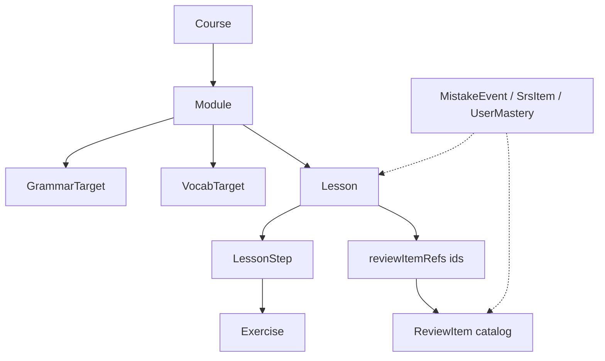

# Schema overview (content + learner state)

| Attribute | Value |
|-----------|--------|
| Status | **Contract** — companion to `/docs/product/*.md` |
| Code | `src/lib/schemas/*` (Zod + inferred TypeScript types) |
| Samples | `content/samples/*.json` |
| Validator | `npm run validate-content` → `tools/validate-content.ts`; Practice: `npm run validate-practice` |

---

## 1. Design goals

- **Data-driven lessons**: UI renders from `Course` → `Module` → `Lesson` → `LessonStep[]`; no lesson-specific React routes required.
- **Extensibility**: New **step types** and **exercise types** are added by extending Zod **discriminated unions** (clients should use exhaustive `switch` / `satisfies` for safety).
- **Separation**:
  - **Content** — course, module, lesson, steps, exercises, grammar/vocab targets, review item *definitions*.
  - **User state** — mistake events, SRS rows, mastery aggregates (not shipped inside static lesson JSON).
  - **Practice & Mastery** — scenario/mission content + session results (`src/lib/schemas/practice/`); see [`practice-schema-overview.md`](./practice-schema-overview.md).
- **Alignment** — bands A2.1–A2.3, can-dos, grammar spine ids, review extraction hooks (`review-engine.md`, `lesson-engine.md`, `content-generation-system.md`).

Supporting primitives live in `shared.schema.ts` (metadata bag, ids, ISO datetimes).

---

## 2. Entity relationships

- **`Course.modules[]`**: ordered thematic units (~12 at full scale per `a2-curriculum.md`).
- **`Module.grammarTargets` / `vocabTargets`**: authoritative catalog for that module.
- **`Lesson.grammarTargets` / `vocabTargets`**: **string ids** referencing the module catalog (enforced by `validate-content.ts`).
- **`Lesson.reviewItemRefs`**: ids into a **review item bank** (JSON file, CMS, or generated store).
- **`ReviewItem`**: canonical prompt/answer card; **`SrsItem`** wraps a `reviewItemId` **per user** with scheduling.
- **`MistakeEvent`**: append-only signal from runtime (step/exercise granularity).

---

## 3. How the lesson engine consumes schemas

1. Resolve **`Lesson`** by `id` (from path, manifest, or API).
2. Walk **`steps`** in order; **`discriminatedUnion('type', …)`** selects presenter + validation rules.
3. Read **`interactionConfig`**, **`content`**, **`audioRefs`**, **`correctAnswers`**, **`exercises[]`** as **opaque-to-UI configuration** — the engine interprets by `type` (see `lesson-engine.md`).
4. Merge **`feedbackConfig`** with product-default copy for **hints / errorTags** (analytics + weak-spot review).
5. On wrong answers, emit **`MistakeEvent`** payloads (server); never embed events in content files.

**Legacy bundle** (`catalog.bundle.json` / `a2Catalog.ts`) remains until migrated; this schema is the **target contract** for new content and generators.

---

## 4. How the review engine consumes schemas

1. **Ingest**: From completed lessons, create or refresh **`ReviewItem`** rows (or reuse pre-authored items referenced by `reviewItemRefs`).
2. **Schedule**: For each learner, persist **`SrsItem`** (`easeFactor`, `interval`, `dueDate`, `performanceHistory`).
3. **Prioritise**: Use **`MistakeEvent.errorType`** and lesson **`mistakeFocus`** / exercise **`feedbackConfig.errorTags`** to weight the daily queue (`review-engine.md`).
4. **Mastery**: Periodically update **`UserMastery`** maps (`vocabMasteryMap`, `grammarMasteryMap`, `skillLevels`) from lesson outcomes + SRS results.

---

## 5. How content generation uses schemas

1. **Author / generate** JSON that validates against **`lessonSchema`** / **`moduleSchema`** / **`courseSchema`**.
2. Run **`npm run validate-content`** in CI (plus future hooks: duplicate NL sentences, CEFR heuristics).
3. **AI pipelines** (`src/content-engine`) should **emit** objects compatible with these shapes (or a documented mapper from `lessonBlueprintSchema` → `Lesson`).
4. **Provenance** travels in optional **`metadata`** on each entity (author, model id, batch id).

---

## 6. File map

| File | Role |
|------|------|
| `shared.schema.ts` | `metadata`, `id`, ISO datetime helpers |
| `feedback.schema.ts` | Copy + `errorTags` |
| `grammarTarget.schema.ts` | Spine-aligned grammar unit |
| `vocabTarget.schema.ts` | Lemma/chunk for SRS |
| `exercise.schema.ts` | Reusable drill payloads |
| `lessonStep.schema.ts` | Discriminated step types |
| `lesson.schema.ts` | Lesson shell + refs |
| `module.schema.ts` | Module + catalogs |
| `course.schema.ts` | Root aggregate |
| `reviewItem.schema.ts` | Review card definition |
| `mistakeEvent.schema.ts` | Learner mistake row |
| `srsItem.schema.ts` | Per-user SRS state |
| `userMastery.schema.ts` | Aggregated mastery |
| `index.ts` | Public exports |
| `practice/*.schema.ts` | Practice scenarios, missions, session results, abilities, confidence, **scenario catalog entries** |
| `practice/index.ts` | Practice barrel export |

---

## 7. Assumptions & migration notes

- **`language: 'nl'`** and **`cefrLevel: 'A2'`** on the course are **canonical** for this product slice; enums allow other levels for reuse.
- **`SRSItem.interval`** is documented as **days** in product copy; dev environments may use minutes — keep **convention in API docs** when backend ships.
- **Existing** `A2CatalogLesson` shape is **not** identical; add a **transform layer** when importing legacy bundles into this schema.

---

## 8. Suggested next step (Stage 3 — engine slice)

Implement a **`getLessonRuntimePayload(lessonId)`** that:

1. Parses or maps stored JSON into **`Lesson`**,  
2. Builds a **normalised step list** (resolve `exercises`, attach module-level grammar snippets if needed),  
3. Exposes **pure functions** for “can advance step?” **without** React — then wire the existing `GuidedLessonPage` to this adapter behind a feature flag.
