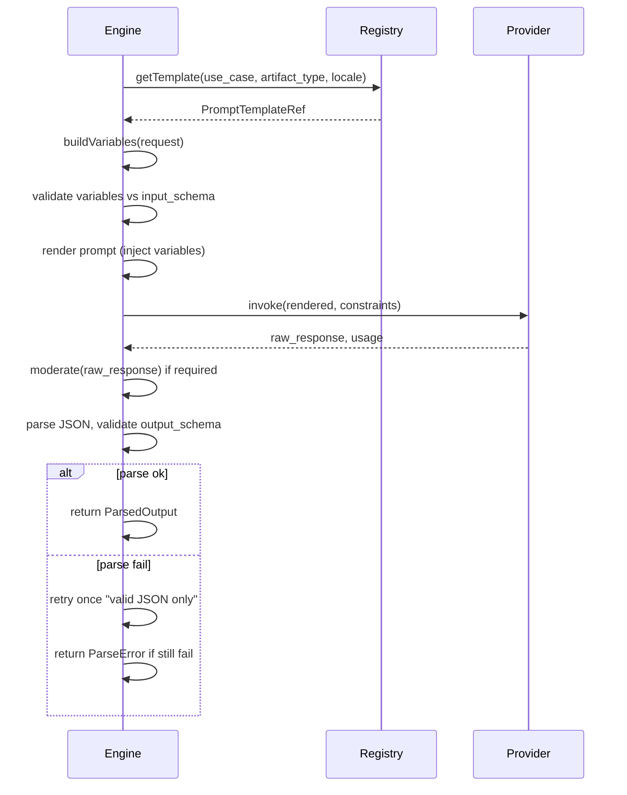

# Prompt Execution Framework

## 1. Purpose

This document defines the **prompt execution framework** used by the content generation engine: template selection, model/provider abstraction, variable injection, output schema enforcement, parsing, retries, fallback model selection, safety filtering, usage and cost logging, and traceability. It ensures that all LLM calls go through a single, controlled path with structured inputs and outputs.

## 2. Scope

- **In scope**: Template selection by use case and artifact type; model/provider interface; prompt variable injection; output schema (Zod/JSON Schema); parsing and validation; retry and fallback; safety (moderation, PII stripping); usage and cost logging; traceability (template version, model, input hash).
- **Out of scope**: Specific LLM API implementations (provider adapters live in integrations); prompt authoring UI.

## 3. Out of Scope

- Implementation of actual HTTP calls to OpenAI, Anthropic, etc. (engine calls an abstract `LLMProvider` interface).
- Visual prompt builder (templates are stored as code + body + schemas).

## 4. Assumptions

- Prompt templates are stored in a registry (DB or file) with code, template_body, input_schema, output_schema, constraints, safety_requirements.
- Output is always expected to be parseable (e.g. JSON); templates instruct the model to return valid JSON.
- One primary model per template (or per job type); fallback model is optional and configurable.

## 5. Template Selection

| Input | Selection logic |
|-------|-----------------|
| use_case | e.g. vocabulary_pack, dialogue, lesson_blueprint, reflection_lesson. |
| artifact_type | VocabularyItem, Dialogue, LessonBlueprint, etc. |
| locale | Optional; template may be locale-specific (e.g. nl, en). |
| version | Optional; if not specified, use latest active version. |

**Output**: PromptTemplateRef { code, version, template_body, input_schema, output_schema, constraints, safety_requirements }.

## 6. Model / Provider Abstraction

The engine does not call APIs directly. It uses an interface:

- **invoke(request: InvokeRequest): Promise<InvokeResult>**
  - **InvokeRequest**: { prompt: string, system_prompt?: string, max_tokens: number, temperature: number, model_id?: string, stop_sequences?: string[] }
  - **InvokeResult**: { raw_response: string, model_id: string, usage: { input_tokens, output_tokens }, finish_reason?: string }

Provider implementations (OpenAI, Anthropic, etc.) are responsible for:
- Authentication and rate limiting
- Mapping model_id to provider-specific model names
- Returning normalized usage for cost logging

## 7. Prompt Variable Injection

- **Input**: Template body with placeholders `{{ var_name }}` and a variables object validated against input_schema.
- **Process**: Replace each `{{ var_name }}` with the value (escaped if needed for the format); fail if required variable is missing.
- **Output**: Rendered prompt string (and optional separate system_prompt if template has a system section).
- **Rules**: No PII in variables; sanitize or hash user-provided text before injection; max length per variable if specified in input_schema.

## 8. Output Schema Enforcement

- **Output schema**: JSON Schema or Zod schema defining expected structure (e.g. { vocabulary: VocabularyItem[] }).
- **Parse**: Extract JSON from raw_response (handle markdown code blocks if present); parse with JSON.parse.
- **Validate**: Run parsed object against output_schema; collect errors.
- **Result**: ParsedOutput<T> with typed data, or ParseError with message and optional partial data (never persisted).

## 9. Parsing

- **Steps**: (1) Strip markdown code fence if present (e.g. ```json ... ```). (2) JSON.parse. (3) Validate against output_schema. (4) Map to engine artifact type(s) if schema is generic.
- **Retry**: On parse failure, one retry with appended instruction “Respond with valid JSON only, no other text.” If still failing, return ParseError; do not persist.

## 10. Retries and Fallback

| Condition | Behavior |
|-----------|----------|
| Transient error (timeout, 5xx) | Retry up to N times (e.g. 2) with backoff. |
| Parse error | One retry with “valid JSON only”; then fail. |
| Rate limit (429) | Backoff and retry per provider policy. |
| Fallback model | If primary model fails after retries, optionally invoke fallback_model_id (e.g. smaller/cheaper model); same template and input. |

Configuration: max_retries, retry_backoff_ms, fallback_model_id (optional).

## 11. Safety Filtering

- **Input**: Before injection, strip or replace PII in variables; length limits.
- **Output**: Before parse/validate, run moderation on raw_response (or on every string field after parse). If moderation flags content, do not persist; log; optionally alert.
- **Template-level**: safety_requirements may specify block_list, allowed_languages, max_output_length.

## 12. Usage and Cost Logging

- **Per invocation**: Log model_id, input_tokens, output_tokens, finish_reason, template_code, template_version, request_duration_ms.
- **Cost**: Estimate cost from usage and model price table (config or lookup); log cost_estimate for billing/analytics.
- **No PII**: Do not log raw prompt or raw response if they might contain user data; log input_hash and output_hash only.

## 13. Traceability

Every execution produces a trace record (in memory or DB) with:
- **trace_id**: UUID for the run.
- **template_code**, **template_version**
- **model_id**
- **input_hash** (of sanitized variables)
- **output_hash** (of raw response, optional)
- **parsed**: boolean
- **validation_passed**: boolean (after artifact validation)
- **artifact_ids** (if persisted)

This supports audit and debugging without storing full content.

## 14. Flow Diagram



## 15. Failure Modes

- Template not found → return error; no invoke.
- Variable validation fail → return error; no invoke.
- Invoke timeout/error → retry then fail; no persist.
- Moderation flag → do not parse or persist; log.
- Parse/validation fail → retry once then return ParseError; no persist.

## 16. Security and Safety

- PII never in variables or logs; input_hash only.
- Moderation on all generated text before use.
- Template and model version pinned for reproducibility.

## 17. Cost Considerations

- Log tokens and estimated cost per run; support batch-level caps.
- Fallback to cheaper model when configured can reduce cost on retry.

## 18. Dependencies

- docs/final/prompts/prompt-library-architecture.md
- content-generation-engine-overview.md
- content-artifact-model.md

## 19. Recommended Decisions

- Implement a single `PromptExecutor` class/module that takes (request, templateRef, provider) and returns (ParsedOutput | ParseError, trace).
- Use Zod for output_schema in code; compile to JSON Schema for storage if needed.
- Keep provider behind an interface so tests can use a mock provider.
