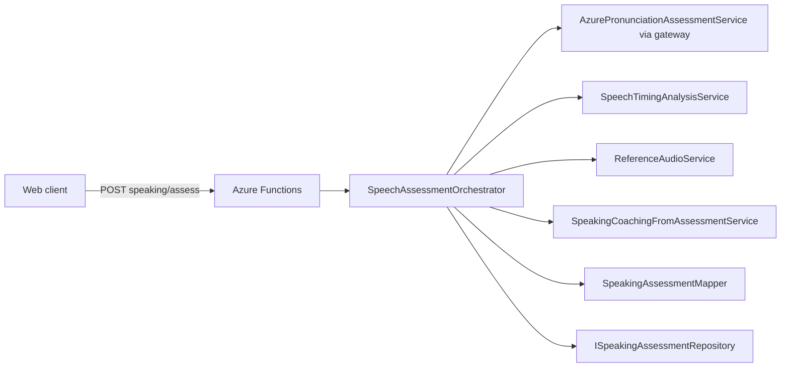

# Speaking feedback — foundation architecture

**Status:** Phase 1 (architecture, contracts, orchestration, APIs, persistence abstraction, FE client).  
**Audit:** `docs/speaking-feedback-foundation-audit.md`  
**Phase 2 (deterministic derived signals):** `docs/speaking-derived-analysis.md`  
**Phase 3 (reference audio + compare):** `docs/reference-audio-and-comparison.md`  
**Phase 4 (grounded LLM coaching):** `docs/speaking-llm-coaching.md`  
**Legacy path:** `POST /api/speech/pronunciation-assessment` remains for Talk / sticky composer; new stack is additive.

## Goals

- One **canonical** assessment model across Azure, timing, coaching, storage, and UI.
- **Strict validation** (Zod) on HTTP ingress; deterministic timing; LLM coaching **must not invent scores**.
- **Observability:** structured JSON logs + step durations.
- **Persistence:** repository interface; file-backed store for dev (`SPEAKING_ASSESSMENT_*`).

## Architecture (high level)



## Services (backend)

| Unit | Path | Responsibility |
|------|------|------------------|
| **SpeechAssessmentOrchestrator** | `speechAssessmentOrchestrator.ts` | Sequencing, logging, persistence, view-model projection. |
| **Azure path** | `pronunciationAssessmentGateway.ts` + `azurePronunciationAssessmentService.ts` | SDK pronunciation assessment; exposes optional `providerRawResult` (parsed Speech JSON). Word timings when Azure returns `Offset`/`Duration`. |
| **SpeechTimingAnalysisService** | `speechTimingAnalysisService.ts` | Pause gaps, WPM estimate, hesitation moments, pace notes — **no LLM**. |
| **ReferenceAudioService** | `referenceAudioService.ts` | Contract for normal / slow / chunked URLs; **phase 1 returns nulls** + provider id (TTS wiring later). |
| **SpeakingCoachingFromAssessmentService** | `speakingCoachingFromAssessmentService.ts` | OpenAI JSON coaching from structured payload; **Zod-validated**; deterministic fallback if key missing or parse fails. |
| **SpeakingAssessmentMapper** | `speakingAssessmentMapper.ts` | Azure normalized scores → canonical `SpeakingAssessmentResult`; merge word-level coaching hints. |
| **Repository** | `speakingAssessmentRepository.ts` | `FileSpeakingAssessmentRepository` \| `NullSpeakingAssessmentRepository`; `createSpeakingAssessmentRepository()`. |

## Canonical domain model

Type definitions: `backend/src/domain/speaking-assessment/speakingAssessmentCanonical.ts`

Top-level: **`SpeakingAssessmentResult`** — includes `assessmentId`, `provider`, `locale`, `scenarioId`, `promptId`, `expectedText`, `transcript`, `transcriptNormalized`, optional `audioBlobUrl`, `userClipDurationMs`, `summary`, `rawScores`, `derivedScores`, `verdicts`, `timingAnalysis`, `wordAssessments[]`, `phraseTargets[]`, `coaching`, `referenceAudio`, `rawProviderPayload`, `generatedCoachingPayload`, `createdAtUtc`.

FE-safe projection: **`SpeakingAssessmentViewModel`** — same fields needed for UI, **no** raw Azure blob; includes `caveats[]`.

HTTP ingress: **`SpeakingAssessHttpBodySchema`** in `speakingAssessmentHttpSchemas.ts`.

## API contracts

Base path: `/api` (Azure Functions route prefix).

| Method | Route | Auth |
|--------|-------|------|
| **POST** | `/speaking/assess` | `x-user-id` (same as rest of app) |
| **GET** | `/speaking/reference-audio?text=&locale=&speed=normal\|slow\|chunked&voice=` | `x-user-id` |
| **GET** | `/speaking/assessment/{assessmentId}` | `x-user-id` (owner check) |

### POST `/speaking/assess` — body (JSON)

- `audioBase64`, `mimeType` (required)
- `locale?`, `scenarioId`, `promptId`, `level` (`A1`|`A2`|`B1`), `mode` (`reference`|`open_response`), `includeReferenceAudio`, `userClipDurationMs?`
- `expectedText?` — **required** when `mode=reference`
- `transcript?` — **required** when `mode=open_response` (Whisper / STT proxy for Azure open-response alignment)

### POST response

```json
{
  "assessmentId": "uuid",
  "assessment": { "...SpeakingAssessmentViewModel" }
}
```

## Environment variables

| Variable | Purpose |
|----------|---------|
| `AZURE_SPEECH_KEY` / `AZURE_SPEECH_REGION` / `AZURE_SPEECH_LOCALE` | Existing Azure Speech pronunciation (default locale `nl-NL`). |
| `PRONUNCIATION_MODE` | `azure` \| `off` — gates Azure pronunciation in **legacy** and **orchestrated** paths. |
| `OPENAI_API_KEY` | Coaching LLM for speaking assessment. |
| `OPENAI_MODEL_SPEAKING_ASSESSMENT` | Model for coaching (fallback: `OPENAI_MODEL_ENRICHMENT` → `OPENAI_MODEL`). |
| `SPEAKING_ASSESSMENT_PERSIST` | `1` / `true` — enable default file store under `data/speaking-assessments` (repo). |
| `SPEAKING_ASSESSMENT_STORE_PATH` | Explicit directory for JSON files. |
| `SPEAKING_CACHE_ENABLED` | Reserved for reference-audio cache hits (logged). |
| `SPEAKING_SAVE_RAW_PROVIDER_PAYLOAD` | When set, persisted row includes `rawProviderPayload` field. |
| `SPEAKING_REFERENCE_AUDIO_PROVIDER` | `azure` \| `openai` \| `browser-fallback` (phase 1: URLs still null). |
| `AZURE_TTS_VOICE` | Default Dutch neural voice label for future reference TTS. |
| `AUDIO_UPLOAD_MAX_MB` | Shared cap with transcribe / pronunciation routes. |

## Data flow (POST assess)

1. Validate body (Zod); decode audio; guard size / empty buffer.
2. **Azure:** `runPronunciationAssessment` with `reference` or `open_response` alignment.
3. **Timing:** `analyzeSpeechTiming` from word `startMs`/`endMs` when present + clip duration + transcript.
4. **Reference audio:** `ReferenceAudioService` (stub URLs unless future TTS).
5. **Coaching LLM:** payload = scores + timing + per-word summary (no invented numbers in prompt); output validated with `SpeakingAssessmentCoachingLlmSchema`.
6. **Map** → `SpeakingAssessmentResult`; **project** → `SpeakingAssessmentViewModel`.
7. **Persist** repository row (always attempts save; null repo no-ops unless file path / persist flag).

## Logging

Each step emits a single JSON line to stdout (`console.log`) with `component: "speaking_assessment"`, `step`, optional `assessmentId`, `durationMs`, and `extra` metadata. Steps: `upload_received`, `azure_assessment_start|end`, `timing_analysis_start|end`, `reference_audio_start|end`, `llm_coaching_start|end`, `orchestration_complete`.

## Frontend integration

- Types: `src/lib/speaking/speakingAssessmentTypes.ts`
- Client: `src/lib/speaking/speakingAssessmentClient.ts` — `requestSpeakingAssessment`, `getSpeakingAssessmentById`, `getSpeakingReferenceAudio`
- Legacy pronunciation response may include optional `providerRawResult` (`audioPronunciationTypes.ts`).

## Future phases (recommended)

1. **Word / phrase richness** — deeper parse of Azure `NBest` JSON; syllable stress; “Dutch-likeness” model features.
2. **Reference playback** — wire `ReferenceAudioService` to Azure TTS or cached blob; `SPEAKING_CACHE_ENABLED` + Redis/blob metadata.
3. **SQL repository** — replace file store with `SpeakingAssessments` table + row-level security by `userId`.
4. **UI** — premium coach card consuming `SpeakingAssessmentViewModel`; retry loops + compare-to-reference waveform.
5. **Training pipeline** — batch exports from `SPEAKING_SAVE_RAW_PROVIDER_PAYLOAD` for model evaluation.
