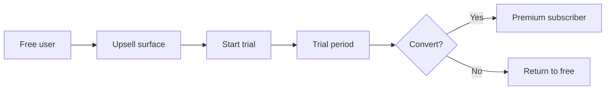

# Phase 1: Business Requirements (v2)

## Document Info

| Attribute | Value |
|-----------|--------|
| Phase | 1 – Business Requirements |
| Version | 2 |
| Status | Draft (post-review) |

---

## 1. Problem Definition

### 1.1 Business Problem

Expats living in the Netherlands need to learn Dutch for daily life, work, and integration, but existing language learning solutions are misaligned with their needs:

- **Academic vs. practical**: Most apps teach generic vocabulary and grammar (e.g. "The horse eats the apple") rather than situation-specific communication (ordering food, doctor visits, workplace meetings, government services).
- **One-size-fits-all**: Content is not tailored to the expat's profile (occupation, family situation, goals, current level).
- **Limited real-world practice**: Few products offer AI-driven conversation simulation, speech analysis, or context-aware prompts tied to the user's daily life and location.
- **Exam and integration gaps**: Dedicated preparation for Dutch integration exams (A2, B1, KNM) is often separate from daily practice, fragmenting the learning experience.

### 1.2 User Problem

Expats struggle to:

- Communicate confidently in real Dutch situations (restaurants, healthcare, work, administration).
- Get personalized, relevant lessons that match their life context.
- Practice speaking and listening with feedback (pronunciation, fluency).
- Prepare efficiently for official integration exams while building practical skills.

### 1.3 Opportunity

A platform that combines **context-aware learning**, **AI conversation and speech**, **personalization**, and **exam preparation** in one product can capture a distinct position: **Contextual AI Language Learning for Expats**, starting with Dutch in the Netherlands.

---

## 2. Product Vision and Objectives

### 2.1 Vision Statement

**AI Dutch Coach** is the most practical way for expats to learn Dutch by focusing on real-life conversations, contextual learning, personalized lessons, and listening/speaking practice integrated into daily life. The long-term vision is to become a broader platform that helps expats integrate linguistically and culturally into their host country.

### 2.2 Strategic Objectives

| ID | Objective | Success Indicator |
|----|-----------|-------------------|
| OBJ-1 | Establish Dutch (NL) as first market with full feature set | Launch in NL with all core modules live |
| OBJ-2 | Achieve sustainable unit economics per paying user | Cost per active user ≤ €2/month; LTV > 3× CAC |
| OBJ-3 | Drive premium conversion at 5–10% | 5–10% of active users on paid tier |
| OBJ-4 | Retain users beyond initial trial | >30% 30-day retention |
| OBJ-5 | Enable future expansion to other languages/countries | Architecture and content model support multi-language/multi-region |

### 2.3 Capability Map (Objectives → Product Capabilities)

| Objective | Product Capabilities |
|-----------|----------------------|
| OBJ-1 | Personalized Learning Engine, Core Language Modules, Scenario Simulations, AI Voice Tutor, Listening Training, Pronunciation Analysis, Daily Reflection, Location Prompts, Exam Prep, Gamification, AI Feedback |
| OBJ-2 | Subscription & entitlements, usage metering, cost controls (see Operations) |
| OBJ-3 | Freemium gating, trial flow, premium upsell surfaces, conversion analytics |
| OBJ-4 | Onboarding, streaks, notifications, re-engagement, content relevance |
| OBJ-5 | Multi-language/content data model, locale-aware content, region-specific scenarios (architecture) |

---

## 3. Target Users and Personas

### 3.1 Primary Audience

Expats living in the Netherlands. Segments include:

- International workers (highly skilled migrants, corporate relocations).
- International students.
- Long-term residents seeking integration.
- Partners of Dutch residents.
- New immigrants preparing for integration exams.

### 3.2 User Attributes (Onboarding)

Collected for personalization and learning path:

| Attribute | Purpose |
|-----------|---------|
| Native language | Content and UI localization; difficulty calibration |
| Known languages | Avoid redundancy; placement |
| Country of origin | Cultural context; scenario relevance |
| Time in Netherlands | Context for scenarios (newcomer vs. settled) |
| Family status (solo, couple, children) | Scenario selection (e.g. school, daycare) |
| Age group | Content tone; exam requirements |
| Occupation / industry | Workplace and professional scenarios |
| Hobbies | Engagement and scenario variety |
| Daily routines | Timing and scenario relevance |
| Current Dutch level (A0–C1) | Placement and difficulty |
| Target level (A2/B1/B2) | Learning path and exam prep |
| Target objective | Integration exam, workplace fluency, social fluency |

### 3.3 Persona Summaries

| Persona | Goals | Key Scenarios |
|---------|--------|----------------|
| **Working Professional** | Workplace Dutch, meetings, emails | Office, client calls, small talk |
| **Student** | Social and academic Dutch | Campus, housing, daily tasks |
| **Parent** | School, daycare, healthcare | School communication, doctor, grocery |
| **Integration Candidate** | Pass A2/B1/KNM exams | Exam prep, civic topics |
| **Partner of Dutch Resident** | Social and family Dutch | Family, in-laws, daily life |

### 3.4 Internal Stakeholders (Reference)

| Role | Interest in Business Requirements |
|------|-----------------------------------|
| Product | Scope, metrics, conversion, roadmap |
| Engineering | Feasibility, dependencies, NFRs |
| Support | User flows, entitlement clarity, edge cases |
| Content / Curriculum | Exam alignment, scenario coverage, localization |
| Legal / Compliance | Consent, retention, GDPR, age policy |
| Marketing / GTM | Conversion funnel, positioning, channels |

*GTM strategy (channels, SEO, community, partnerships) is documented separately; conversion funnel and premium positioning are in scope for this document.*

---

## 4. Value Proposition

### 4.1 Core Value

Teach Dutch through **real-world experiences** instead of generic academic content. Differentiators:

- Context-aware learning (scenarios based on user profile and goals).
- AI-driven conversation simulation and voice tutor.
- Speech analysis and pronunciation feedback.
- Daily-life reflection lessons (e.g. "you went to the supermarket" → lesson on supermarket phrases).
- Location-aware prompts: **user can enable or disable**; when enabled, app suggests phrases near relevant venues (e.g. café). Fully optional feature.
- Exam preparation integrated with practical skills.

### 4.2 Positioning

**"Dutch learning for expats."** Sub-positioning: contextual, AI-powered, practical.

### 4.3 Competitive Assumption

Differentiation is defensible via **expat focus**, **context-aware scenarios**, and **integrated speech/AI**; generic apps (Duolingo, Babbel) do not offer the same depth of real-life scenario and personalization. Niche positioning supports premium willingness.

---

## 5. Business Model and Revenue

### 5.1 Model

**Freemium**: Free tier with limited access; Premium tier with full features.

### 5.2 Free Tier

- Core vocabulary lessons.
- Basic grammar.
- **Limited exercises**: capped number of lessons or scenario sessions per day or per week (exact caps defined in Feature Domain spec; e.g. 3–5 lessons/day, 1–2 scenario sessions/week).

### 5.3 Premium Tier

- AI voice conversations.
- Pronunciation analysis.
- Advanced listening training.
- Scenario simulations (unlimited within fair use).
- Exam preparation modules.
- Personalized daily lessons (e.g. from daily reflection).
- **Unlimited AI practice** subject to fair-use policy (e.g. reasonable daily caps to control cost and abuse; defined in Operations/Feature specs).

### 5.4 Pricing

- **Target range**: €8–€15 per month (subscription).
- **Conversion target**: 5–10% of active users.
- **Trial**: Recommended 7- or 14-day premium trial to support conversion (decision in Open Questions).

### 5.5 Revenue Example

- 10,000 users × 8% conversion × €10/month ≈ **€8,000/month**.
- At scale, operational costs estimated ~$10,000/month; margins improve with AI optimization.

---

## 6. Scope

### 6.1 In Scope (Full Product)

- Personalized learning engine and learning path.
- Core language modules (vocabulary, grammar, listening, speaking, reading, quizzes, flashcards).
- Real-life scenario simulations (AI conversation partner).
- AI voice conversation tutor (premium).
- Listening training (including situational audio).
- Pronunciation analysis and feedback (premium).
- Daily life reflection module (photo/location/notes → generated lesson).
- Location-aware learning prompts: **optional; user can enable/disable**; requires consent and permissions.
- Dutch exam preparation (A2, B1, KNM).
- Gamification (XP, streaks, achievements, daily challenges, leaderboards).
- AI tutor feedback (grammar, vocabulary, pronunciation, fluency, listening).
- User profile and onboarding.
- Premium subscription and entitlement enforcement.
- Multi-language and multi-region readiness in architecture and data (Dutch first).

### 6.2 Out of Scope (Initial Release)

- Native iOS/Android apps (architecture must allow future addition).
- Community features (language partners, conversation groups) — future enhancement.
- Corporate/enterprise tier — future.
- Offline-first full lesson delivery (degraded mode only as per UI spec).
- Teaching languages other than Dutch at launch (architecture supports adding them).
- Detailed GTM tactics (channel playbooks) — referenced elsewhere; conversion funnel in scope.

---

## 7. Business Rules

| ID | Rule | Applies To |
|----|------|------------|
| BR-1 | Premium features are gated by subscription status | Entitlements, feature access |
| BR-2 | User level (A0–C1) drives content difficulty and recommendations | Lesson engine, scenarios |
| BR-3 | Location prompts require explicit user consent; user can disable at any time; feature is optional | Location-aware feature |
| BR-4 | Audio and photo data require consent and are subject to retention limits | Privacy, data |
| BR-5 | Minors (if ever supported) require additional safety and consent rules | Compliance, future |
| BR-6 | Exam preparation modules align with official exam structures (A2, B1, KNM) | Content, assessment |
| BR-7 | Gamification points and streaks follow defined rules (e.g. streak freeze, XP caps) | Gamification engine |
| BR-8 | Free-tier limits (lesson/scenario caps) are enforced per user per period | Entitlements, usage |

---

## 8. Business-Level Functional Requirements (BFRs)

Traceable requirements for downstream phases.

| ID | Requirement |
|----|-------------|
| BFR-001 | The system shall support a freemium model with a free tier and a premium (paid) tier. |
| BFR-002 | The system shall enforce premium entitlements so that premium-only features are inaccessible to free users unless in trial. |
| BFR-003 | The system shall support subscription-based premium (monthly; annual TBD). |
| BFR-004 | The system shall support a time-limited premium trial (duration TBD; recommended 7 or 14 days). |
| BFR-005 | The system shall collect and use user profile attributes (native language, level, goals, etc.) to personalize learning path and content. |
| BFR-006 | The system shall support Dutch as the first teaching language and allow future addition of other teaching languages. |
| BFR-007 | The system shall support multiple learner native languages and locales for UI and content. |
| BFR-008 | The system shall provide export and deletion of user data in line with GDPR. |
| BFR-009 | The system shall obtain explicit consent for optional data (microphone, location, photos, AI context) and allow withdrawal. |
| BFR-010 | The system shall store and process personal data in a manner consistent with EU data residency requirements (see NFR below). |
| BFR-011 | The system shall enforce free-tier usage limits (lesson/scenario caps) as defined in feature spec. |
| BFR-012 | The system shall support Dutch integration exam preparation (A2, B1, KNM) as defined in content scope. |

---

## 9. Business-Level Non-Functional Requirements (NFRs)

| ID | Requirement |
|----|-------------|
| BNFR-001 | **Data residency**: Personal data (profile, audio, location, usage) shall be stored and processed in the EU (e.g. EU region of cloud provider) unless explicitly otherwise for a specific subprocessor with adequate safeguards. |
| BNFR-002 | **Compliance**: The system shall support GDPR rights (access, rectification, erasure, portability, restriction, objection) and document retention per data category. |

---

## 10. High-Level Business Workflows

### 10.1 Onboarding → First Lesson

```mermaid
flowchart LR
  A[Sign up / Login] --> B[Profile & preferences]
  B --> C[Consent (optional features)]
  C --> D[Level & goals]
  D --> E[First lesson / recommendation]
  E --> F[Ongoing learning]
```

- **Sign up / Login**: User creates account or signs in.
- **Profile & preferences**: Native language, occupation, family, etc.
- **Consent**: Microphone, location, notifications, photo upload (each optional).
- **Level & goals**: Current level, target level, objective (exam, work, social).
- **First lesson / recommendation**: System recommends first lesson based on profile.
- **Ongoing learning**: User enters main learning loop.

### 10.2 Free → Trial → Premium Conversion



- **Upsell surface**: In-app prompts when user hits free limit or high engagement.
- **Trial**: Time-limited premium access (e.g. 7 or 14 days).
- **Convert**: Payment at end of trial or during trial; otherwise revert to free.

### 10.3 User Lifecycle (Retention View)


- **New**: Just onboarded.
- **Active**: Regular engagement (e.g. at least N sessions in last 7 days).
- **Lapsed**: No engagement for defined period; re-engagement (notifications, email) as per product decision.
- **Churned**: Long-term inactive or cancelled; win-back possible later.

*Definitions of "active," "lapsed," and "churned" time windows are set in product/analytics.*

---

## 11. Success Metrics

| Metric | Target | Measurement |
|--------|--------|-------------|
| Daily active users (DAU) | Growth over time | Analytics |
| Lesson completion rate | Track per module type | Analytics |
| Conversation session length | Average duration | Analytics |
| Speech practice usage | Sessions per user/week | Analytics |
| Exam pass rate improvement | Self-reported or linked if feasible | Surveys / integration |
| Premium conversion rate | 5–10% | Subscription funnel |
| 30-day retention | >30% | Cohort analysis |
| 90-day retention | Track and optimize | Cohort analysis |
| Cost per active user | ≤ ~$2/month | Finance / ops |
| LTV/CAC | LTV > 3× CAC | Finance |

---

## 12. Assumptions

| ID | Assumption |
|----|------------|
| A-1 | Expats are willing to pay €8–15/month for a focused, practical Dutch product. |
| A-2 | AI (LLM + speech) quality and latency are sufficient for conversation and feedback. |
| A-3 | Mobile web is an acceptable first channel; PWA and responsive design meet initial needs. |
| A-4 | User-provided profile and context data are accurate enough for personalization. |
| A-5 | Regulatory environment (GDPR, AI) allows collection and processing of voice, location, and profile data with consent. |
| A-6 | Dutch exam structures (A2, B1, KNM) remain stable for content design. |
| A-7 | Expansion to other languages/countries will use the same product and architecture patterns. |
| A-8 | Users accept fair-use limits on "unlimited" premium AI usage for sustainability. |

---

## 13. Risks

| ID | Risk | Mitigation |
|----|------|------------|
| R-1 | AI cost per user erodes margins | Usage caps, caching, model optimization, tiered limits |
| R-2 | Low conversion to premium | Strong free value, clear upsell, trial period |
| R-3 | Churn after exam (e.g. after passing integration) | Ongoing goals, social fluency, B2 content, community features later |
| R-4 | Privacy/consent concerns (voice, location) | Clear consent flows, retention, deletion, transparency |
| R-5 | Competition from incumbents (Duolingo, Babbel, etc.) | Differentiation on context and expat focus; niche positioning |
| R-6 | Dependency on third-party AI/speech APIs | Fallbacks, multi-provider strategy, SLAs |
| R-7 | User expectation of native app vs. mobile web | Clear positioning, PWA, future native path documented in architecture |

---

## 14. Compliance and Trust

### 14.1 GDPR / Privacy

- **Lawful basis**: Consent for optional data (location, audio, photos); contract/legitimate interest where appropriate.
- **Rights**: Access, rectification, erasure, portability, restriction, objection.
- **Retention**: Defined per data type (see Data doc); audio and location subject to short retention where possible.
- **Data export and deletion**: Full export and account deletion supported (BFR-008).

### 14.2 Consent

- Explicit consent for: microphone, location, notifications, photo upload, AI processing of personal context (BFR-009).
- Consent withdrawable; features degrade or disable when consent is withdrawn.

### 14.3 AI and Safety

- AI content and corrections moderated; no harmful or inappropriate outputs.
- Transparency: users informed when they interact with AI.
- Child safety: if underage users are ever supported, additional guardrails and consent.

### 14.4 Premium and Payments

- Secure handling of payment and subscription data (PCI considerations via payment provider).
- Clear communication of subscription terms, renewal, cancellation.

---

## 15. Dependencies

- **External**: AI/LLM APIs, speech (STT/TTS), pronunciation analysis, payment provider, cloud infrastructure.
- **Internal**: User profile service, lesson engine, content pipeline, gamification, notifications.
- **Other specs**: Feature Domain (free-tier caps, fair-use); Data (retention, residency); Integrations (payment, AI, speech); Operations (cost controls).

---

## 16. Open Questions

| ID | Question | Owner |
|----|----------|--------|
| OQ-1 | Exact pricing (€8 vs €10 vs €15) and trial length | Product / Business |
| OQ-2 | Whether to support annual subscription and discount | Product |
| OQ-3 | Partnership with language schools or relocation agencies at launch | GTM |
| OQ-4 | Minimum age for users (e.g. 16+) for initial release | Legal / Product |
| OQ-5 | Exact free-tier caps (lessons/day, scenarios/week) | Product / Feature spec |

---

## 17. Recommended Decisions

- **Recommend** defining a 7- or 14-day premium trial to support conversion.
- **Recommend** storing all user-sensitive data in EU for GDPR and latency (BNFR-001).
- **Recommend** documenting retention periods per data category in the Data specification.
- **Recommend** treating location and audio as opt-in only, with clear in-app explanations.
- **Recommend** defining fair-use limits for premium AI usage in Operations/Feature specs and communicating them in-app (e.g. "generous daily limit").
