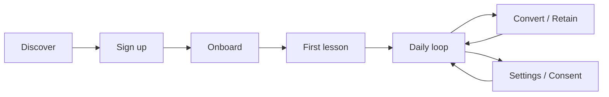

# Phase 5: User Workflows & Product Journeys (v1)

## Document Info

| Attribute | Value |
|-----------|--------|
| Phase | 5 – User Workflows & Product Journeys |
| Version | 1 |
| Status | Draft |

---

## 1. Purpose and Scope

This document defines **user workflows** and **product journeys** so that implementation (especially UI and API) can align with user goals. It references Feature Domain (FD-*) and Business workflows and adds granular steps, decision points, and error paths.

**In scope**: Sign-up and onboarding, first lesson, daily learning loop, scenario and voice flows, exam prep, premium conversion, re-engagement, settings and consent.

**Out of scope**: Detailed screen layouts (UI doc); API contracts (Backend doc).

---

## 2. Journey Map Overview

---

## 3. Sign-Up and Onboarding Journey

### 3.1 Goal

User creates account and completes profile so the system can personalize content and recommend first lesson.

### 3.2 Entry Points

- Landing/marketing page → Sign up.
- In-app (if logged out) → Sign up / Log in.

### 3.3 Workflow (Step-by-Step)

| Step | Actor | Action | System Response | FD / Notes |
|------|--------|--------|------------------|------------|
| 1 | User | Opens sign-up (email or social) | Show sign-up form | Auth |
| 2 | User | Enters email + password (or OAuth) | Validate; create account or link | BFR-009 not yet |
| 3 | System | Redirect to onboarding | Show profile step 1 | FD-01 |
| 4 | User | Fills profile: native language, country, time in NL, family, occupation, hobbies, routines | Validate; save partial; next | FD01-FR-001 |
| 5 | User | Sets level (A0–C1) and target (A2/B1/B2), objective (exam/work/social) | Save; required | FD01-FR-001, IS-002 |
| 6 | System | Show consent screen(s) | Explain each: microphone, location, notifications, photo, AI context | BFR-009 |
| 7 | User | Grants or declines each consent | Persist flags | FD01-FR-002 |
| 8 | System | Compute recommendation; show "Get started" / first lesson CTA | FD01-FR-004 | FD-02 |
| 9 | User | Taps "Start" or "Go to lesson" | Navigate to home or first lesson | |

### 3.4 Alternate Paths

- **Skip optional profile fields**: Allow; minimal required = level, target, one goal.
- **Resume**: User leaves and returns → resume at last step (FD01-FR-003).
- **Edit later**: Profile and consent editable from Settings (FD-01).

### 3.5 Error Paths

- **Validation error**: Inline message; prevent next until valid.
- **Network error**: Retry; save locally if supported and sync later (optional).

---

## 4. First Lesson Journey

### 4.1 Goal

User completes first recommended lesson and sees value (progress, XP, feedback).

### 4.2 Entry Points

- End of onboarding ("Start your first lesson").
- Home ("Continue" or "Recommended for you").

### 4.3 Workflow

| Step | Actor | Action | System Response |
|------|--------|--------|------------------|
| 1 | System | Show recommended lesson (from profile/level) | FD02-FR-001 |
| 2 | User | Taps lesson | Load lesson content; show first card/slide |
| 3 | User | Completes cards/exercises | Checkpoint save; next |
| 4 | User | Completes quiz (if part of lesson) | Score; pass/fail; retry if allowed |
| 5 | System | Award XP; update streak; show feedback summary | FD-10, FD-11 |
| 6 | User | Sees "Next lesson" or "Back to home" | Return to home with updated state |

### 4.4 Alternate Paths

- **Abandon**: Leave mid-lesson; progress saved at checkpoint; home shows "Continue [lesson]" next time.
- **Fail quiz**: One retry; then show answers and allow continue.

### 4.5 Error Paths

- **Load failure**: Retry; show error and "Try again" or "Choose another lesson."

---

## 5. Daily Learning Loop (Returning User)

### 5.1 Goal

User opens app, sees progress and recommendations, completes one or more activities (lessons, scenario, voice, listening, exam prep), and maintains streak.

### 5.2 Entry Points

- Push/in-app notification ("Time to practice").
- Direct open (home).

### 5.3 Workflow

| Step | Actor | Action | System Response |
|------|--------|--------|-----------------|
| 1 | User | Opens app | Auth check; load home |
| 2 | System | Show home: streak, XP, today's progress, recommended next (lesson/scenario/exam) | FD-10, Lesson Engine |
| 3 | User | Chooses activity (lesson, scenario, voice, listening, exam prep) | Navigate to that flow (see §6–§8) |
| 4 | User | Completes activity | Progress saved; XP/streak; feedback |
| 5 | User | Returns to home or starts another activity | Home state updated |
| 6 | (Optional) | Free user hits cap | Show upsell (FD-12) |

### 5.4 Decision Points

- **Free at cap**: Block new lesson/scenario; show "Upgrade for unlimited" or "Come back tomorrow."
- **Premium/trial**: Full access within fair use.

### 5.5 Related Journeys (Same Loop)

- **Listening (FD-05)**: User selects listening exercise from home → audio + questions → submit → feedback (and optional transcript after); progress and XP.
- **Daily reflection (FD-07)**: User adds reflection entries (photo/location/note) → later, system generates "Your day" lesson → user completes lesson; premium only.

---

## 6. Scenario Simulation Journey (Text/Chat)

### 6.1 Goal

User practices a real-life situation by chatting with AI in Dutch; gets feedback at end.

### 6.2 Entry Points

- Home "Scenarios" or "Practice conversation."
- After lesson (e.g. "Try this scenario").

### 6.3 Workflow

| Step | Actor | Action | System Response |
|------|--------|--------|-----------------|
| 1 | User | Selects scenario (e.g. Café) | Check entitlement (FD12-FR-002); if free at cap → upsell |
| 2 | System | Show scenario intro and first AI message (or character prompt) | FD03-FR-004 (AI indicated) |
| 3 | User | Types reply in Dutch | Send to backend; LLM + moderation (FD03-FR-002, FD03-FR-003) |
| 4 | System | Return AI reply (filtered) | Display in chat |
| 5 | Repeat 3–4 | Conversation continues | Optional: gentle corrections in reply |
| 6 | User | Taps "End" or completes N turns | Summary + feedback (FD-11); XP |
| 7 | System | Save session; update usage (free count) | FD03-FR-006, FD12-FR-003 |

### 6.4 Error Paths

- **LLM timeout**: "Something went wrong"; Retry.
- **Moderation block**: Generic message; do not show harmful content.

---

## 7. AI Voice Tutor Journey

### 7.1 Goal

User has a spoken Dutch conversation with AI; receives TTS and optional pronunciation/fluency feedback.

### 7.2 Entry Points

- Home "Voice conversation" or "Speak with AI."
- From scenario (if voice-enabled scenario).

### 7.3 Workflow

| Step | Actor | Action | System Response |
|------|--------|--------|-----------------|
| 1 | User | Taps "Start voice conversation" | Check entitlement + microphone consent (FD04-FR-003) |
| 2 | If no consent | Prompt for microphone permission | Once; if denied → message + text fallback |
| 3 | If no entitlement | Show upsell | FD-12 |
| 4 | User | Selects topic/level; optional speed | Start session |
| 5 | System | Play TTS (AI prompt) | FD04-FR-001 |
| 6 | User | Speaks | STT → text; send to LLM |
| 7 | System | LLM response → TTS; play | Optional: show transcript |
| 8 | Repeat 5–7 | Conversation | Replay (FD04-FR-002), speed change |
| 9 | User | Ends session | Summary; optional pronunciation feedback (FD-06); XP |
| 10 | System | Persist session; check fair-use (FD04-FR-005) | |

### 7.4 Error Paths

- **STT/TTS failure**: Retry or "Use text instead."
- **High latency**: Loading state; consider streaming TTS.

---

## 8. Exam Preparation Journey

### 8.1 Goal

User practices exam components (reading, listening, speaking, writing, KNM) and optionally runs a simulated exam.

### 8.2 Entry Points

- Home "Exam prep" or goal = integration exam in profile.
- After onboarding if goal = exam.

### 8.3 Workflow

| Step | Actor | Action | System Response |
|------|--------|--------|-----------------|
| 1 | User | Selects exam (A2/B1) and component (e.g. Reading) | Check entitlement (FD09-FR-004) |
| 2 | System | Serve practice (passage + questions) (IS-004, IS-005) | FD09-FR-001, FD09-FR-002 |
| 3 | User | Completes questions; submits | Score; feedback; progress (FD09-FR-003) |
| 4 | User | Optionally starts "Simulated exam" | Timed; all components or subset |
| 5 | System | Results summary | Persist; show areas to improve |

### 8.4 Alternate Paths

- **Limited free content**: Free user sees some practice; "Unlock full exam prep" for premium.

---

## 9. Premium Conversion Journey (Free → Trial → Paid)

### 9.1 Goal

Free user discovers premium value, starts trial, and converts to paid (or returns to free).

### 9.2 Entry Points

- Hit free cap (lesson or scenario) → upsell modal.
- In-app "Upgrade" or "Try premium."
- After high-engagement moment (e.g. first scenario completed) → soft upsell.

### 9.3 Workflow

| Step | Actor | Action | System Response |
|------|--------|--------|-----------------|
| 1 | User | Sees upsell (cap reached or CTA) | Show benefits; "Start free trial" (BFR-004) |
| 2 | User | Taps "Start trial" | Redirect to payment (no charge) or in-app trial start |
| 3 | System | Create trial; set end date | FD12-FR-004; BFR-013 (trial_started) |
| 4 | User | Uses premium features during trial | Full access (FD12-FR-002) |
| 5 | At trial end | System checks payment | If paid → premium (FD12-FR-004); else revert to free (FD12-FR-002) |
| 6 | User | (Optional) Adds payment during trial | Payment success → premium; BFR-013 |

### 9.4 Error Paths

- **Payment failed**: Notify; retry; before trial end, remind to add payment.

---

## 10. Re-engagement and Lapsed User

### 10.1 Goal

User who has not opened app for N days returns; see progress, streak status, and easy next step.

### 10.2 Entry Points

- Push/email "You haven't practiced in X days" (if consent).
- Direct open.

### 10.3 Workflow

| Step | Actor | Action | System Response |
|------|--------|--------|-----------------|
| 1 | User | Opens app after lapse | Load home |
| 2 | System | Show streak status (lost or held with freeze); "Recommended for you" | FD-10; Lesson Engine |
| 3 | User | Starts short activity (e.g. one lesson or flashcard) | Re-engage; streak can resume (BR-7) |
| 4 | Optional | System sends reminder (if consent) | Notifications (FD-notifications) |

---

## 11. Settings and Consent Journey

### 11.1 Goal

User updates profile, preferences, or consent; withdraws consent where desired.

### 11.2 Entry Points

- Home or profile → Settings.
- In-context (e.g. first time voice → microphone prompt).

### 11.3 Workflow

| Step | Actor | Action | System Response |
|------|--------|--------|-----------------|
| 1 | User | Opens Settings | Show: Profile, Notifications, Privacy/Consent, Subscription, Help |
| 2 | User | Edits profile (level, goals, etc.) | Save; update recommendations (FD01-FR-001) |
| 3 | User | Toggles notification on/off | Save; no device permission if off (BFR-009) |
| 4 | User | Withdraws consent (e.g. location) | Persist; disable location features (FD08-FR-002); BR-3 |
| 5 | User | Manages subscription (cancel, update payment) | Redirect or deep link to payment provider; webhook sync (FD-12) |
| 6 | User | Requests data export or deletion | Per BFR-008; flow in Operations/Legal |

---

## 12. Summary: Key Workflows

| Journey | Key Steps | FD / BFR |
|---------|-----------|----------|
| Sign-up & onboarding | Sign up → profile → level/goals → consent → first recommendation | FD-01, BFR-005, BFR-009 |
| First lesson | Recommendation → complete lesson → XP/feedback → home | FD-02, FD-10, FD-11 |
| Daily loop | Home → choose activity → complete → home (or cap/upsell) | FD-02–FD-12 |
| Scenario | Select → chat with AI → end → feedback | FD-03, FD-11, FD-12 |
| Voice tutor | Consent/entitlement → speak/listen loop → end → feedback | FD-04, FD-06, FD-11, FD-12 |
| Exam prep | Select component → practice → score; optional simulated exam | FD-09, FD-12 |
| Conversion | Upsell → trial → use → payment or revert | FD-12, BFR-004, BFR-013 |
| Re-engagement | Open after lapse → home → short activity | FD-10 |
| Settings/consent | Edit profile, consent, subscription, export/delete | FD-01, FD-12, BFR-008, BFR-009 |

---

## 13. Assumptions and Dependencies

- **Assumptions**: All workflows assume authenticated user unless sign-up. Consent and entitlement checks are synchronous where needed for gating. Payment and webhook flows eventual-consistent.
- **Dependencies**: FD-* (feature domains), Business (BFR, workflows), UI doc (screen inventory, navigation).
